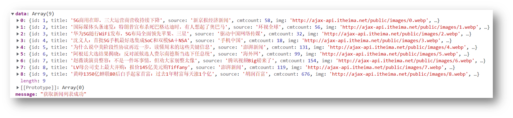
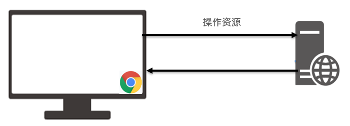

# AJAX学习笔记

# 一.AJAX的使用

## 01.AJAX 概念和 axios 使用

1. 什么是 AJAX ? [mdn](https://developer.mozilla.org/zh-CN/docs/Web/Guide/AJAX/Getting_Started)

   * 使用浏览器的 XMLHttpRequest 对象 与服务器通信

   * 浏览器网页中，使用 AJAX技术（XHR对象）发起获取省份列表数据的请求，服务器代码响应准备好的省份列表数据给前端，前端拿到数据数组以后，展示到网页

     

2. 什么是服务器？

   * 可以暂时理解为提供数据的一台电脑

3. 为何学 AJAX ?

   * 以前我们的数据都是写在代码里固定的, 无法随时变化
   * 现在我们的数据可以从服务器上进行获取，让数据变活

4. 怎么学 AJAX ?

   * 这里使用一个第三方库叫 axios, 后续在学习 XMLHttpRequest 对象了解 AJAX 底层原理
   * 因为 axios 库语法简单，让我们有更多精力关注在与服务器通信上，而且后续 Vue，React 学习中，也使用 axios 库与服务器通信

5. 需求：从服务器获取省份列表数据，展示到页面上（体验 axios 语法的使用）

   > 获取省份列表数据 - 目标资源地址：http://hmajax.itheima.net/api/province

   * 完成效果：

     

6. 接下来讲解 axios 语法，步骤：

  1. 引入 axios.js 文件到自己的网页中

     > axios.js文件链接: https://cdn.jsdelivr.net/npm/axios/dist/axios.min.js

  2. 明确axios函数的使用语法

     ```js
     axios({
       url: '目标资源地址'
     }).then((result) => {
       // 对服务器返回的数据做后续处理
     })
     ```

     > 注意：请求的 url 地址, 就是标记资源的网址
     >
     > 注意：then 方法这里先体验使用，由来后续会讲到

     

7. 对应代码

  ```html
  <!DOCTYPE html>
  <html lang="en">
  
  <head>
    <meta charset="UTF-8">
    <meta http-equiv="X-UA-Compatible" content="IE=edge">
    <meta name="viewport" content="width=device-width, initial-scale=1.0">
    <title>AJAX概念和axios使用</title>
  </head>
  
  <body>
    <!--
      axios库地址：https://cdn.jsdelivr.net/npm/axios/dist/axios.min.js
      省份数据地址：http://hmajax.itheima.net/api/province
  
      目标: 使用axios库, 获取省份列表数据, 展示到页面上
      1. 引入axios库
    -->
    <p class="my-p"></p>
    <script src="https://cdn.jsdelivr.net/npm/axios/dist/axios.min.js"></script>
    <script>
      // 2. 使用axios函数
      axios({
        url: 'http://hmajax.itheima.net/api/province'
      }).then(result => {
        console.log(result)
        // 好习惯：多打印，确认属性名
        console.log(result.data.list)
        console.log(result.data.list.join('<br>'))
        // 把准备好省份列表，插入到页面
        document.querySelector('.my-p').innerHTML = result.data.list.join('<br>') 
      })
    </script>
  </body>
  
  </html>
  ```


##   02.认识 URL

1. 为什么要认识 URL ? [mdn](https://developer.mozilla.org/zh-CN/docs/Web/Guide/AJAX/Getting_Started)

   * 虽然是后端给我的一个地址，但是哪部分标记的是服务器电脑，哪部分标记的是资源呢？所以为了和服务器有效沟通我们要认识一下

2. 什么是 URL ？

   * 统一资源定位符，简称网址，用于定位网络中的资源（资源指的是：网页，图片，数据，视频，音频等等）

     

3. URL 的组成?

   * 协议，域名，资源路径（URL 组成有很多部分，我们先掌握这3个重要的部分即可）

     

     

4. 什么是 http 协议 ?

   * 叫超文本传输协议，规定了浏览器和服务器传递数据的格式（而格式具体有哪些稍后我们就会学到）

     

5. 什么是域名 ?

   * 标记服务器在互联网当中的方位，网络中有很多服务器，你想访问哪一台，就需要知道它的域名才可以

     

6. 什么是资源路径 ?

   * 一个服务器内有多个资源，用于标识你要访问的资源具体的位置

     

7. 接下来做个需求，访问新闻列表的 URL 网址，打印新闻数据

   * 效果图如下：

   

   > 新闻列表数据 URL 网址：http://hmajax.itheima.net/api/news

   ```js
   axios({
     url: 'http://hmajax.itheima.net/api/news'
   }).then(result => {
     console.log(result)
   })
   ```

   > url解释：从黑马服务器使用http协议，访问/api/news路径下的新闻列表资源


2. <details>
   <summary>答案</summary>
   <ul>
   <li>协议://域名/资源路径
   </li>
   </ul>
   </details>


## 03.URL 查询参数

1. 什么是查询参数 ?

   * 携带给服务器额外信息，让服务器返回我想要的某一部分数据而不是全部数据
   * 举例：查询河北省下属的城市列表，需要先把河北省传递给服务器

     

2. 查询参数的语法 ？

   * 在 url 网址后面用?拼接格式：http://xxxx.com/xxx/xxx?参数名1=值1&参数名2=值2
   * 参数名一般是后端规定的，值前端看情况传递即可

3. axios 如何携带查询参数?

   * 使用 params 选项即可

     ```js
     axios({
       url: '目标资源地址',
       params: {
         参数名: 值
       }
     }).then(result => {
       // 对服务器返回的数据做后续处理
     })
     ```
     
     > 查询城市列表的 url地址：[http://hmajax.itheima.net/api/city](http://hmajax.itheima.net/api/city?pname=河北省)
     >
     > 参数名：pname （值要携带省份名字）

4. 需求：获取“河北省”下属的城市列表，展示到页面，对应代码：

   ```html
   <!DOCTYPE html>
   <html lang="en">
   <head>
     <meta charset="UTF-8">
     <meta http-equiv="X-UA-Compatible" content="IE=edge">
     <meta name="viewport" content="width=device-width, initial-scale=1.0">
     <title>查询参数</title>
   </head>
   <body>
     <!-- 
       城市列表: http://hmajax.itheima.net/api/city
       参数名: pname
       值: 省份名字
     -->
     <p></p>
     <script src="https://cdn.jsdelivr.net/npm/axios/dist/axios.min.js"></script>
     <script>
       axios({
         url: 'http://hmajax.itheima.net/api/city',
         // 查询参数
         params: {
           pname: '辽宁省'
         }
       }).then(result => {
         console.log(result.data.list)
         document.querySelector('p').innerHTML = result.data.list.join('<br>')
       })
     </script>
   </body>
   </html>
   ```


## 04.常用请求方法和数据提交

1. 想要提交数据，先来了解什么是请求方法

   * 请求方法是一些固定单词的英文，例如：GET，POST，PUT，DELETE，PATCH（这些都是http协议规定的），每个单词对应一种对服务器资源要执行的操作

     

     

   * 前面我们获取数据其实用的就是GET请求方法，但是axios内部设置了默认请求方法就是GET，我们就没有写

   * 但是提交数据需要使用POST请求方法

2. 什么时候进行数据提交呢？

   * 例如：多端要查看同一份订单数据，或者使用同一个账号进行登录，那订单/用户名+密码，就需要保存在服务器上，随时随地进行访问

     

3. axios 如何提交数据到服务器呢？

   * 需要学习，method 和 data 这2个新的选项了

     ```js
     axios({
       url: '目标资源地址',
       method: '请求方法',
       data: {
         参数名: 值
       }
     }).then(result => {
       // 对服务器返回的数据做后续处理
     })
     ```
     
     

4. 需求：注册账号，提交用户名和密码到服务器保存

   > 注册用户 URL 网址：http://hmajax.itheima.net/api/register
   >
   > 请求方法：POST
   >
   > 参数名：
   >
   > username：用户名（要求中英文和数字组成，最少8位）
   >
   > password：密码（最少6位）

   

5. 正确代码如下：

   ```js
   /*
     注册用户：http://hmajax.itheima.net/api/register
     请求方法：POST
     参数名：
       username：用户名（中英文和数字组成，最少8位）
       password：密码  （最少6位）
   
     目标：点击按钮，通过axios提交用户和密码，完成注册
   */
   document.querySelector('.btn').addEventListener('click', () => {
     axios({
       url: 'http://hmajax.itheima.net/api/register',
       method: 'POST',
       data: {
         username: 'itheima007',
         password: '7654321'
       }
     })
   })
   ```


​	url：目标资源地址，method：请求方法，params：查询参数，data：提交的数据

## 05.axios 错误处理

1. 如果注册相同的用户名，则会遇到注册失败的请求，也就是 axios 请求响应失败了，你会在控制台看到如图的错误：

   

2. 在 axios 语法中要如何处理呢？

   * 因为，普通用户不会去控制台里看错误信息，我们要编写代码拿到错误并展示给用户在页面上

3. 使用 axios 的 catch 方法，捕获这次请求响应的错误并做后续处理，语法如下：

   ```js
   axios({
     // ...请求选项
   }).then(result => {
     // 处理成功数据
   }).catch(error => {
     // 处理失败错误
   })
   ```

4. 需求：再次重复注册相同用户名，提示用户注册失败的原因

   

   

5. 对应代码

   ```js
   document.querySelector('.btn').addEventListener('click', () => {
       axios({
         url: 'http://hmajax.itheima.net/api/register',
         method: 'post',
         data: {
           username: 'itheima007',
           password: '7654321'
         }
       }).then(result => {
         // 成功
         console.log(result)
       }).catch(error => {
         // 失败
         // 处理错误信息
         console.log(error)
         console.log(error.response.data.message)
         alert(error.response.data.message)
       })
   })
   ```

## 06.HTTP 协议-请求报文

1. 首先，HTTP 协议规定了浏览器和服务器返回内容的<span style="color: red;">格式</span>

2. 请求报文：是浏览器按照协议规定发送给服务器的内容，例如刚刚注册用户时，发起的请求报文：

   

   

3. 这里的格式包含：

   * 请求行：请求方法，URL，协议
   * 请求头：以键值对的格式携带的附加信息，比如：Content-Type（指定了本次传递的内容类型）
   * 空行：分割请求头，空行之后的是发送给服务器的资源
   * 请求体：发送的资源

4. 我们切换到浏览器中，来看看刚才注册用户发送的这个请求报文以及内容去哪里查看呢

5. 代码：直接在上个代码基础上复制，然后运行查看请求报文对应关系即可


总结

1. 浏览器发送给服务器的内容叫做，请求报文

2. 请求报文的组成是什么？请求行，请求头，空行，请求体

3. 通过 Chrome 的网络面板如何查看请求体？

   


## 07.请求报文-错误排查

1. 学习了查看请求报文有什么用呢？
   * 可以用来确认我们代码发送的请求数据是否真的正确
2. 配套模板代码里，对应 08 标题文件夹里是我同桌的代码，它把登录也写完了，但是无法登录，我们来到模板代码中，找到运行后，在<span style="color: red;">不逐行查看代码的情况下</span>，查看请求报文，看看它登录提交的相关信息对不对，帮他找找问题出现的原因
3. 发现请求体数据有问题，往代码中定位，找到类名写错误了
4. 代码：在配套文件夹素材里，找到需要对应代码，直接运行，根据报错信息，找到错误原因


## 08.HTTP 协议-响应报文

1. 响应报文：是服务器按照协议固定的格式，返回给浏览器的内容

   

   

2. 响应报文的组成：

   * 响应行（状态行）：协议，HTTP响应状态码，状态信息
   * 响应头：以键值对的格式携带的附加信息，比如：Content-Type（告诉浏览器，本次返回的内容类型）
   * 空行：分割响应头，控制之后的是服务器返回的资源
   * 响应体：返回的资源

3. HTTP 响应状态码：

   * 用来表明请求是否成功完成

   * 例如：404（客户端要找的资源，在服务器上不存在）

     

1. 响应报文的组成？响应行，响应头，空行，响应体

2. HTTP 响应状态码是做什么的？表明请求是否成功完成，2xx都是成功的

   

## 9.接口文档

1. 接口文档：描述接口的文章（一般是后端工程师，编写和提供）
2. 接口：指的使用 AJAX 和 服务器通讯时，使用的 URL，请求方法，以及参数，例如：[AJAX阶段接口文档](https://apifox.com/apidoc/shared-1b0dd84f-faa8-435d-b355-5a8a329e34a8)
3. 例如：获取城市列表接口样子

   
4. 需求：打开 AJAX 阶段接口文档，查看登录接口，并编写代码，完成一次登录的效果吧
5. 代码如下：

   ```js
   document.querySelector('.btn').addEventListener('click', () => {
     // 用户登录
     axios({
       url: 'http://hmajax.itheima.net/api/login',
       method: 'post',
       data: {
         username: 'itheima007',
         password: '7654321'
       }
     })
   })
   ```

   

## 10.form-serialize 插件

1. 我们前面收集表单元素的值，是一个个标签获取的

   

2. 如果一套表单里有很多很多表单元素，如何一次性快速收集出来呢？

   

3. 使用 form-serialize 插件提供的 serialize 函数就可以办到

4. form-serialize 插件语法：

   1. 引入 form-serialize 插件到自己网页中

   2. 使用 serialize 函数

      * 参数1：要获取的 form 表单标签对象（要求表单元素需要有 name 属性-用来作为收集的数据中属性名）

      * 参数2：配置对象
        * hash：
          * true - 收集出来的是一个 JS 对象结构
          * false - 收集出来的是一个查询字符串格式
        * empty：
          * true - 收集空值
          * false - 不收集空值

5. 需求：收集登录表单里用户名和密码

6. 对应代码：

   ```html
   <!DOCTYPE html>
   <html lang="en">
   
   <head>
     <meta charset="UTF-8">
     <meta http-equiv="X-UA-Compatible" content="IE=edge">
     <meta name="viewport" content="width=device-width, initial-scale=1.0">
     <title>form-serialize插件使用</title>
   </head>
   
   <body>
     <form action="javascript:;" class="example-form">
       <input type="text" name="username">
       <br>
       <input type="text" name="password">
       <br>
       <input type="button" class="btn" value="提交">
     </form>
     <!-- 
       目标：在点击提交时，使用form-serialize插件，快速收集表单元素值
       1. 把插件引入到自己网页中
     -->
     <script src="./lib/form-serialize.js"></script>
     <script>
       document.querySelector('.btn').addEventListener('click', () => {
         /**
          * 2. 使用serialize函数，快速收集表单元素的值
          * 参数1：要获取哪个表单的数据
          *  表单元素设置name属性，值会作为对象的属性名
          *  建议name属性的值，最好和接口文档参数名一致
          * 参数2：配置对象
          *  hash 设置获取数据结构
          *    - true：JS对象（推荐）一般请求体里提交给服务器
          *    - false: 查询字符串
          *  empty 设置是否获取空值
          *    - true: 获取空值（推荐）数据结构和标签结构一致
          *    - false：不获取空值
         */
         const form = document.querySelector('.example-form')
         const data = serialize(form, { hash: true, empty: true })
         // const data = serialize(form, { hash: false, empty: true })
         // const data = serialize(form, { hash: true, empty: false })
         console.log(data)
       })
     </script>
   </body>
   
   </html>
   ```

# 二.原理

## 1.XMLHttpRequest - 基础使用

1. AJAX 是浏览器与服务器通信的技术，采用 XMLHttpRequest 对象相关代码

2. axios 是对 XHR 相关代码进行了封装，让我们只关心传递的接口参数

3. XHR 是 axios 内部与服务器交互过程的真正原理

   

4. 语法如下：

   ```js
   const xhr = new XMLHttpRequest()
   xhr.open('请求方法', '请求url网址')
   xhr.addEventListener('loadend', () => {
     // 响应结果
     console.log(xhr.response)
   })
   xhr.send()
   ```

   

   

5. 将以一个需求来体验下原生 XHR 语法，获取所有省份列表并展示到页面上

6. 代码如下：

   ```html
   <!DOCTYPE html>
   <html lang="en">
   
   <head>
     <meta charset="UTF-8">
     <meta http-equiv="X-UA-Compatible" content="IE=edge">
     <meta name="viewport" content="width=device-width, initial-scale=1.0">
     <title>XMLHttpRequest_基础使用</title>
   </head>
   
   <body>
     <p class="my-p"></p>
     <script>
       /**
        * 目标：使用XMLHttpRequest对象与服务器通信
        *  1. 创建 XMLHttpRequest 对象
        *  2. 配置请求方法和请求 url 地址
        *  3. 监听 loadend 事件，接收响应结果
        *  4. 发起请求
       */
       // 1. 创建 XMLHttpRequest 对象
       const xhr = new XMLHttpRequest()
   
       // 2. 配置请求方法和请求 url 地址
       xhr.open('GET', 'http://hmajax.itheima.net/api/province')
   
       // 3. 监听 loadend 事件，接收响应结果
       xhr.addEventListener('loadend', () => {
         console.log(xhr.response)
         const data = JSON.parse(xhr.response)
         console.log(data.list.join('<br>'))
         document.querySelector('.my-p').innerHTML = data.list.join('<br>')
       })
   
       // 4. 发起请求
       xhr.send()
     </script>
   </body>
   
   </html>
   ```

   

1. AJAX 原理是什么?window 提供的 XMLHttpRequest

   

2. XHR 使用步骤？

   创建 XHR 对象 2. 调用 open 方法，设置 url 和请求方法 3. 监听 loadend 事件，接收结果 4. 调用 send 方法，发起请求


## 02.XMLHttpRequest - 查询参数

1. 什么是查询参数：携带额外信息给服务器，返回匹配想要的数据

2. 查询参数原理要携带的位置和语法：http://xxxx.com/xxx/xxx?参数名1=值1&参数名2=值2

3. 所以，原生 XHR 需要自己在 url 后面携带查询参数字符串，没有 axios 帮助我们把 params 参数拼接到 url 字符串后面了

4. 需求：查询河北省下属的城市列表

   

5. 核心代码如下：

   ```js
   /**
    * 目标：使用XHR携带查询参数，展示某个省下属的城市列表
   */
   const xhr = new XMLHttpRequest()
   xhr.open('GET', 'http://hmajax.itheima.net/api/city?pname=辽宁省')
   xhr.addEventListener('loadend', () => {
     console.log(xhr.response)
     const data = JSON.parse(xhr.response)
     console.log(data)
     document.querySelector('.city-p').innerHTML = data.list.join('<br>')
   })
   xhr.send()
   ```


1. XHR 如何携带查询参数?在调用 open 方法的时候，在 url? 后面按照指定格式拼接参数名和值


## 03.XMLHttpRequest - 数据提交

1. 了解原生 XHR 进行数据提交的方式

2. 需求：通过 XHR 完成注册用户功能

   

3. 步骤和语法：

   1. 注意1：但是这次没有 axios 帮我们了，我们需要自己设置请求头 Content-Type：application/json，来告诉服务器端，我们发过去的内容类型是 JSON 字符串，让他转成对应数据结构取值使用

   2. 注意2：没有 axios 了，我们前端要传递的请求体数据，也没人帮我把 JS 对象转成 JSON 字符串了，需要我们自己转换

   3. 注意3：原生 XHR 需要在 send 方法调用时，传入请求体携带

      ```js
      const xhr = new XMLHttpRequest()
      xhr.open('请求方法', '请求url网址')
      xhr.addEventListener('loadend', () => {
        console.log(xhr.response)
      })
      
      // 1. 告诉服务器，我传递的内容类型，是 JSON 字符串
      xhr.setRequestHeader('Content-Type', 'application/json')
      // 2. 准备数据并转成 JSON 字符串
      const user = { username: 'itheima007', password: '7654321' }
      const userStr = JSON.stringify(user)
      // 3. 发送请求体数据
      xhr.send(userStr)
      ```


4. 核心代码如下：

   ```js
   /**
    * 目标：使用xhr进行数据提交-完成注册功能
   */
   document.querySelector('.reg-btn').addEventListener('click', () => {
     const xhr = new XMLHttpRequest()
     xhr.open('POST', 'http://hmajax.itheima.net/api/register')
     xhr.addEventListener('loadend', () => {
       console.log(xhr.response)
     })
   
     // 设置请求头-告诉服务器内容类型（JSON字符串）
     xhr.setRequestHeader('Content-Type', 'application/json')
     // 准备提交的数据
     const userObj = {
       username: 'itheima007',
       password: '7654321'
     }
     const userStr = JSON.stringify(userObj)
     // 设置请求体，发起请求
     xhr.send(userStr)
   })
   ```

   

## 04.认识_Promise

1. 什么是 Promise ？

   * Promise 对象用于表示一个异步操作的最终完成（或失败）及其结构值
   * 表示（管理）一个异步操作最终状态和结果值的对象

2. Promise 的好处是什么？

   * 逻辑更清晰（成功或失败会关联后续的处理函数）

   * 了解 axios 函数内部运作的机制

     

   * 能解决回调函数地狱问题，今天先来看下它的基础使用

3. Promise 管理异步任务，语法怎么用？

   ```js
   // 1. 创建 Promise 对象
   const p = new Promise((resolve, reject) => {
    // 2. 执行异步任务-并传递结果
    // 成功调用: resolve(值) 触发 then() 执行
    // 失败调用: reject(值) 触发 catch() 执行
   })
   // 3. 接收结果
   p.then(result => {
    // 成功
   }).catch(error => {
    // 失败
   })
   ```

4. 示例代码：

   ```js
   /**
    * 目标：使用Promise管理异步任务
   */
   // 1. 创建Promise对象
   const p = new Promise((resolve, reject) => {
     // 2. 执行异步代码
     setTimeout(() => {
       // resolve('模拟AJAX请求-成功结果')
       reject(new Error('模拟AJAX请求-失败结果'))
     }, 2000)
   })
   
   // 3. 获取结果
   p.then(result => {
     console.log(result)
   }).catch(error => {
     console.log(error)
   })
   ```

   

## 05.认识_Promise 的状态

1. 为什么要了解 Promise 的三种状态 ？

   * 知道 Promise 对象如何关联的处理函数，以及代码的执行顺序

2. Promise 有哪三种状态？

   > 每个 Promise 对象必定处于以下三种状态之一

   1. 待定（pending）：初始状态，既没有被兑现，也没有被拒绝
   2. 已兑现（fulfilled）：操作成功完成
   3. 已拒绝（rejected）：操作失败

   > 状态的英文字符串，可以理解为 Promise 对象内的字符串标识符，用于判断什么时候调用哪一个处理函数

3. Promise 的状态改变有什么用：调用对应函数，改变 Promise 对象状态后，内部触发对应回调函数传参并执行

   

4. 注意：每个 Promise 对象一旦被兑现/拒绝，那就是已敲定了，状态无法再被改变


## 06.Promise 与XHR的连用

1. 使用 Promise 和 XHR 请求省份列表数据并展示到页面上

   

2. 步骤：

   1. 创建 Promise 对象

   2. 执行 XHR 异步代码，获取省份列表数据

   3. 关联成功或失败回调函数，做后续的处理

      > 错误情况：用地址错了404演示

3. 核心代码如下：

   ```js
   /**
    * 目标：使用Promise管理XHR请求省份列表
    *  1. 创建Promise对象
    *  2. 执行XHR异步代码，获取省份列表
    *  3. 关联成功或失败函数，做后续处理
   */
   // 1. 创建Promise对象
   const p = new Promise((resolve, reject) => {
     // 2. 执行XHR异步代码，获取省份列表
     const xhr = new XMLHttpRequest()
     xhr.open('GET', 'http://hmajax.itheima.net/api/province')
     xhr.addEventListener('loadend', () => {
       // xhr如何判断响应成功还是失败的？
       // 2xx开头的都是成功响应状态码
       if (xhr.status >= 200 && xhr.status < 300) {
         resolve(JSON.parse(xhr.response))
       } else {
         reject(new Error(xhr.response))
       }
     })
     xhr.send()
   })
   
   // 3. 关联成功或失败函数，做后续处理
   p.then(result => {
     console.log(result)
     document.querySelector('.my-p').innerHTML = result.list.join('<br>')
   }).catch(error => {
     // 错误对象要用console.dir详细打印
     console.dir(error)
     // 服务器返回错误提示消息，插入到p标签显示
     document.querySelector('.my-p').innerHTML = error.message
   })
   ```


## 08.封装_简易axios-Get

1. 需求：基于 Promise 和 XHR 封装 myAxios 函数，获取省份列表展示到页面

   

2. 核心语法：

   ```js
   function myAxios(config) {
     return new Promise((resolve, reject) => {
       // XHR 请求
       // 调用成功/失败的处理程序
     })
   }
   
   myAxios({
     url: '目标资源地址'
   }).then(result => {
       
   }).catch(error => {
       
   })
   ```

   

3. 步骤：

   1. 定义 myAxios 函数，接收配置对象，返回 Promise 对象
   2. 发起 XHR 请求，默认请求方法为 GET
   3. 调用成功/失败的处理程序
   4. 使用 myAxios 函数，获取省份列表展示


4. 核心代码如下：

   ```js
   /**
    * 目标：封装_简易axios函数_获取省份列表
    *  1. 定义myAxios函数，接收配置对象，返回Promise对象
    *  2. 发起XHR请求，默认请求方法为GET
    *  3. 调用成功/失败的处理程序
    *  4. 使用myAxios函数，获取省份列表展示
   */
   // 1. 定义myAxios函数，接收配置对象，返回Promise对象
   function myAxios(config) {
     return new Promise((resolve, reject) => {
       // 2. 发起XHR请求，默认请求方法为GET
       const xhr = new XMLHttpRequest()
       xhr.open(config.method || 'GET', config.url)
       xhr.addEventListener('loadend', () => {
         // 3. 调用成功/失败的处理程序
         if (xhr.status >= 200 && xhr.status < 300) {
           resolve(JSON.parse(xhr.response))
         } else {
           reject(new Error(xhr.response))
         }
       })
       xhr.send()
     })
   }
   
   // 4. 使用myAxios函数，获取省份列表展示
   myAxios({
     url: 'http://hmajax.itheima.net/api/province'
   }).then(result => {
     console.log(result)
     document.querySelector('.my-p').innerHTML = result.list.join('<br>')
   }).catch(error => {
     console.log(error)
     document.querySelector('.my-p').innerHTML = error.message
   })
   ```


1. 自己封装的 myAxios 如何设置默认请求方法 GET?

   config.method 判断有值就用，无值用‘GET’方法

   

## 09.封装_简易axios

1. 需求：在上个封装的建议 axios 函数基础上，修改代码支持传递查询参数功能

2. 修改步骤：

   1. myAxios 函数调用后，判断 params 选项
   2. 基于 URLSearchParams 转换查询参数字符串
   3. 使用自己封装的 myAxios 函数显示地区列表

3. 核心代码：

   ```js
   function myAxios(config) {
     return new Promise((resolve, reject) => {
       const xhr = new XMLHttpRequest()
       // 1. 判断有params选项，携带查询参数
       if (config.params) {
         // 2. 使用URLSearchParams转换，并携带到url上
         const paramsObj = new URLSearchParams(config.params)
         const queryString = paramsObj.toString()
         // 把查询参数字符串，拼接在url？后面
         config.url += `?${queryString}`
       }
   
       xhr.open(config.method || 'GET', config.url)
       xhr.addEventListener('loadend', () => {
         if (xhr.status >= 200 && xhr.status < 300) {
           resolve(JSON.parse(xhr.response))
         } else {
           reject(new Error(xhr.response))
         }
       })
       xhr.send()
     })
   }
   
   // 3. 使用myAxios函数，获取地区列表
   myAxios({
     url: 'http://hmajax.itheima.net/api/area',
     params: {
       pname: '辽宁省',
       cname: '大连市'
     }
   }).then(result => {
     console.log(result)
     document.querySelector('.my-p').innerHTML = result.list.join('<br>')
   })
   ```


1. 外面传入查询参数对象，myAxios 函数内如何转查询参数字符串?

   <details>
   <summary>答案</summary>
   <ul>
   <li>使用 URLSearchParams 对象转换</li>
   </ul>
   </details>


## 10.封装_简易axios

1. 需求：修改 myAxios 函数支持传递请求体数据，完成注册用户功能

2. 修改步骤：

   1. myAxios 函数调用后，判断 data 选项
   2. 转换数据类型，在 send 方法中发送
   3. 使用自己封装的 myAxios 函数完成注册用户功能

3. 核心代码：

   ```js
   function myAxios(config) {
     return new Promise((resolve, reject) => {
       const xhr = new XMLHttpRequest()
   
       if (config.params) {
         const paramsObj = new URLSearchParams(config.params)
         const queryString = paramsObj.toString()
         config.url += `?${queryString}`
       }
       xhr.open(config.method || 'GET', config.url)
   
       xhr.addEventListener('loadend', () => {
         if (xhr.status >= 200 && xhr.status < 300) {
           resolve(JSON.parse(xhr.response))
         } else {
           reject(new Error(xhr.response))
         }
       })
       // 1. 判断有data选项，携带请求体
       if (config.data) {
         // 2. 转换数据类型，在send中发送
         const jsonStr = JSON.stringify(config.data)
         xhr.setRequestHeader('Content-Type', 'application/json')
         xhr.send(jsonStr)
       } else {
         // 如果没有请求体数据，正常的发起请求
         xhr.send()
       }
     })
   }
   
   document.querySelector('.reg-btn').addEventListener('click', () => {
     // 3. 使用myAxios函数，完成注册用户
     myAxios({
       url: 'http://hmajax.itheima.net/api/register',
       method: 'POST',
       data: {
         username: 'itheima999',
         password: '666666'
       }
     }).then(result => {
       console.log(result)
     }).catch(error => {
       console.dir(error)
     })
   })
   ```


# 三-AJAX高级

## 01.同步代码和异步代码

1. [同步代码]([https://developer.mozilla.org/zh-CN/docs/Learn/JavaScript/Asynchronous/Introducing#%E5%90%8C%E6%AD%A5%E7%BC%96%E7%A8%8B](https://developer.mozilla.org/zh-CN/docs/Learn/JavaScript/Asynchronous/Introducing))：逐行执行，需原地等待结果后，才继续向下执行


2. [异步代码](https://developer.mozilla.org/zh-CN/docs/Learn/JavaScript/Asynchronous/Introducing)：调用后耗时，不阻塞代码继续执行（不必原地等待），在将来完成后触发回调函数传递结果

3. js中的异步：setTimeout / setInterval，事件，AJAX ，都是通过回调函数来接收数据

4. 回答代码打印顺序：发现异步代码接收结果，使用的都是回调函数

   ```js
   const result = 0 + 1
   console.log(result)
   setTimeout(() => {
     console.log(2)
   }, 2000)
   document.querySelector('.btn').addEventListener('click', () => {
     console.log(3)
   })
   document.body.style.backgroundColor = 'pink'
   console.log(4)
   ```

   > 结果：1， 4， 2
   >
   > 按钮点击一次打印一次 3


## 02.回调函数地狱

1. 需求：展示默认第一个省，第一个城市，第一个地区在下拉菜单中

   

2. 概念：在回调函数中嵌套回调函数，一直嵌套下去就形成了回调函数地狱

3. 缺点：可读性差，异常无法捕获，耦合性严重，牵一发动全身

   ```js
   axios({ url: 'http://hmajax.itheima.net/api/province' }).then(result => {
     const pname = result.data.list[0]
     document.querySelector('.province').innerHTML = pname
     // 获取第一个省份默认下属的第一个城市名字
     axios({ url: 'http://hmajax.itheima.net/api/city', params: { pname } }).then(result => {
       const cname = result.data.list[0]
       document.querySelector('.city').innerHTML = cname
       // 获取第一个城市默认下属第一个地区名字
       axios({ url: 'http://hmajax.itheima.net/api/area', params: { pname, cname } }).then(result => {
         document.querySelector('.area').innerHTML = result.data.list[0]
       })
     })
   })
   ```


## 03.Promise-链式调用

1. 概念：依靠 then() 方法会返回一个新生成的 Promise 对象特性，继续串联下一环任务，直到结束

2. 细节：then() 回调函数中的返回值，会影响新生成的 Promise 对象最终状态和结果

3. 好处：通过链式调用，解决回调函数嵌套问题

   

4. 按照图解，编写核心代码：

   ```js
   /**
    * 目标：掌握Promise的链式调用
    * 需求：把省市的嵌套结构，改成链式调用的线性结构
   */
   // 1. 创建Promise对象-模拟请求省份名字
   const p = new Promise((resolve, reject) => {
     setTimeout(() => {
       resolve('北京市')
     }, 2000)
   })
   
   // 2. 获取省份名字
   const p2 = p.then(result => {
     console.log(result)
     // 3. 创建Promise对象-模拟请求城市名字
     // return Promise对象最终状态和结果，影响到新的Promise对象
     return new Promise((resolve, reject) => {
       setTimeout(() => {
         resolve(result + '--- 北京')
       }, 2000)
     })
   })
   
   // 4. 获取城市名字
   p2.then(result => {
     console.log(result)
   })
   
   // then()原地的结果是一个新的Promise对象
   console.log(p2 === p)
   ```


## 04.Promise-链式调用_解决回调地狱

1. 目标：使用 Promise 链式调用，解决回调函数地狱问题

2. 做法：每个 Promise 对象中管理一个异步任务，用 then 返回 Promise 对象，串联起来

   

3. 按照图解思路，编写核心代码：

   ```js
   /**
    * 目标：把回调函数嵌套代码，改成Promise链式调用结构
    * 需求：获取默认第一个省，第一个市，第一个地区并展示在下拉菜单中
   */
   let pname = ''
   // 1. 得到-获取省份Promise对象
   axios({url: 'http://hmajax.itheima.net/api/province'}).then(result => {
     pname = result.data.list[0]
     document.querySelector('.province').innerHTML = pname
     // 2. 得到-获取城市Promise对象
     return axios({url: 'http://hmajax.itheima.net/api/city', params: { pname }})
   }).then(result => {
     const cname = result.data.list[0]
     document.querySelector('.city').innerHTML = cname
     // 3. 得到-获取地区Promise对象
     return axios({url: 'http://hmajax.itheima.net/api/area', params: { pname, cname }})
   }).then(result => {
     console.log(result)
     const areaName = result.data.list[0]
     document.querySelector('.area').innerHTML = areaName
   })
   ```

Promise 链式调用如何解决回调函数地狱? **then 的回调函数中 return Promise对象，影响当前新 Promise 对象的值**


## 05.async 函数和 await

1. 概念：在 async 函数内，使用 await 关键字取代 then 函数，等待获取 Promise 对象成功状态的结果值 

2. 做法：使用 async 和 await 解决回调地狱问题

3. 核心代码：

   ```js
   /**
    * 目标：掌握async和await语法，解决回调函数地狱
    * 概念：在async函数内，使用await关键字，获取Promise对象"成功状态"结果值
    * 注意：await必须用在async修饰的函数内（await会阻止"异步函数内"代码继续执行，原地等待结果）
   */
   // 1. 定义async修饰函数
   async function getData() {
     // 2. await等待Promise对象成功的结果
     const pObj = await axios({url: 'http://hmajax.itheima.net/api/province'})
     const pname = pObj.data.list[0]
     const cObj = await axios({url: 'http://hmajax.itheima.net/api/city', params: { pname }})
     const cname = cObj.data.list[0]
     const aObj = await axios({url: 'http://hmajax.itheima.net/api/area', params: { pname, cname }})
     const areaName = aObj.data.list[0]
   
   
     document.querySelector('.province').innerHTML = pname
     document.querySelector('.city').innerHTML = cname
     document.querySelector('.area').innerHTML = areaName
   }
   
   getData()
   ```

   > 使用 await 替代 then 的方法

## 06.async 函数和 await 捕获错误

1. try 和 catch 的作用：语句标记要尝试的语句块，并指定一个出现异常时抛出的响应

   作用2：捕获同步流程的代码报错信息

   ```js
   try {
     // 要执行的代码
   } catch (error) {
     // error 接收的是，错误消息
     // try 里代码，如果有错误，直接进入这里执行
   }
   ```

   > try 里有报错的代码，会立刻跳转到 catch 中

2. 尝试把代码中 url 地址写错，运行观察 try catch 的捕获错误信息能力

   ```js
   /**
    * 目标：async和await_错误捕获
   */
   async function getData() {
     // 1. try包裹可能产生错误的代码
     try {
       const pObj = await axios({ url: 'http://hmajax.itheima.net/api/province' })
       const pname = pObj.data.list[0]
       const cObj = await axios({ url: 'http://hmajax.itheima.net/api/city', params: { pname } })
       const cname = cObj.data.list[0]
       const aObj = await axios({ url: 'http://hmajax.itheima.net/api/area', params: { pname, cname } })
       const areaName = aObj.data.list[0]
   
       document.querySelector('.province').innerHTML = pname
       document.querySelector('.city').innerHTML = cname
       document.querySelector('.area').innerHTML = areaName
     } catch (error) {
       // 2. 接着调用catch块，接收错误信息
       // 如果try里某行代码报错后，try中剩余的代码不会执行了
       console.dir(error)
     }
   }
   
   getData()
   ```

   

## 07.事件循环

1. 事件循环（EventLoop）：掌握后知道 JS 是如何安排和运行代码的

   > 请回答下面 2 段代码打印的结果，并说明原因

   ```js
   console.log(1)
   setTimeout(() => {
     console.log(2)
   }, 2000)
   ```

   ```js
   console.log(1)
   setTimeout(() => {
     console.log(2)
   }, 0)
   console.log(3)
   ```

   

2. 作用：事件循环负责执行代码，收集和处理事件以及执行队列中的子任务

3. 原因：JavaScript 单线程（某一刻只能执行一行代码），为了让耗时代码不阻塞其他代码运行，设计了事件循环模型

4. 概念：执行代码和收集异步任务的模型，在调用栈空闲，反复调用任务队列里回调函数的执行机制，就叫事件循环

5. JavaScript 内代码执行机制：执行同步代码，遇到异步代码交给宿主浏览器环境执行异步有了结果后，把回调函数放入任务队列排队当调用栈空闲后，反复调用任务队列里的回调函数

   ```js
   /**
    * 目标：阅读并回答执行的顺序结果
   */
   console.log(1)
   setTimeout(() => {
     console.log(2)
   }, 0)
   console.log(3)
   setTimeout(() => {
     console.log(4)
   }, 2000)
   console.log(5)
   ```

   

## 08.宏任务与微任务

1. ES6 之后引入了 Promise 对象， 让 JS 引擎也可以发起异步任务

2. js中宏任务与微任务的执行规则：执行第一个 script 脚本事件宏任务，里面同步代码
    遇到 宏任务/微任务 交给宿主环境，有结果回调函数进入对应队列
    当执行栈空闲时，清空微任务队列，再执行下一个宏任务，从1再来

   

3. 异步任务划分为了

   * 宏任务：由浏览器环境执行的异步代码
   * 微任务：由 JS 引擎环境执行的异步代码

4. 宏任务和微任务具体划分：

   

   1. 事件循环模型


   ```js
   /**
    * 目标：阅读并回答打印的执行顺序
   */
   console.log(1)
   setTimeout(() => {
     console.log(2)
   }, 0)
   const p = new Promise((resolve, reject) => {
     resolve(3)
   })
   p.then(res => {
     console.log(res)
   })
   console.log(4)
   ```

   

   


> 注意：宏任务每次在执行同步代码时，产生微任务队列，清空微任务队列任务后，微任务队列空间释放！
>
> 下一次宏任务执行时，遇到微任务代码，才会再次申请微任务队列空间放入回调函数消息排队
>
> 总结：一个宏任务包含微任务队列，他们之间是包含关系，不是并列关系
>
> 

## 10.事件循环 - 经典面试题

### 目标

锻炼事件循环模型的使用


### 讲解

1. 需求：请切换到对应配套代码，查看具体代码，并回答打印顺序（锻炼事件循环概念的理解，阅读代码执行顺序_）

   ```js
   // 目标：回答代码执行顺序
   console.log(1)
   //异步
   setTimeout(() => {
     console.log(2)
     const p = new Promise(resolve => resolve(3))
     p.then(result => console.log(result))
   }, 0)
   const p = new Promise(resolve => {
       //异步
     setTimeout(() => {
       console.log(4)
     }, 0)
       
     resolve(5)
   })
   p.then(result => console.log(result))
   const p2 = new Promise(resolve => resolve(6))
   p2.then(result => console.log(result))
   console.log(7)
   
   
   打印顺序：1 7 5 6 2 3 4
   同步部分：
   
   console.log(1)：立即执行，输出 1。
   Promise 和 setTimeout：
   
   setTimeout(() => { console.log(2) ... }, 0)：此部分被放入事件循环的消息队列中，在当前同步任务执行完毕后，等待事件循环执行。
   const p = new Promise(resolve => { ... })：Promise 的构造函数中包含了一个 setTimeout，但 resolve(5) 是同步执行的，因此会立即执行。
   p.then(result => console.log(result))：将 then 方法放入微任务队列中，等待当前任务完成后执行。
   其他 Promise 和输出：
   
   const p2 = new Promise(resolve => resolve(6))：这是一个同步执行的 Promise，因此会立即执行并放入微任务队列。
   console.log(7)：立即输出 7。
   事件循环执行异步任务：
   
   等待主线程任务结束后，事件循环开始处理微任务和宏任务。
   微任务队列中的任务优先级高于宏任务。
   微任务执行顺序：
   
   执行 resolve(5)，Promise p 的 then 方法被调用，输出 5。
   执行 const p2 = new Promise(resolve => resolve(6))，Promise p2 的 then 方法被调用，输出 6。
   宏任务执行顺序：
   
   setTimeout 的回调函数执行，输出 2。
   setTimeout 在 const p 中的回调函数执行，输出 4。
   总结输出顺序：
   
   1：同步任务，直接输出。
   7：同步任务，直接输出。
   5：微任务，Promise p 的 resolve(5) 触发。
   6：微任务，Promise p2 的 resolve(6) 触发。
   2：宏任务，setTimeout 回调函数执行。
   3：微任务，Promise p 的 then 方法输出。
   4：宏任务，const p 中的 setTimeout 回调函数执行。
   ```

   

   


## 11.Promise.all 静态方法

1. 概念：合并多个 Promise 对象，等待所有同时成功完成（或某一个失败），做后续逻辑

   

2. 语法：

   ```js
   const p = Promise.all([Promise对象, Promise对象, ...])
   p.then(result => {
     // result 结果: [Promise对象成功结果, Promise对象成功结果, ...]
   }).catch(error => {
     // 第一个失败的 Promise 对象，抛出的异常对象
   })
   ```


3. 需求：同时请求“北京”，“上海”，“广州”，“深圳”的天气并在网页尽可能同时显示

   

4. 核心代码如下：

   ```html
   <!DOCTYPE html>
   <html lang="en">
   
   <head>
     <meta charset="UTF-8">
     <meta http-equiv="X-UA-Compatible" content="IE=edge">
     <meta name="viewport" content="width=device-width, initial-scale=1.0">
     <title>Promise的all方法</title>
   </head>
   
   <body>
     <ul class="my-ul"></ul>
     <script src="https://cdn.jsdelivr.net/npm/axios/dist/axios.min.js"></script>
     <script>
       /**
        * 目标：掌握Promise的all方法作用，和使用场景
        * 业务：当我需要同一时间显示多个请求的结果时，就要把多请求合并
        * 例如：默认显示"北京", "上海", "广州", "深圳"的天气在首页查看
        * code：
        * 北京-110100
        * 上海-310100
        * 广州-440100
        * 深圳-440300
       */
       // 1. 请求城市天气，得到Promise对象
       const bjPromise = axios({ url: 'http://hmajax.itheima.net/api/weather', params: { city: '110100' } })
       const shPromise = axios({ url: 'http://hmajax.itheima.net/api/weather', params: { city: '310100' } })
       const gzPromise = axios({ url: 'http://hmajax.itheima.net/api/weather', params: { city: '440100' } })
       const szPromise = axios({ url: 'http://hmajax.itheima.net/api/weather', params: { city: '440300' } })
   
       // 2. 使用Promise.all，合并多个Promise对象
       const p = Promise.all([bjPromise, shPromise, gzPromise, szPromise])
       p.then(result => {
         // 注意：结果数组顺序和合并时顺序是一致
         console.log(result)
         const htmlStr = result.map(item => {
           return `<li>${item.data.data.area} --- ${item.data.data.weather}</li>`
         }).join('')
         document.querySelector('.my-ul').innerHTML = htmlStr
       }).catch(error => {
         console.dir(error)
       })
     </script>
   </body>
   
   </html>
   ```


## 重点

1. axios 的配置项有哪几个，作用分别是什么？
2. 接口文档都包含哪些信息？
3. 在浏览器中如何查看查询参数/请求体，以及响应体数据？
4. 请求报文和响应报文由几个部分组成，每个部分的作用？
5. 了解 AJAX 原理之 XMLHttpRequest（XHR）相关语法
6. 了解 Promise 的作用和三种状态
7. 了解 axios 内部运作的过程
8. 掌握 async 和 await 的使用
9. 理解 EventLoop 和宏任务微任务执行顺序
10. 了解 Promise.all 的作用和使用场景
