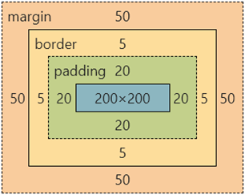
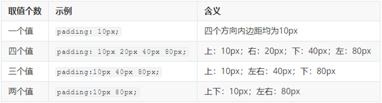
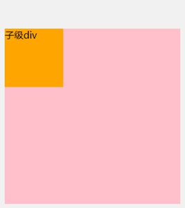
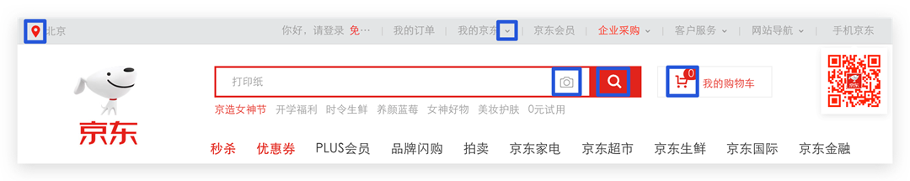
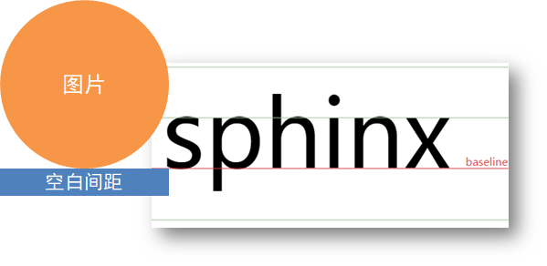

# css基础

层叠样式表 (Cascading Style Sheets，缩写为 CSS），是一种 **样式表** 语言，用来**描述 HTML 文档的呈现**（**美化内容**）。

### 01-css引入方式

- 行内样式：CSS 写在标签的 style 属性值里

```html
<div style="color: red; font-size:20px;">这是 div 标签</div>
```

- 内部样式表：CSS 代码写在 style 标签里面

- 外部样式表：在 HTML 使用 link 标签引入css文件

  ```html
  <link rel='stylesheet' herf='./style.css'>
  ```

### 02-选择器

- **标签选择器：**使用**标签名**作为选择器 → 选中**同名标签设置相同的样式**。

​	例如：p, h1, div, a, img......

- **类选择器 ：**查找标签，**差异化**设置标签的显示效果。

  ```html
  <style>
    /* 定义类选择器 */
    .red {
      color: red;
    }
  </style>
  <!-- 使用类选择器 -->
  <div class="red">这是 div 标签</div>
  ```

  注意：

  * 类名**自定义**，不要用纯数字或中文，尽量用英文命名
  * 一个类选择器**可以供多个标签使用**
  * **一个标签可以使用多个类名**，类名之间用**空格**隔开

  > 开发习惯：类名见名知意，多个单词h可以用 - 连接，例如：news-hd。

  - **id选择器**

    id 选择器一般**配合 JavaScript** 使用，很少用来设置 CSS 样式

    ```html
    <style>  /* 定义 id 选择器 */  
        #red {    color: red;  }
    </style>
    <!-- 使用 id 选择器 -->
    <div id="red">这是 div 标签</div>
    ```

    

  - **通配符选择器**

​		作用：查找页面**所有**标签，设置相同样式。

​		通配符选择器： ***，不需要调用**，浏览器自动查找页面所有标签，设置相同的样式

> ​	通常用于清除默认样式

### 03-文字控制属性

1. 字体大小 font-size:  px;

2. 行高 line-height  属性值：num+px  如果只是num则表示标签font-size属性值的倍数

3. 字体样式（倾斜）font-style  倾斜：**italic**  不倾斜：**normal** 

4. 单行文字垂直居中：**行高属性值等于盒子高度属性值**

5. 字体类型：font-family

6. 文本缩进：text-indent  属性值：数字 + px  或者 **数字 + em**（推荐：**1em = 当前标签的字号大小**）

7. **文本对齐方式** ：text-align：left左对齐 right右对齐 center居中

8. 文本修饰线  **text-decoration**  属性值： none无  **underline** 下划线

   **line-through 删除线**  overline 上划线

9. color 文字颜色

### 04-复合选择器 

定义：由两个或多个基础选择器，通过不同的方式组合而成。

作用：更准确、更高效的选择目标元素（标签）。

#### 4-1后代选择器

通过在父选择器后面添加子选择器 { CSS 属性}，父子选择器之间用**空格**隔开。

作用：父元素里面的子元素添加样式 不影响父元素外的元素

```html
<style>
    后代选择器
  div span {
    color: red;
  }
</style>
<span> span 标签</span>
<div>
  <span>这是 div 的儿子 span</span >
</div>
```

#### 4-2子代选择器

选中某元素的子代元素（**最近的子级**）。父选择器 > 子选择器 { CSS 属性}，父子选择器之间用 **>** 隔开。

```html
<style>
  div > span {
    color: red;
  }
</style>

<div>
  <span>这是 div 里面的 span</span>变红
  <p>
    <span>这是 div 里面的 p 里面的 span</span>不变红
  </p>
</div>
```

#### 4-3并集选择器

选中**多组标签**设置**相同**的样式。

选择器写法：选择器1, 选择器2, …, 选择器N { CSS 属性}，选择器之间用 **,** 隔开。

```html
<style>
  div,
  p,
  span {
    color: red;
  }
</style>

<div> div 标签</div>
<p>p 标签</p>
<span>span 标签</span>
```

#### 4-4交集选择器 

选中**同时满足多个条件**的元素。

选择器写法：选择器1选择器2 { CSS 属性}，选择器之间连写 

```html
<style>
  p.box {
  color: red;
}
</style>

<p class="box">p 标签，使用了类选择器 box</p>
<p>p 标签</p>
<div class="box">div 标签，使用了类选择器 box</div>
```

> 注意：如果交集选择器中有标签选择器，标签选择器必须书写在最前面。

#### 4-5伪类选择器 

伪类选择器：伪类表示元素**状态**，选中元素的某个状态设置样式。

:hover 悬停时   :link访问时  :visited访问后  :active点击时

```html
<style>
  a:hover {
    color: red;
  }
  .box:hover {
    color: green;
  }
</style>

<a href="#">a 标签</a>
<div class="box">div 标签</div>
```

### 05-css特性

* 继承性：继承性：子级默认继承父级的**文字控制属性**。（如果标签有默认文字样式会继承失败）

* 层叠性：相同的属性会覆盖：**后面的 CSS 属性覆盖前面的 CSS 属性**；不同的属性会叠加：**不同的 CSS 属性都生效**

* 优先级:权重，当一个标签**使用了多种选择器时**，基于不同种类的选择器的**匹配规则**。

* **基础选择器**

  规则：选择器**优先级高的样式生效**。

  公式：**通配符选择器 < 标签选择器 < 类选择器 < id选择器 < 行内样式 < !important**

  ​           **（选中标签的范围越大，优先级越低)!important 权重最大

### 06-背景属性

1. 背景图 background-image: url(./images/1.png);

2. **平铺方式  background-repeat** ： no-repeat不平铺 repeat平铺  repeat-x repeat-y平铺方向

3. 背景图位置background-position：left bottom right top （也可以用数值px）

4.  背景图缩放background-size

   属性值：

   关键字

   *  cover：等比例缩放背景图片以完全覆盖背景区，可能背景图片部分看不见
   *  contain：等比例缩放背景图片以完全装入背景区，可能背景区部分空白

   百分比：根据盒子尺寸计算图片大小

   数字 + 单位（例如：px）

5. 背景图固定 作用：背景不会随着元素的内容滚动。background-attachment：fixed

### 07-元素级别（显示模式) 重点

#### 7-1块级元素

特点：

* 独占一行；宽度默认是父级的100%；添加宽高属性生效

#### 7-2行内元素

特点：

* 一行可以显示多个；设置宽高属性不生效；宽高尺寸由内容撑开

#### 7-3行内块元素

* 一行可以显示多个；设置宽高属性生效；宽高尺寸也可以由内容撑开

#### 7-4 元素转换

属性：**display**  属性值block 块级 inline行内 inline-block行内块

# css进阶

# 一.盒子模型

### 01-结构伪类选择器 （孩子选择器）

- **基本使用** (掌握)

作用：根据元素的**结构关系**查找元素。 


```css
li:first-child {
  background-color: green;
}
```

- **:nth-child(公式)** (掌握)


> 提示：公式中的n取值从 **0** 开始。 

### 02-伪元素选择器 

作用：创建**虚拟元素**（伪元素），用来**摆放装饰性的内容**。 


```css
div::before {
  content: "before 伪元素";
}
div::after {
  content: "after 伪元素";
}
```

注意点：

* 必须设置 **content: ””属性**，用来 设置伪元素的内容，如果没有内容，则**引号留空**即可
* 伪元素默认是**行内**显示模式
* **权重和标签选择器相同**

### 03-盒子模型

作用：布局网页，摆放盒子和内容。

#### 3-1盒子模型-组成

* 内容区域 – width & height
* 内边距 – padding（出现在内容与盒子边缘之间）
* 边框线 – border 
* 外边距 – margin（出现在盒子外面）

```css
div {
  margin: 50px;
  border: 5px solid brown;
  padding: 20px;
  width: 200px;
  height: 200px;
  background-color: pink;
}
```





#### 3-2边框线

- **四个方向**

属性名：**border** 属性值：边框线粗细  线条样式  颜色

solid 实线 dashed 虚线 dotted点线

```css
div {
  border: 5px solid brown;
  width: 200px;
  height: 200px;
  background-color: pink;
}
```

- **单方向边框线** 

属性名：**border-方位名词**

属性值：边框线粗细  线条样式  颜色

```css
  border-top: 2px solid red;
  border-right: 3px dashed green;
  border-bottom: 4px dotted blue;
  border-left: 5px solid orange;
```

#### 3-3内边距 

作用：设置 内容 与 盒子边缘 之间的距离。（添加 padding 会撑大盒子）

* 属性名：padding / padding-方位

```css
div {
  /* 四个方向 内边距相同 */
  padding: 30px;
  /* 单独设置一个方向内边距 */
  padding-top: 10px;
  padding-right: 20px;
  padding-bottom: 40px;
  padding-left: 80px;
  width: 200px;
  height: 200px;
  background-color: pink;
}
```

* padding 多值写法



> 从**上**开始**顺时针**赋值，当前方向没有数值则与**对面取值相同**。 

#### 3-4外边距 

作用：拉开两个盒子之间的距离

属性名：**margin**

提示：与 padding 属性值写法、含义相同

#### 3-5版心居中

左右 margin 值 为 auto（盒子要有宽度）

```css
div {
  margin: 0 auto;
  width: 1000px;
  height: 200px;
  background-color: pink;
}
```


### 04-元素溢出

作用：控制溢出元素的内容的显示方式。

属性名：**overflow**


### 05-外边距问题（掌握）

- **合并现象**

场景：**垂直**排列的兄弟元素，上下 **margin** 会**合并**

现象：取两个 margin 中的**较大值生效**


```css
.one {
  margin-bottom: 50px;
}
.two {
  margin-top: 20px;
}
```

- **外边距塌陷**

场景：父子级的标签，子级的添加 **上外边距** 会产生**塌陷**问题

现象：**导致父级一起向下移动**

```css
.son {
  margin-top: 50px;
  width: 100px;
  height: 100px;
  background-color: orange;
}
```



解决方法：

* 取消子级margin，父级设置padding；父级设置 overflow: hidden；父级设置 border-top

### 行内元素 – 内外边距问题 

场景：行内元素添加 margin 和 padding，无法改变元素垂直位置

解决方法：给行内元素添加 **line-height** 可以改变垂直位置

```css
span {
  /* margin 和 padding 属性，无法改变垂直位置 */
  margin: 50px;
  padding: 20px;
  /* 行高可以改变垂直位置 */
  line-height: 100px;
}
```

### 06-圆角

作用：设置元素的外边框为圆角。

属性名：**border-radius**

属性值：数字+px / 百分比

提示：属性值是圆角半径


* 多值写法


> 技巧：从左上角开始顺时针赋值，当前角没有数值则与对角取值相同。 

* **正圆形状**：给正方形盒子设置圆角属性值为 **宽高的一半 / 50%**

```css
img {
  width: 200px;
  height: 200px;
  
  border-radius: 100px;
  border-radius: 50%;
}
```

* **胶囊形状**：给长方形盒子设置圆角属性值为 盒子高度的一半 

```css
div {
  width: 200px;
  height: 80px;
  background-color: orange;
  border-radius: 40px;
}
```


### 07-盒子阴影

作用：给元素设置阴影效果

属性名：**box-shadow**

属性值：X 轴偏移量  Y 轴偏移量  模糊半径  扩散半径  颜色  内外阴影

注意： 

* X 轴偏移量 和 Y 轴偏移量 必须书写
* 默认是外阴影，内阴影需要添加 inset

```css
div {
  width: 200px;
  height: 80px;
  background-color: orange;
  box-shadow: 2px 5px 10px 0 rgba(0, 0, 0, 0.5) inset;
}
```

## 二.Flex布局

### 01-文档流

标准流也叫文档流，指的是标签在页面中**默认的排布规则**，例如：块元素独占一行，行内元素可以一行显示多个。 

### 02-浮动

作用：让块元素水平排列。(display :block 将行内元素转化成块级元素)

属性名：**float**

属性值  **left**：左对齐   **right**：右对齐

特点：

* 浮动后的盒子**顶对齐**
* 浮动后的盒子具备**行内块**特点
* 浮动后的盒子**脱标**（脱离文档流），**不占用标准流的位置**

```html
<style>
  /* 特点：顶对齐；具备行内块显示模式特点；浮动的盒子会脱标 */
  .one {
    width: 100px;
    height: 100px;
    background-color: brown;
    float: left;
  }
  .two {
    width: 200px;
    height: 200px;
    background-color: orange;
    /* float: left; */
    float: right;
  }
</style>
<div class="one">one</div>
<div class="two">two</div>
```

### 03-清除浮动（待补充）

场景：浮动元素会脱标，如果**父级没有高度**，**子级无法撑开父级高度**（可能导致页面布局错乱）

解决方法：**清除浮动**（清除浮动带来的影响）

在**父元素内容的最后**添加一个**块级**元素，设置 CSS 属性 **clear: both** （用于清除浮动的属性）


### 04-Flex布局

Flex 布局也叫**弹性布局**，是浏览器**提倡的布局模型**，非常适合**结构化**布局，提供了强大的空间分布和对齐能力。

Flex 模型不会产生浮动布局中脱标现象，布局网页更简单、更灵活。

#### 4-1 flex使用方式

设置方式：给**父**元素设置 **display: flex**，子元素可以自动挤压或拉伸

组成部分：

* 弹性容器
* 弹性盒子
* 主轴：默认在**水平**方向
* 侧轴 / 交叉轴：默认在**垂直**方向
* 


#### 4.2 **flex-direction**  设置主轴及主轴方向

- row        从左至右水平线
- row-reverse    从右至左水平线
- column      从上至下垂直线  
- column-reverse  从下至上垂直线

#### 4.3 justify-content  主轴对齐方式

- `flex-start`（默认值）：主轴起点对齐 【从主轴起点开始 依次排列项目 没有间距】
- `flex-end`：主轴终点对齐【从主轴终点开始 依次排列项目 没有间距】
- `center`： 居中
- `space-between`：两端对齐，项目之间的间隔都相等。
- `space-around`：每个项目两侧的间隔相等。所以，项目之间的间隔比项目与边框的间隔大一倍。

- `space-evenly `    每个盒子的间距 和 左右间距都是相同的  

#### 4.4   align-items     单个侧轴的对齐方式

- `flex-start`：（默认值：前提 项目都有高宽）交叉轴的起点对齐。
- `flex-end`：交叉轴的终点对齐。
- `center`：交叉轴的中点对齐。
- `baseline`: 项目的第一行文字的基线对齐。
- `stretch`（默认值 项目没有高宽，侧轴方向的高宽被拉满）：如果项目未设置高度或设为auto，将占满整个容器的高度。

#### 4.5   flex-wrap  换行 

- nowrap   （默认值）不换行 （项目高宽压缩）

- wrap      换行 且 第一行在上方  
- wrap-reverse  换行 且第一行在下方

```css
.box{
  flex-wrap: nowrap | wrap | wrap-reverse;
}
```

#### 4.6     align-content     多个侧轴对齐方式

- `flex-start`：与侧轴的起点对齐。
- `flex-end`：与侧轴的终点对齐。
- `center`：与侧轴的中点对齐。
- `space-between`：与侧轴两端对齐，轴线之间的间隔平均分布。
- `space-around`：每根轴线两侧的间隔都相等。所以，轴线之间的间隔比轴线与边框的间隔大一倍。
- `stretch`（默认值）：轴线占满整个交叉轴。
- `space-evenly `    每行的间距相同

```css
.box {
  align-content: flex-start | flex-end | center | space-between | space-around | stretch;
}
```


#### 4.7 flex-flow  设置主轴和是否换行[缩写 了解]

```css
.box {
  flex-flow: <flex-direction> || <flex-wrap>;
  }
```

### 05-项目属性

#### 5.1 order 设置项目的出场顺序

> 数字：默认值为0      出场顺序：由小到大 可以是负数

```css
.box1{
    order:数字;    
}
```

```css
  .box1{
            order: 0;
        }
        
        .box1:nth-child(6){
            order: -1;
        }
```

#### 5.2 flex-grow   放大比例(将剩余空间 占据多少份分给这个盒子)

> 如果所有的项目排列完成后  空间还有剩余的 

> 数字： 可以小数 也可以正整数    >=0

```css
  .box1{
            width: 200px;
            height: 200px;
            border: 1px solid #f60;
        }
        .box1:first-child{
            flex-grow: 0.5;
        }
       
        .box1:nth-child(2){
            flex-grow: 2.5;
        }
        .box1:nth-child(3){
            flex-grow: 1.5;
        }
        .box1:last-child{
            flex-grow: 0.5;
        }
```

#### 5.3  flex-shrink 缩小倍数(将超出空间 占据多少份分给这个盒子)

> 如果所有的项目排列完成后  总项目高宽 超出了 容器的高宽 ，需要扣除均分超出部分

> 数字： 可以小数 也可以正整数     默认值：1

```css
 .box{
            width: 1000px;
            height: 200px;
            border:  1px solid green;
            display: flex;

        }
        .box1{
            width: 200px;
            height: 200px;
            border: 1px solid #f60;
        }
        .box1:first-child{
            flex-shrink: 2;
        }
        .box1:nth-child(2){
            flex-shrink: 2;
        }
        .box1:nth-child(3){
            flex-shrink: 0;
        }
        .box1:nth-child(4){
            flex-shrink: 0;
        }
        .box1:nth-child(5){
            flex-shrink: 0;
        }
        .box1:nth-child(6){
            flex-shrink: 0;
        }
     
```

#### 5.4  flex-basis 固定大小

> 不放大 也不缩小 强制设置为这个值
>
> 设置了高宽，但是受弹性布局的影响 高宽又被更改了，强制设置为这个高宽值

```css
.box1:nth-child(3){
            /*先设置 放大和缩小倍数为0   */
            flex-grow: 0;
            flex-shrink: 0;
            flex-basis:300px;
       }
```


#### 5.5 flex 设置放大 缩小 固定值

> 如果只需要设置 放大值 ，就写一个参数即可  
>
> 设置缩小值  必须前面两个  

```css
flex:放大值  缩小值 固定值;     
```

```css
flex:0 1  0;
```

```css
 .box1:first-child{
            flex:0 0 250px;
        }
        .box1:nth-child(2){
            flex:0 0 250px;
        }
        .box1:nth-child(3){
            /* flex-shrink: 1; */
            flex:0 1 auto;
        }
        .box1:nth-child(4){
            /* flex-shrink: 1; */
            flex: 0 1 auto;
        }
        .box1:nth-child(5){
            flex:0 0 180px;
        }
        .box1:nth-child(6){
            flex:0 0 180px;
        }
```

```html
<!-- 菜单1 2  设置为200 固定宽度-->
     <!-- 菜单3 4 设置为100 固定宽度 -->
      <!-- 菜单5  设置为450   -->
    <!-- 菜单6 自动弹性宽度 -->


    <!-- 菜单1 和菜单2  需设置为250px -->
     <!-- 3 4 均分超出部分的宽度 -->
      <!-- 5 6 设置固定值为180px -->
    <div class="box">
        <div class="box1">菜单01</div>
        <div class="box1">菜单02</div>
        <div class="box1">菜单03</div>
        <div class="box1">菜单04</div>
        <div class="box1">菜单05</div>
        <div class="box1">菜单06</div>
    </div>
```

# CSS高级

> 目标：掌握定位的作用及特点；掌握 CSS 高级技巧

## 01-定位（重点）

作用：灵活的改变盒子在网页中的位置

实现：

1.定位模式：position

2.边偏移：设置盒子的位置

* left
* right
* top
* bottom

### 1.1相对定位

**position: relative**

特点：

* 不脱标，占用自己原来位置
* 显示模式特点保持不变
* 设置边偏移则相对自己原来位置移动

```css
div {
  position: relative;
  top: 100px;
  left: 200px;
}	
```

### 1.2绝对定位

**position: absolute**

使用场景：子级绝对定位，父级相对定位（**子绝父相**）

特点：

* 脱标，不占位
* 显示模式具备行内块特点
* 设置边偏移则相对最近的已经定位的祖先元素改变位置
* 如果祖先元素都未定位，则相对浏览器可视区改变位置

```css
.father {
  position: relative;
}

.father span {
  position: absolute;
  top: 0;
  right: 0;
}
```

### 1.3定位居中


实现步骤：

1. 绝对定位
2. 水平、垂直边偏移为 50%
3. 子级向左、上移动自身尺寸的一半

* 左、上的外边距为 –尺寸的一半
* transform: translate(-50%, -50%)

```css
img {
  position: absolute;
  left: 50%;
  top: 50%;

  /* margin-left: -265px;
  margin-top: -127px; */

  /* 方便： 50% 就是自己宽高的一半 */
  transform: translate(-50%, -50%);
}
```

### 1.4固定定位

**position: fixed**

场景：元素的位置在网页滚动时不会改变

特点：

* 脱标，不占位
* 显示模式具备行内块特点
* 设置边偏移相对浏览器窗口改变位置

```css
div {
  position: fixed;
  top: 0;
  right: 0;

  width: 500px;
}
```

### 1.5堆叠层级z-index（掌握）


默认效果：按照标签书写顺序，后来者居上

作用：设置定位元素的层级顺序，改变定位元素的显示顺序

属性名：**z-index**

属性值：**整数数字**（默认值为0，取值越大，层级越高）

```css
.box1 {
  background-color: pink;
  /* 取值是整数，默认是0，取值越大显示顺序越靠上 */
  z-index: 1;
}

.box2 {
  background-color: skyblue;
  left: 100px;
  top: 100px;

  z-index: 2;
}
```

## 02-高级技巧

### 2.1CSS精灵（待补充）

CSS 精灵，也叫 **CSS Sprites**，是一种网页**图片应用处理方式**。把网页中**一些背景图片**整合到**一张图片**文件中，再**background-position** 精确的定位出背景图片的位置。


优点：减少服务器被请求次数，减轻服务器的压力，提高页面加载速度


实现步骤：

1. 创建盒子，**盒子尺寸**与**小图**尺寸**相同**
2. 设置盒子**背景图**为精灵图
3. 添加 **background-position** 属性，改变**背景图位置**

​       3.1 使用 PxCook 测量小图片**左上角坐标**

​       3.2 取**负数**坐标为 background-position 属性值（向左上移动图片位置）

### 2.2字体图标 [图标库](https://www.iconfont.cn/)



字体图标：**展示的是图标，本质是字体**

作用：在网页中添加**简单的、颜色单一**的小图标

优点

* **灵活性**：灵活地修改样式，例如：尺寸、颜色等
* **轻量级**：体积小、渲染快、降低服务器请求次数
* **兼容性**：几乎兼容所有主流浏览器
* **使用方便**：先下载再使用

#### 2.3下载字体

iconfont 图标库：<https://www.iconfont.cn/> 

登录 → 素材库 → 官方图标库 → 进入图标库 → 选图标，加入购物车 → 购物车，添加至项目，确定 → 下载至本地 


#### 2.4使用字体

1. 引入字体样式表（iconfont.css） 


2. 标签使用字体图标类名
   * iconfont：字体图标基本样式（字体名，字体大小等等）
   * icon-xxx：图标对应的类名


#### 2.5上传矢量图

作用：项目特有的图标上传到 iconfont 图标库，生成字体


上传步骤：上传 → 上传图标 → 选择 svg 矢量图，打开 → 提交 → 系统审核

## 03-CSS修饰属性

### 3.1垂直对齐方式 



属性名：vertical-align


### 3.2过渡(重点)

作用：可以为一个元素在不同状态之间切换的时候添加**过渡效果**

属性名：**transition（复合属性）**

属性值：**过渡的属性  花费时间 (s)**

提示：

* 过渡的属性可以是具体的 CSS 属性
* 也可以为 all（两个状态属性值不同的所有属性，都产生过渡效果）
* transition 设置给元素本身

```css
img {
  width: 200px;
  height: 200px;
  transition: all 1s;
}

img:hover {
  width: 500px;
  height: 500px;
}
```

### 3.3透明度opacity

作用：设置**整个元素的透明度**（包含背景和内容）

属性名：opacity

属性值：0 – 1

* 0：完全透明（元素不可见）
* 1：不透明
* 0-1之间小数：半透明

### 3.4光标类型cursor

作用：鼠标悬停在元素上时指针显示样式

属性名：cursor


## 前端基础 CSS3 变形 动画

- CSS3渐变（重点）
- 变形  
  - 平移
  - 缩放
  - 旋转
  - 斜切
- 动画
  - 动画定义
  - 动画使用
  - 动画属性
  - JS操作


## 01-css3 渐变

### 1.1 线性渐变

> 方向值: 通过点位    常用9个点    left bottom       top       
>
> 通过角度  90deg  180deg

```css
background:linear-gradient(角度值,颜色值1，颜色2，颜色3...)
background:linear-gradient(to 点位值,颜色值1，颜色2，颜色3...)
```

### 1.2 径向渐变

```css
background:radial-gradient(颜色值1，颜色2，颜色3...)
```

```css
   .box{
            width: 300px;
            height: 100px;
            border: 1px solid red;
            /* 线性渐变 */
            background: linear-gradient(to top right,red,green,blue);
        }
        .box1{
            width: 300px;
            height: 300px;
            border-radius: 50%;
            /* 径向渐变 */
            background:radial-gradient(#b4d2ec,#c4e9ad) ;
        }
```

### 1.3 重复渐变 [了解]

> 一个颜色设置占比后 重复出现多次 

- 重复线性渐变

```css
background:linear-gradient(角度值,颜色值1 10%，颜色2 15%，颜色3 20%...)
background:linear-gradient(to 点位值,颜色值1 10%，颜色2 15%，颜色3 20%...)
```

```css
   .box{
            width: 300px;
            height: 100px;
            border: 1px solid red;
            /* 重复线性渐变 */
            background: linear-gradient(to top right,red 10%,green 20%,blue 30%);
        }
        .box1{
            width: 300px;
            height: 300px;
            border-radius: 50%;
            /* 重复径向渐变 */
            background:radial-gradient(#b4d2ec 10%,#c4e9ad 10%) ;
        }
```

### 1.4 文字渐变

```css
  background:linear-gradient(to bottom,red,#fd8403,yellow); 
 background-clip:text;   //以文字区域进行截取  
  -webkit-text-fill-color:transparent;  //文字区域 清除默认填充色

```

## 02-变形  transform

### 2.1 平移 translate

> 平移位置： 300px(相对于现在的位置 平移300px)     
>
> 百分比值 100%：如果是x轴平移 相当于盒子宽度        如果y轴平移 相当于盒子高度   
>
> px 和%值都支持负数，负数就是向上和 向左平移

```
transform:translate(x轴平移的位置,y轴平移的位置)
x 轴平移： transform:translateX(x轴平移的位置)
Y轴平移： transform:translateY(Y轴平移的位置)
```

- 盒子居中

```css
//父盒子有宽高即可
display：flex;
justify-content:center;
align-items:center;
```

```css
//定位宽高减半 知道子盒子高宽 300*300
position:absloate;
top:50%;
left:50%;
margin-left:-150px;
margin-top:-150px;

position:absloate;
top:calc(50% - 150px);
left:calc(50% - 150px);

```

```css
//四角拉扯 子盒子必须有宽高
position:absloate;
top:0;
left:0;
right:0;
bottom:0;
margin:auto;
```

```css
//最完美的盒子居中 不需要知道父盒子高宽 不需要子盒子高宽
position:absloate;
top:50%;
left:50%;
transform:translate(-50%,-50%);
```

### 2.2 缩放 scale 

> 缩放倍数: 纯数字  支持小数   （不能写负数）
>
> 倍数<1  缩小为原来的多少倍
>
> 倍数==1  不放大 不缩小
>
> 倍数>1  放大为原来的多少倍

```css
transform:scale(X轴缩放倍数,Y轴缩放倍数);
X轴缩放 transform:scaleX(X轴缩放倍数);
Y轴缩放 transform:scaleY(y轴缩放倍数);
如果x轴和y轴都缩放同样的倍数：  transform:scale(缩放倍数)
```

```css
  <style>
        .box{
            margin: 200px ;
            width: 300px;
            height: 200px;
            background: antiquewhite;
            /* 宽600  高400 */
            transform: scale(0.5);
            /* transform: scaleX(0.5); */
        }
    </style>
```

- 案例 图片网站缩放效果  11:15

> 外层盒子 宽高固定， 图片盒子 transform scale 进行放大， 外层设置溢出隐藏  
>
> 鼠标移入 移出 通过 ：hover 
>
> 移入时 缓慢放大 ，设置过渡效果  `transition:css属性名| all  时长s 快慢曲线 `

```html
   .box{
            width: 500px;
            height: 250px;
            margin: 200px;
            border: 1px solid red;
            border-radius: 25px;
            /* 溢出隐藏 */
            overflow: hidden;
        }
        .box img{
            display: block;
            width: 500px;
            height: 250px;
            /* 过渡效果 */
            transition: all .5s;
        }
        .box img:hover{
    
            transform: scale(1.5);
        }
        .desc{
            background: rgba(0,0,0,.5);
            color: #fff;
        }

    </style>
</head>
<body>
    <div class="box">
        
        <!-- <div class="desc">惊蛰，学习成绩阿是不是等哈说</div> -->
    </div>
```

> 移入大盒子  里面的图片缓慢放大
>
> 移入大盒子  里面的文本盒子 缓慢向上移动 平移
>
> 缓慢变化 过渡效果：图片  文本 

```html
   <style>
        .box{
            width: 500px;
            height: 250px;
            margin: 200px;
            border: 1px solid red;
            border-radius: 25px;
            /* 溢出隐藏 */
            overflow: hidden;
           
        }
        .box img{
            display: block;
            width: 500px;
            height: 250px;
            transition:all .5s;
        }
        /* 移入大盒子 修改大盒子中的img标签的样式 */
        .box:hover img{
            transform: scale(1.5);
        
        }
        .box:hover .desc{
            transform: translateY(-40px);
            transition:all .5s;
            
        }
        .desc{
            background: rgba(0,0,0,.5);
            color: #fff;
            padding: 10px 20px;
          
        }

    </style>
</head>
<body>
    <div class="box">
        
        <div class="desc">惊蛰，学习成绩阿是不是等哈说</div>
    </div>
```


### 2.3  翻转旋转 rotate 

> 角度值： 180deg  110deg   可以是无限大的值 支持负数

```css
transform:rotate(旋转角度值 deg)
transform:rotateX(x轴翻转角度值)
transform:rotateY(Y轴翻转角度值)
transform:rotateZ(旋转角度值 deg)
```

```css
<head>
    <meta charset="UTF-8">
    <meta name="viewport" content="width=device-width, initial-scale=1.0">
    <title>Document</title>
    <style>
        div{
            width: 300px;
            height: 200px;
            background: antiquewhite;
            font-size: 40px;
            color: blue;
            margin:200px;
            transition: all 3s;
        }
        div:hover{
            /* 刚好翻转到横截面 消失了 90  半圈  一圈半 两圈半....都会消失 */
            /* transform: rotateX(180deg); */
            /* transform: rotateY(180deg); */
            transform: rotateZ(3600deg);
        }
    </style>
</head>
<body>
    <div class="box">滚</div>
</body>
```


- 旋转原点

> 值：  可以  top left    right bottom      bottom center 
>
> ​       50%  50%     100% 0  
>
> ​       300px  200px       超出范围 百分比或者px值表示

```css
transform-origin:50% 50%;
```

```css
 <style>
        .box{
            width: 200px;
            height: 200px;
            border-radius: 50%;
            background: radial-gradient(#fff,#000);
            text-align: center;
            line-height: 200px;
            font-size: 50px;
            transition: all 2s;
        }
        .box:hover{
            transform: translateX(500px) rotate(3600deg);
        }
    </style>
</head>
<body>
    <div class="box">滚</div>
</body>
```

### 2.4 斜切  skew 

> 斜切的角度

```css
transform:skew(角度值)   //x 和y 都倾斜这个角度
transform:skewX(角度值)  
transform:skewY(角度值)
```

```css
    <title>Document</title>
    <style>
        .box{
            margin: 200px;
            width: 200px;
            height: 200px;
            background: aquamarine;
            transition: all 2s;
         
        }
        .box:hover{
            transform: skew(90deg);
        }
    </style>
</head>
<body>
    <div class="box"></div>
```


## 03.动画定义与使用

### 3.1  关键帧的定义  动画定义 

```css
@keyframes 关键帧名字/动画名{
    //起始帧
    from{
        //css样式 --默认开始的样式 
    }
     //结束帧
    to{
      //css样式--结束的式样  
    }
   
}
```

- 多个关键帧的定义 

```css
        @keyframes run{
            0%{
             transform: translate(0,0) rotate(0);
            }
            25%{
                transform: translate(800px,0) rotate(1960deg);  
            }
            50%{
                transform: translate(800px,500px) rotate(2960deg);  
            }
            75%{
                transform: translate(0,500px) rotate(4960deg);  
            }

            100%{
                transform: translate(0,0) rotate(6960deg);  
            }
        }
        .box{
            width: 200px;
            height: 200px;
            background: radial-gradient(#fff,#000);
            border-radius: 50%;
            text-align: center;
            line-height: 200px;
            animation: run 10s;
        }
```


### 3.2 使用关键帧/动画

```css
.box{
    animation:动画名 动画执行时长 等待时长  过渡类型 ....;
}
```

```css
  @keyframes run{
            0%{
             transform: translate(0,0) rotate(0);
            }
            25%{
                transform: translate(800px,0) rotate(1960deg);  
            }
            50%{
                transform: translate(800px,500px) rotate(2960deg);  
            }
            75%{
                transform: translate(0,500px) rotate(4960deg);  
            }

            100%{
                transform: translate(0,0) rotate(6960deg);  
            }
        }
        @keyframes text{
            0%{
                opacity: 0;

            }
            100%{
               opacity: 1;
            }
        }
        .box{
            width: 200px;
            height: 200px;
            background: radial-gradient(#fff,#000);
            border-radius: 50%;
            text-align: center;
            line-height: 200px;
            animation: run 10s;
        }

        .text{
            font-size: 26px;
            opacity: 0;
            animation: text 5s 10s;
        }
    </style>
</head>
<body>
    <div class="box">滚动</div>
    <div class="text">我是一段现因的文字</div>
```


## 04-动画属性 8个

- 动画名  animation-name
- 动画执行时长   animation-duration
- 动画等待时长 animation-delay
- 快慢曲线（贝塞尔曲线） animation-timing-function
  - linear  线性  
  - ease  平滑  
  - ease-in   由慢到快
  - ease-out 由快到慢
  - ease-in-out 由慢到快再到慢 
  - (0-1,0-1,0-1,0-1)

- 动画循环次数  animation-iteration-count
  -  infinite  
  -  具体次数 5

- 是否反向运动   animation-direction
  - normal   不反向
  - alternate   反向运动（反向运动也占据循环次数）
- 动画持续时间 结束瞬间的状态 animation-fill-mode
  - forwards： 设置对象状态为**动画结束**时的状态 
  - backwards： 设置对象状态为**动画开始**时的状态 

- 动画默认的运行状态   animation-play-state 【最常用】
  - 开始运行  running 
  - 暂停运行  paused

```css
    .box{
            width: 200px;
            height: 200px;
            background: radial-gradient(#fff,#000);
            border-radius: 50%;
            text-align: center;
            line-height: 200px;
            animation: run 2s ease-out 3  alternate forwards paused;
        }

```


## 05-JS操作动画   

```js
dom.style.属性名= "属性值"
```

## 06-三方动画  animate.css

```url
https://animate.style/
```

```html
    <link
    rel="stylesheet"
    href="https://cdnjs.cloudflare.com/ajax/libs/animate.css/4.1.1/animate.min.css"
  />
</head>
<body>
    <div class="animate__animated animate__fadeInRightBig">我是一段文字</div>
    <h1 class="animate__animated animate__fadeOutUp">我是标题</h1> 
```

