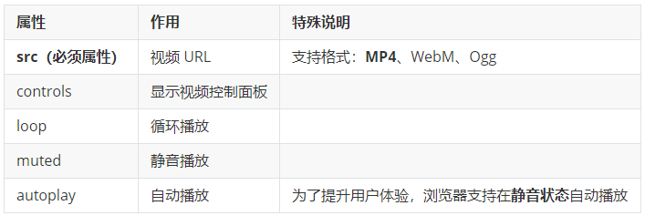
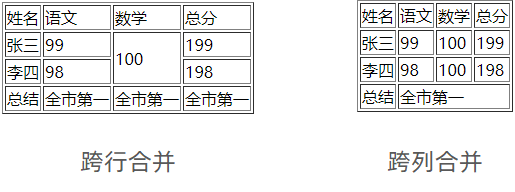
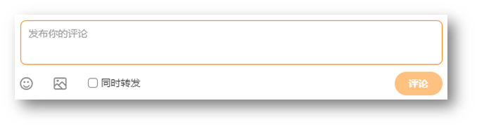
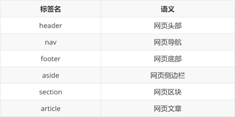

# html学习笔记

HTML 是指HTML超文本标记语言——HyperText Markup Language。

## 01-HTML结构

* html：整个网页
* head：网页头部，用来存放给浏览器看的信息，例如 CSS
  * title：网页标题
* body：网页主体，用来存放给用户看的信息，例如图片、文字

```html
<html>
  <head>
    <title>网页标题</title>
  </head>
  <body>
    网页主体
  </body>
</html>
```

> 提示
>
> VS Code 可以快速生成骨架：在 HTML 文件（.html）中，!（英文）配合 Enter / Tab 键

## 02-注释

概念：注释是对代码的解释和说明，能够提高程序的可读性，方便理解、查找代码。

注释不会再浏览器中显示。

在 VS Code 中，**添加 / 删除**注释的快捷键：**Ctrl + /** 

## 03-标签元素

1.块级元素：一个标签独占一行

包含：body html div 

  **h1-h6**  一级---六级标题 **p**  段落标签 **form** 表单元素

h5中新增的块级元素：header footer nav asidebody  身体 html  全文档 form  表单标签


2.行类标签：多个标签可以放在同一行

包含：a 超链接  span  img  图片  input 输入框元素

 text  strong 加粗 b(加粗字体) i(斜体) u 下划线 s 删除线 buttton 按钮

```html
<a herf='baidu.com'>百度</a>
<input type='text'/><--!文本输入框-->

<button>点一下</button>


```

### 3.1-a标签

超链接默认是在当前窗口跳转页面，添加 **target="_blank"** 实现**新窗口**打开页面。

在开发初期，不确定跳转地址，则 href 属性值写为 **#**，表示**空链接**，页面不会跳转，在当前页面刷新一次

```html
<a href="https://www.baidu.com/">跳转到百度</a>

<!-- 跳转到本地文件：相对路径查找 --> 
<!-- target="_blank" 新窗口跳转页面 --> 
<a href="./01-标签的写法.html" target="_blank">跳转到01-标签的写法</a>

<!-- 开发初期，不知道超链接的跳转地址，href属性值写#，表示空链接，不会跳转 -->
<a href="#">空链接</a>
```

### 3-2-音频

```html
<audio src="音频的 URL"></audio>
```

常用属性


> 拓展：书写 HTML5 属性时，如果属性名和属性值相同，可以简写为一个单词。 

```html
<!-- 在 HTML5 里面，如果属性名和属性值完全一样，可以简写为一个单词 -->
<audio src="./media/music.mp3" controls loop autoplay></audio>
```

### 3-3-视频

```html
<video src="视频的 URL"></video>
```

常用属性



```html
<!-- 在浏览器中，想要自动播放，必须有 muted 属性 -->
<video src="./media/vue.mp4" controls loop muted autoplay></video>
```

## 04-列表

作用：布局内容排列整齐的区域。

列表分类：无序列表、有序列表、定义列表。

### 4-1-无序列表

作用：布局排列整齐的**不需要规定顺序**的区域。

标签：ul 嵌套 li，ul 是无序列表，li 是列表条目。

```html
<ul>
  <li>第一项</li>
  <li>第二项</li>
  <li>第三项</li>
  ……
</ul>
```

> 注意事项：
>
> * ul 标签里面只能包裹 li 标签
> * li 标签里面可以包裹任何内容

### 4-2有序列表

作用：布局排列整齐的**需要规定顺序**的区域。

标签：ol 嵌套 li，ol 是有序列表，li 是列表条目。

```html
<ol>
  <li>第一项</li>
  <li>第二项</li>
  <li>第三项</li>
  ……
</ol>
```

> 注意事项：
>
> * ol 标签里面只能包裹 li 标签
> * li 标签里面可以包裹任何内容

### 4-3定义列表

标签：dl 嵌套 dt 和 dd，dl 是定义列表，dt 是定义列表的标题，dd 是定义列表的描述 / 详情。

```html
<dl>
  <dt>列表标题</dt>
  <dd>列表描述 / 详情</dd>
   ……
</dl>
```


> 注意事项：
>
> * dl 里面只能包含dt 和 dd
> * dt 和 dd 里面可以包含任何内容

## 05-表格

网页中的表格与 Excel 表格类似，用来展示数据。 


### 5-1基本使用

标签：table 嵌套 tr，tr 嵌套 td / th。 


> 提示：在网页中，**表格默认没有边框线**，使用 **border 属性**可以为表格添加边框线。 

```html
<table border="1">
  <tr>
    <th>姓名</th>
    <th>语文</th>
    <th>数学</th>
    <th>总分</th>
  </tr>
  <tr>
    <td>张三</td>
    <td>99</td>
    <td>100</td>
    <td>199</td>
  </tr>
  <tr>
    <td>李四</td>
    <td>98</td>
    <td>100</td>
    <td>198</td>
  </tr>
  <tr>
    <td>总结</td>
    <td>全市第一</td>
    <td>全市第一</td>
    <td>全市第一</td>
  </tr>
</table>
```

### 5-2表格结构标签

作用：用表格结构标签把内容划分区域，让表格结构更清晰，语义更清晰。


> 提示：表格结构标签可以省略。

### 5-3合并单元格

作用：将多个单元格合并成一个单元格，以合并同类信息。 



合并单元格的步骤：

1. 明确合并的目标
2. 保留**最左最上**的单元格，添加属性（取值是**数字**，表示需要**合并的单元格数量**）
   * **跨行合并**，保留最上单元格，添加属性 **rowspan**
   * **跨列合并**，保留最左单元格，添加属性 **colspan**
3. 删除其他单元格

```html
<table border="1">
  <thead>
    <tr>
      <th>姓名</th>
      <th>语文</th>
      <th>数学</th>
      <th>总分</th>
    </tr>
  </thead>
  <tbody>
    <tr>
      <td>张三</td>
      <td>99</td>
      <td rowspan="2">100</td>
      <td>199</td>
    </tr>
    <tr>
      <td>李四</td>
      <td>98</td>
      <!-- <td>100</td> -->
      <td>198</td>
    </tr>
  </tbody>
  <tfoot>
    <tr>
      <td>总结</td>
      <td colspan="3">全市第一</td>
      <!-- <td>全市第一</td>
      <td>全市第一</td> -->
    </tr>
  </tfoot>
</table>
```

> 注意：不能跨表格结构标签合并单元格（thead、tbody、tfoot）。

## 06-表单

作用：收集用户信息。

使用场景：

* 登录页面
* 注册页面
* 搜索区域

### 6-1-input 标签

input 标签 type 属性值不同，则功能不同。 

```html
<input type="..." >
```


### 6-2-input 标签占位文本 

占位文本：提示信息，文本框和密码框都可以使用。 

```html
<input type="..." placeholder="提示信息">
```

### 6-3-单选框

常用属性


```html
<input type="radio" name="gender" checked> 男
<input type="radio" name="gender"> 女
```

> 提示：name 属性值自定义。

### 6-4-上传文件 

默认情况下，文件上传表单控件只能上传一个文件，添加 multiple 属性可以实现文件多选功能。

```html
<input type="file" multiple>
```

### 6-5-多选框

多选框也叫复选框，默认选中：checked。

```html
<input type="checkbox" checked> 敲前端代码
```

### 6-6-下拉菜单


标签：select 嵌套 option，select 是下拉菜单整体，option是下拉菜单的每一项。

```html
<select>
  <option>北京</option>
  <option>上海</option>
  <option>广州</option>
  <option>深圳</option>
  <option selected>武汉</option>
</select>
```

> 默认显示第一项，**selected** 属性实现**默认选中**功能。

### 6-7-文本域

作用：多行输入文本的表单控件。 



```html
<textarea>默认提示文字</textarea>
```

> 注意点：
>
> * 实际开发中，使用 CSS 设置 文本域的尺寸
> * 实际开发中，一般禁用右下角的拖拽功能

### 6-8-label 标签 

作用：网页中，某个标签的说明文本。 


经验：用 label 标签绑定文字和表单控件的关系，增大表单控件的点击范围。 


* 写法一
  * label 标签只包裹内容，不包裹表单控件
  * 设置 label 标签的 for 属性值 和表单控件的 id 属性值相同

```html
<input type="radio" id="man">
<label for="man">男</label>
```

* 写法二：使用 label 标签包裹文字和表单控件，不需要属性 

```html
<label><input type="radio"> 女</label>
```

> 提示：支持 label 标签增大点击范围的表单控件：文本框、密码框、上传文件、单选框、多选框、下拉菜单、文本域等等。 

### 6-9-按钮

```html
<button type="">按钮</button>
```


```html
<!-- form 表单区域 -->
<!-- action="" 发送数据的地址 -->
<form action="">
  用户名：<input type="text">
  <br><br>
  密码：<input type="password">
  <br><br>

  <!-- 如果省略 type 属性，功能是 提交 -->
  <button type="submit">提交</button>
  <button type="reset">重置</button>
  <button type="button">普通按钮</button>
</form>
```

> 提示：按钮需配合 form 标签（表单区域）才能实现对应的功能。

## 07-语义化

### 7-1无语义的布局标签 

作用：布局网页（划分网页区域，摆放内容）

* div：独占一行
* span：不换行

```html
<div>div 标签，独占一行</div>
<span>span 标签，不换行</span>
```

### 7-2-有语义的布局标签



## 08-字符实体


