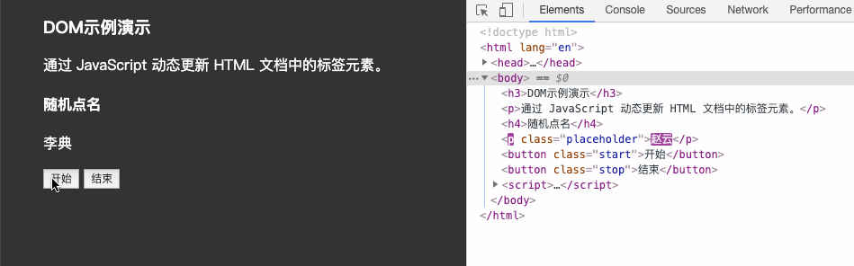
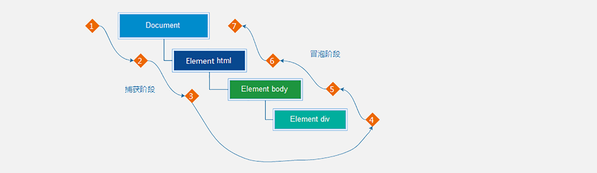

# JavaScript进阶

## 一.进阶引入

DOM（Document Object Model）是将整个 HTML 文档的每一个标签元素视为一个对象，这个对象下包含了许多的属性和方法，通过操作这些属性或者调用这些方法实现**对 HTML 的动态更新**，为实现网页特效以及用户交互提供技术支撑。

简言之 DOM 是用来动态修改 HTML 的，其目的是开发网页特效及用户交互。

观察一个小例子：



上述的例子中当用户分分别点击【开始】或【结束】按钮后，通过右侧调试窗口可以观察到 html 标签的内容在不断的发生改变，这便是通过 DOM 实现的。

#### 1.DOM 树

```html
<!DOCTYPE html>
<html lang="en">
<head>
  <meta charset="UTF-8">
  <meta name="viewport" content="width=device-width, initial-scale=1.0">
  <title>标题</title>
</head>
<body>
  文本
  <a href="">链接名</a>
  <div id="" class="">文本</div>
</body>
</html>
```

如下图所示，将 HTML 文档以树状结构直观的表现出来，我们称之为文档树或 DOM 树，**文档树直观的体现了标签与标签之间的关系。**


#### 2.DOM 节点

节点是文档树的组成部分，**每一个节点都是一个 DOM 对象**，主要分为元素节点、属性节点、文本节点等。

1. 【元素节点】其实就是 HTML 标签，如上图中 `head`、`div`、`body` 等都属于元素节点。
2. 【属性节点】是指 HTML 标签中的属性，如上图中 `a` 标签的 `href` 属性、`div` 标签的 `class` 属性。
3. 【文本节点】是指 HTML 标签的文字内容，如 `title` 标签中的文字。
4. 【根节点】特指 `html` 标签。

#### 3.document

`document` 是 JavaScript 内置的专门用于 DOM 的对象，该对象包含了若干的属性和方法，`document` 是学习 DOM 的核心。

```html
<script>
  // document 是内置的对象
  // console.log(typeof document);

  // 1. 通过 document 获取根节点
  console.log(document.documentElement); // 对应 html 标签

  // 2. 通过 document 节取 body 节点
  console.log(document.body); // 对应 body 标签

  // 3. 通过 document.write 方法向网页输出内容
  document.write('Hello World!');
</script>
```

上述列举了 `document` 对象的部分属性和方法，我们先对 `document` 有一个整体的认识。

### 4.获取DOM对象

1. querySelector   满足条件的第一个元素
2. querySelectorAll  满足条件的元素集合 返回伪数组
3. getElementById 根据元素的 `id` 属性值获取文档中的单个元素
4. getElementsByTagName根据元素的**标签名**获取文档中的所有元素，返回一个伪数组
5. getElementsByClassName根据元素的 `class` 名获取文档中的所有元素，返回一个伪数组
6. **`getElementsByName()`**根据元素的 `name` 属性获取文档中的所有元素，返回一个伪数组。

​	

```html
<!DOCTYPE html>
<html lang="en">
<head>
  <meta charset="UTF-8">
  <meta name="viewport" content="width=device-width, initial-scale=1.0">
  <title>DOM - 查找节点</title>
</head>
<body>
  <h3>查找元素类型节点</h3>
  <p>从整个 DOM 树中查找 DOM 节点是学习 DOM 的第一个步骤。</p>
  <ul>
      <li>元素</li>
      <li>元素</li>
      <li>元素</li>
      <li>元素</li>
  </ul>
  <script>
  	const p = document.querySelector('p')  // 获取第一个p元素
  	const lis = document.querySelectorAll('li')  // 获取第一个p元素
  </script>
</body>
</html>
```

### 5.操作元素内容

通过修改 DOM 的文本内容，动态改变网页的内容。

1. `innerText` 将文本内容添加/更新到任意标签位置，**文本中包含的标签不会被解析。**

```html
<script>
  // innerText 将文本内容添加/更新到任意标签位置
  const intro = document.querySelector('.intro')
  // intro.innerText = '嗨~ 我叫李雷！'
</script>
```

2. `innerHTML` 将文本内容添加/更新到任意标签位置，**文本中包含的标签会被解析。**

```html
<script>
  // innerHTML 将文本内容添加/更新到任意标签位置
  const intro = document.querySelector('.intro')
  intro.innerHTML = '<h4>嗨~ 我叫韩梅梅！</h4>'
</script>
```

#### 5.1常用属性修改

1. 直接能过属性名修改，最简洁的语法

```html
<script>
  // 1. 获取 img 对应的 DOM 元素
  const pic = document.querySelector('.pic')
	// 2. 修改属性
  pic.src = './images/lion.webp'
  pic.width = 400;
  pic.alt = '图片不见了...'
</script>
```

#### 5.2控制样式属性

1. **应用【修改样式】，通过修改行内样式 `style` 属性，实现对样式的动态修改**。

通过元素节点获得的 `style` 属性本身的数据类型也是对象，如 `box.style.color`、`box.style.width` 分别用来获取元素节点 CSS 样式的 `color` 和 `width` 的值。

```html
<body>
  <div class="box">随便一些文本内容</div>
  <script>
    // 获取 DOM 节点
    const box = document.querySelector('.intro')
    box.style.color = 'red'
    box.style.width = '300px'
    // css 属性的 - 连接符与 JavaScript 的 减运算符
    box.style.backGroundColor = 'pink'
  </script>
</body>
```

任何标签都有 `style` 属性，通过 `style` 属性可以动态更改网页标签的样式，**遇到 `css` 属性中包含字符 `-` 时，要将 `-` 去掉并将其后面的字母改成大写**

2. **操作类名(className) 操作CSS**

如果修改的样式比较多，直接通过style属性修改比较繁琐，我们可以通过借助于css类名的形式。

~~~html
<head>
  <title>练习 - 修改样式</title>
    <style>
        .pink {
            background: pink;
            color: hotpink;
        }
    </style>
</head>
<body>
  <div class="box">随便一些文本内容</div>
  <script>
    // 获取 DOM 节点
    const box = document.querySelector('.intro')
    box.className = 'pink'
  </script>
</body>
</html>
~~~

>注意：
>
>**1.由于class是关键字, 所以使用className去代替**
>
>2.className是使用新值换旧值, 如果需要添加一个类,需要保留之前的类名

3. 通过 classList 操作类控制CSS

可以通过classList方式追加和删除类名 **add('类名')追加   toggle('类名')切换   remove('类名')删除**

~~~html
<head>
    <title>Document</title>
    <style>
        div {
            width: 200px;
            height: 200px;
            background-color: pink;
        }
        .active {
            width: 300px;
            height: 300px;
            background-color: hotpink;
            margin-left: 100px;
        }
    </style>
</head>
<body>
    <div class="one"></div>
    <script>
        let box = document.querySelector('div')
        // add是个方法 添加  追加
        // box.classList.add('active')
        // remove() 移除 类
        // box.classList.remove('one')
        // 切换类
        box.classList.toggle('one')
    </script>
</body>
~~~

#### 5.3操作表单元素属性

获取:DOM对象.属性名 设置:DOM对象.属性名= 新值

~~~html
<body>
    <input type="text" value="请输入">
    <button disabled>按钮</button>
    <input type="checkbox" name="" id="" class="agree">
    <script>
        // 1. 获取元素
        let input = document.querySelector('input')
        // 2. 取值或者设置值  得到input里面的值可以用 value
        // console.log(input.value)
        input.value = '小米手机'
        input.type = 'password'
        // 2. 启用按钮
        let btn = document.querySelector('button')
        // disabled 不可用   =  false  这样可以让按钮启用
        btn.disabled = false
        // 3. 勾选复选框
        let checkbox = document.querySelector('.agree')
        checkbox.checked = false
    </script>
</body>
~~~

#### 5.4自定义属性(重点)

标准属性: 标签天生自带的属性 比如class id title等, 可以直接使用点语法操作比如： disabled、checked、selected

自定义属性：

在html5中推的**data-自定义属性**  ；在标签上一律以data-开头

在DOM对象上一律**以dataset对象方式**获取

~~~html
<body>
   <div data-id="1"> 自定义属性 </div>
    <script>
        // 1. 获取元素
        let div = document.querySelector('div')
        // 2. 获取自定义属性值
         console.log(div.dataset.id)
      
    </script>
</body>
~~~

### 6.间歇函数（定时器setInterval）

> 知道间歇函数的作用，利用间歇函数创建定时任务。

`setInterval` 在指定的延迟时间后执行一次函数或代码片段

​	（例如一秒执行一次） 单位:毫秒  1000毫秒=1秒

结束定时器：通过

```html
function showTime() {
  let now = new Date();
  console.log(now.toLocaleTimeString());
}
// 每隔 1 秒显示当前时间
let timerId = setInterval(showTime, 1000);
// 输出：(每隔 1 秒) 当前时间

//结束定时器
clearInterval(timerId);

```

### 7.延时器（**`setTimeout`**）

按照指定的延迟时间重复执行函数或代码片段。

```js
function greet(name) {
  console.log(`Hello, ${name}!`);
}
// 延迟 2 秒后执行 greet 函数
let timerId = setTimeout(greet, 2000, 'Alice');
// 输出：(2 秒后) Hello, Alice!

//取消延时器
clearTimeout(timerId);
```


## 二.事件（掌握）

事件是编程语言中的术语，它是用来描述程序的行为或状态的，**一旦行为或状态发生改变，便立即调用一个函数。**

### 1.事件监听

结合 DOM 使用事件时，为 DOM 对象添加事件监听，等待事件触发时，便立即调用一个函数。

`addEventListener` 为Dom对象添加事件监听，它的两个参数分别为【事件类型】和【事件回调】(事件发生要产生的结果)。

```html
<body>
  <h3>事件监听</h3>
  <p id="text">为 DOM 元素添加事件监听，等待事件发生，便立即执行一个函数。</p>
  <button id="btn">点击改变文字颜色</button>
  <script>
    // 1. 获取 button 对应的 DOM 对象
    const btn = document.querySelector('#btn')

    // 2. 添加事件监听
    btn.addEventListener('click', function () {
      console.log('等待事件被触发...')
      // 改变 p 标签的文字颜色
      let text = document.getElementById('text')
      text.style.color = 'red'
    })
  </script>
</body>
```

完成事件监听分成3个步骤：

1. 获取 DOM 元素
2. 通过 `addEventListener` 方法为 DOM 节点添加事件监听
3. 等待事件触发
4. 事件触发后，相对应的回调函数会被执行

事件就是无非就是找个机会（事件触发）调用一个函数（回调函数）。

### 2.事件类型

`click` 点击事件 ：是监听用户鼠标的单击操作，除了【单击】还有【双击】`dblclick`

```html
<script>
  // 双击事件类型
  btn.addEventListener('dblclick', function () {
    const text = document.querySelector('.text')
    text.style.color = 'red'
  })
</script>
```

### 3.事件处理程序

`addEventListener` 的第2个参数是函数，这个函数会在事件被触发时立即被调用，在这个函数中可以编写任意逻辑的代码（对Dom元素操作的代码）

```html
<script>
  // 双击事件类型
  btn.addEventListener('dblclick', function () {
    console.log('等待事件被触发...')
    
    const text = document.querySelector('.text')
    // 改变 p 标签的文字颜色
    text.style.color = 'red'
    // 改变 p 标签的文本内容
    text.style.fontSize = '20px'
  })
</script>
```

结论：【事件处理程序】决定了事件触发后应该执行的逻辑。


### 4.事件类型

事件类型可分为：鼠标事件、键盘事件、表单事件、焦点事件等。

#### 4.1鼠标事件

鼠标事件是指跟鼠标操作相关的事件

1.**鼠标移入事件：mouseenter**/ mouseover监听鼠标是否移入 DOM 元素

2.**鼠标移出事件：mouseleave** /mouseout监听鼠标是否移出 DOM 元素

```html
<body>
  <h3>鼠标事件</h3>
  <p>监听与鼠标相关的操作</p>
  <hr>
  <div class="box"></div>
  <script>
    // 需要事件监听的 DOM 元素
    const box = document.querySelector('.box');

      // 监听鼠标是移入当前 DOM 元素
    box.addEventListener('mouseenter', function () {
      // 修改文本内容
      this.innerText = '鼠标移入了...';
      // 修改光标的风格
      this.style.cursor = 'move';
    })
      
    // 监听鼠标是移出当前 DOM 元素
    box.addEventListener('mouseleave', function () {
      // 修改文本内容
      this.innerText = '鼠标移出了...';
    })
      
  </script>
</body>
```

####  4.2键盘事件

keydown   键盘按下触发
keyup   键盘抬起触发

#### 4.3焦点事件

focus  获得焦点

blur 失去焦点

#### 4.4文本框输入事件

input  

#### 4.5页面加载事件

加载外部资源（如图片、外联CSS和JavaScript等）加载完毕时触发的事件

有些时候需要等页面资源全部处理完了做一些事情

**事件名：load**

监听页面所有资源加载完毕：

~~~javascript
window.addEventListener('load', function() {
    // xxxxx
})
~~~

#### 4.6元素滚动事件

滚动条在滚动的时候持续触发的事件

~~~javascript
window.addEventListener('scroll', function() {
    // xxxxx
})
~~~

#### 4.7页面尺寸事件（页面变化事件)

会在窗口尺寸改变的时候触发事件：

~~~javascript
window.addEventListener('resize', function() {
    // xxxxx
})
~~~

#### 4.8元素尺寸与位置

获取元素的自身宽高、包含元素自身设置的宽高、padding、border

offsetWidth和offsetHeight  获取出来的是数值,方便计算

注意: 获取的是可视宽高, 如果盒子是隐藏的,获取的结果是0

#### 4.9change 事件

监听事件是否发生变化 

常用语输入框的监听 以及对于掌握状态的变化

```html
<body>
    <div >
		<input type='text' class='box'>
    </div>
    <scrpit>
        document.querySelector('.box').addEventListener('change', function() {
    // xxxxx
})
    </scrpit>
</body>
```


## 5.事件对象(event重点)

任意事件类型被触发时与事件相关的信息会被以对象的形式记录下来，我们称这个对象为事件对象。

通常以（e/ev/event)表示

```html
<body>
  <h3>事件对象</h3>
  <hr>
  <div class="box"></div>
  <script>
    // 获取 .box 元素
    const box = document.querySelector('.box')
    // 添加事件监听
    box.addEventListener('click', function (e) {
      console.log('任意事件类型被触发后，相关信息会以对象形式被记录下来...');
      // 事件回调函数的第1个参数即所谓的事件对象
      console.log(e)
    })
  </script>
</body>
```

事件对象中包含的信息：

1. `ev.type` 当前事件的类型
2. `ev.clientX/Y` 光标相对浏览器窗口的位置
3. `ev.offsetX/Y` 光标相于当前 DOM 元素的位置

注：在事件回调函数内部通过 window.event 同样可以获取事件对象。

## 6.回调函数(重点)

如果将函数 A 做为参数传递给函数 B 时，我们称函数 A 为回调函数。

```html
<script>
  // 声明 foo 函数
  function foo(arg) {
    console.log(arg);
  }
  // 普通的值做为参数
  foo(10);
  foo('hello world!');
  foo(['html', 'css', 'javascript']);

  function bar() {
    console.log('函数也能当参数...');
  }
  // 函数也可以做为参数形成回调函数
  foo(bar);
</script>
```

常用的回调函数：`fn` 函数做为参数传给了 `setInterval` 

```html
<script>
	function fn() {
    console.log('我是回调函数...');
  }
  // 调用定时器
  setInterval(fn, 1000);
</script>
```

## 三.事件流

事件流是对事件执行过程的描述 ，记载事件的运行流程



如图所示，任意事件被触发时总会有两个阶段：【捕获阶段】和【冒泡阶段】。

捕获阶段是【从父到子】的传导过程，冒泡阶段是【从子向父】的传导过程。

### 1.捕获和冒泡

1.结合事件流的特征，当某个元素的事件被触发时，事件总是会先经过其祖先才能到达当前元素，然后再由当前元素向祖先传递，事件在流动的过程中遇到相同的事件便会被触发。

2.事件相继触发的【执行顺序】，事件的执行顺序是可控制的，即可以在捕获阶段被执行，也可以在冒泡阶段被执行。

3.如果事件是在冒泡阶段执行的，我们称为冒泡模式，它会先执行子盒子事件再去执行父盒子事件，默认是冒泡模式。

4.如果事件是在捕获阶段执行的，我们称为捕获模式，它会先执行父盒子事件再去执行子盒子事件。

为事件**添加true**在捕获阶段执行事件

```html
<body>
  <h3>事件流</h3>
  <p>事件流是事件在执行时的底层机制，主要体现在父子盒子之间事件的执行上。</p>
  <div class="outer">
    <div class="inner"></div>
  </div>
  <script>
    // 获取嵌套的3个节点
    const outer = document.querySelector('.outer')
    const inner = document.querySelector('.inner')

    // 外层的盒子
    outer.addEventListener('click', function () {
      console.log('outer...')
    }, true) // true 表示在捕获阶段执行事件
    
    // 中间的盒子
    outer.addEventListener('click', function () {
      console.log('inner...')
    }, true)
  </script>
</body>
```

结论：

1. `addEventListener` 第3个参数决定了事件是在捕获阶段触发还是在冒泡阶段触发
2. `addEventListener` 第3个参数为  `true` 表示捕获阶段触发，`false` 表示冒泡阶段触发，默认值为 `false`
3. 事件流只会在父子元素具有相同事件类型时才会产生影响
4. 绝大部分场景都采用默认的冒泡模式

### 2.阻止冒泡

阻止冒泡是指阻断事件的流动，保证事件只在当前元素被执行，而不再去影响到其对应的祖先元素。

```html
<body>
  <h3>阻止冒泡</h3>
  <div class="outer">
      <div class="child"></div>
    </div>
  </div>
  <script>
    const outer = document.querySelector('.outer')
    const child = document.querySelector('.child')
    // 外层的盒子
    outer.addEventListener('click', function () {
      console.log('outer...')
    })
    // 内层的盒子
    child.addEventListener('click', function (e) {
      console.log('child...')

      // 借助事件对象，阻止事件向上冒泡
      e.stopPropagation()
    })
  </script>
</body>
```

结论：事件对象中的 `e.stopPropagation` 方法，专门用来阻止事件冒泡。

>**鼠标经过事件：**
>
>**mouseover 和 mouseout 会有冒泡效果**
>
>**mouseenter  和 mouseleave   没有冒泡效果 (推荐)**

## 四.事件委托(重点)

事件委托是利用事件流的特征解决一些现实开发需求的知识技巧，**主要的作用是提升程序效率。**

大量的事件监听是比较耗费性能的，如下代码所示

```html
<script>
  // 假设页面中有 10000 个 button 元素
  const buttons = document.querySelectorAll('table button');

  for(let i = 0; i <= buttons.length; i++) {
    // 为 10000 个 button 元素添加了事件
    buttons.addEventListener('click', function () {
      // 省略具体执行逻辑...
    })
  }
</script>
```

利用事件流的特征，可以对上述的代码进行优化，事件的的冒泡模式总是会将事件流向其父元素的，如果父元素监听了相同的事件类型，那么父元素的事件就会被触发并执行，正是利用这一特征对上述代码进行优化，如下代码所示：

```html
<script>
  // 假设页面中有 10000 个 button 元素
  let buttons = document.querySelectorAll('table button');
  
  // 假设上述的 10000 个 buttom 元素共同的祖先元素是 table
  let parents = document.querySelector('table');
  parents.addEventListener('click', function () {
    console.log('点击任意子元素都会触发事件...');
  })
</script>
```

我们的最终目的是保证只有点击 button 子元素才去执行事件的回调函数，如何判断用户点击是哪一个子元素呢？


**事件对象中的属性 `target` 或 `srcElement`属性表示真正触发事件的元素，它是一个元素类型的节点**

```html
<script>
  // 假设页面中有 10000 个 button 元素
  const buttons = document.querySelectorAll('table button')
  
  // 假设上述的 10000 个 buttom 元素共同的祖先元素是 table
  const parents = document.querySelector('table')
  parents.addEventListener('click', function (ev) {
    // console.log(ev.target);
    // 只有 button 元素才会真正去执行逻辑
    if(ev.target.tagName === 'BUTTON') {
      // 执行的逻辑
    }
  })
</script>
```

优化过的代码只对祖先元素添加事件监听，相比对 10000 个元素添加事件监听执行效率要高许多！！！

## 五.日期对象(掌握)

掌握 Date 日期对象的使用，动态获取当前计算机的时间。

### 1.实例化

```js
 const date = new Date(); // 系统默认时间
 const date = new Date('2020-05-01') // 指定时间
```

### 2.方法

getFullYear 获取四位年份

getMonth 获取月份，取值为 0 ~ 11

getDate 获取月份中的每一天，不同月份取值也不相同

getDay 获取星期，取值为 0 ~ 6

getHours 获取小时，取值为 0 ~ 23

getMinutes 获取分钟，取值为 0 ~ 59

getSeconds 获取秒，取值为 0 ~ 59

```js
  // 1. 实例化
 const date = new Date();
 // 2. 调用时间对象方法
 // 通过方法分别获取年、月、日，时、分、秒
 const year = date.getFullYear(); // 四位年份
 const month = date.getMonth()+1; // 0 ~ 11
```

### 3.时间戳

时间戳是指1970年01月01日00时00分00秒起至现在的总秒数或毫秒数，它是一种特殊的计量时间的方式。

获取时间戳的方法:getTime 和 Date.now 和  +new Date()

```js

 const date = new Date()
  // 2. 获取时间戳
  console.log(date.getTime())
  console.log(+new Date())
  console.log(Date.now())

```

## 六.操作Dom节点

### 1.插入节点

在已有的 DOM 节点中插入新的 DOM 节点时，需要关注两个关键因素：首先要得到新的 DOM 节点，其次在哪个位置插入这个节点。

- **`createElement` 动态创建任意 DOM 节点**

- **`cloneNode` 复制现有的 DOM 节点，传入参数 true 会复制所有子节点**

- **`appendChild` 在末尾（结束标签前）插入节点**

```html
<body>
  <h3>插入节点</h3>
  <p>在现有 dom 结构基础上插入新的元素节点</p>
  <hr>
  <!-- 普通盒子 -->
  <div class="box"></div>
  <!-- 点击按钮向 box 盒子插入节点 -->
  <button class="btn">插入节点</button>
  <script>
    // 点击按钮，在网页中插入节点
    const btn = document.querySelector('.btn')
    btn.addEventListener('click', function () {
      // 1. 获得一个 DOM 元素节点
      const p = document.createElement('p')
      p.innerText = '创建的新的p标签'
      p.className = 'info'
      
      // 复制原有的 DOM 节点
      const p2 = document.querySelector('p').cloneNode(true)
      p2.style.color = 'red'

      // 2. 插入盒子 box 盒子
      document.querySelector('.box').appendChild(p)
      document.querySelector('.box').appendChild(p2)
    })
  </script>
</body>

```

2.插入节点

- **`createElement` 动态创建任意 DOM 节点**

- **`cloneNode` 复制现有的 DOM 节点，传入参数 true 会复制所有子节点**

- **`insertBefore` 在父节点中任意子节点之前插入新节点**

```html
<body>
  <h3>插入节点</h3>
  <p>在现有 dom 结构基础上插入新的元素节点</p>
	<hr>
  <button class="btn1">在任意节点前插入</button>
  <ul>
    <li>HTML</li>
    <li>CSS</li>
    <li>JavaScript</li>
  </ul>
  <script>
    // 点击按钮，在已有 DOM 中插入新节点
    const btn1 = document.querySelector('.btn1')
    btn1.addEventListener('click', function () {

      // 第 2 个 li 元素
      const relative = document.querySelector('li:nth-child(2)')

      // 1. 动态创建新的节点
      const li1 = document.createElement('li')
      li1.style.color = 'red'
      li1.innerText = 'Web APIs'

      // 复制现有的节点
      const li2 = document.querySelector('li:first-child').cloneNode(true)
      li2.style.color = 'blue'

      // 2. 在 relative 节点前插入
      document.querySelector('ul').insertBefore(li1, relative)
      document.querySelector('ul').insertBefore(li2, relative)
    })		
  </script>
</body>
```

### 2.删除节点

删除现有的 DOM 节点，也需要关注两个因素：首先由父节点删除子节点，其次是要删除哪个子节点。

**通过`removeChild` 删除节点时一定是由父子关系。**

```html
<body>
  <!-- 点击按钮删除节点 -->
  <button>删除节点</button>
  <ul>
    <li>HTML</li>
    <li>CSS</li>
    <li>Web APIs</li>
  </ul>

  <script>
    const btn = document.querySelector('button')
    btn.addEventListener('click', function () {
      // 获取 ul 父节点
      let ul = document.querySelector('ul')
      // 待删除的子节点
      let lis = document.querySelectorAll('li')

      // 删除节点
      ul.removeChild(lis[0])//ul.removechild(ul.children[0])
    })
  </script>
</body>
```

### 3查找节点

DOM 树中的任意节点都不是孤立存在的，它们要么是父子关系，要么是兄弟关系，不仅如此，我们可以依据节点之间的关系查找节点。

#### 3.1父子关系

- **`childNodes` 获取全部的子节点，回车换行会被认为是空白文本节点**
- **`children` 只获取元素类型节点**

```html
<body>
  <button class="btn1">所有的子节点</button>
  <!-- 获取 ul 的子节点 -->
  <ul>
    <li>HTML</li>
    <li>CSS</li>
    <li>JavaScript 基础</li>
    <li>Web APIs</li>
  </ul>
  <script>
    const btn1 = document.querySelector('.btn1')
    btn1.addEventListener('click', function () {
      // 父节点
      const ul = document.querySelector('ul')

      // 所有的子节点
      console.log(ul.childNodes)
      // 只包含元素子节点
      console.log(ul.children)
    })
  </script>
</body>
```


**`parentNode` 获取父节点，以相对位置查找节点**

```html
<body>
  <table>
    <tr>
      <td width="60">序号</td>
      <td>课程名</td>
      <td>难度</td>
      <td width="80">操作</td>
    </tr>
    <tr>
      <td>1</td>
      <td><span>HTML</span></td>
      <td>初级</td>
      <td><button>变色</button></td>
    </tr>
    <tr>
      <td>2</td>
      <td><span>CSS</span></td>
      <td>初级</td>
      <td><button>变色</button></td>
    </tr>
    <tr>
      <td>3</td>
      <td><span>Web APIs</span></td>
      <td>中级</td>
      <td><button>变色</button></td>
    </tr>
  </table>
  <script>
    // 获取所有 button 节点，并添加事件监听
    const buttons = document.querySelectorAll('table button')
    for(let i = 0; i < buttons.length; i++) {
      buttons[i].addEventListener('click', function () {
        // console.log(this.parentNode); // 父节点 td
        // console.log(this.parentNode.parentNode); // 爷爷节点 tr
        this.parentNode.parentNode.style.color = 'red'
      })
    }
  </script>
</body>
```


#### 3.2兄弟关系

- **`previousSibling` 获取前一个节点，以相对位置查找节点。**
- **`nextSibling` 获取后一个节点，以相对位置查找节点。**

```html
<body>
  <ul>
    <li>HTML</li>
    <li>CSS</li>
    <li>JavaScript 基础</li>
    <li>Web APIs</li>
  </ul>
  <script>
    // 获取所有 li 节点
    const lis = document.querySelectorAll('ul li')

    // 对所有的 li 节点添加事件监听
    for(let i = 0; i < lis.length; i++) {
      lis[i].addEventListener('click', function () {
        // 前一个节点
        console.log(this.previousSibling)
        // 下一下节点
        console.log(this.nextSibling)
      })
    }
  </script>
</body>
```


## 七.window对象

**JavaScript组成**


### 1.window对象

**BOM** (Browser Object Model ) 是浏览器对象模型

- window对象是一个全局对象，是JavaScript中的顶级对象
- document、alert()、console.log()这些都是window的属性，基本BOM的属性和方法都是window的
- 所有通过var定义在全局作用域中的变量、函数都会变成window对象的属性和方法
- window对象下的属性和方法调用的时候可以省略window


#### 1.1延时器（**`setTimeout`**）

按照指定的延迟时间重复执行函数或代码片段。

```js
function greet(name) {
  console.log(`Hello, ${name}!`);
}
// 延迟 2 秒后执行 greet 函数
let timerId = setTimeout(greet, 2000, 'Alice');
// 输出：(2 秒后) Hello, Alice!

//取消延时器
clearTimeout(timerId);
```

#### 2.定时器setInterval

`setInterval` 在指定的延迟时间后执行一次函数或代码片段

​	（例如一秒执行一次） 单位:毫秒  1000毫秒=1秒

```html
function showTime() {
  let now = new Date();
  console.log(now.toLocaleTimeString());
}
// 每隔 1 秒显示当前时间
let timerId = setInterval(showTime, 1000);
// 输出：(每隔 1 秒) 当前时间

//结束定时器
clearInterval(timerId);
```

#### 3.location对象 (重点)

location (地址) 它拆分并保存了 URL 地址的各个组成部分， 它是一个对象

| 属性/方法 | 说明                                                 |
| --------- | ---------------------------------------------------- |
| href      | 属性，获取完整的 URL 地址，赋值时用于地址的跳转      |
| search    | 属性，获取地址中携带的参数，符号 ？后面部分          |
| hash      | 属性，获取地址中的啥希值，符号 # 后面部分            |
| reload()  | 方法，用来刷新当前页面，传入参数 true 时表示强制刷新 |

~~~html
<body>
  <form>
    <input type="text" name="search"> <button>搜索</button>
  </form>
  <a href="#/music">音乐</a>
  <a href="#/download">下载</a>
  <button class="reload">刷新页面</button>
  <script>
    // location 对象  
    // 1. href属性 （重点） 得到完整地址，赋值则是跳转到新地址
    console.log(location.href)
    // location.href = 'http://www.itcast.cn'

    // 2. search属性  得到 ? 后面的地址 
    console.log(location.search)  // ?search=笔记本

    // 3. hash属性  得到 # 后面的地址
    console.log(location.hash)

    // 4. reload 方法  刷新页面
    const btn = document.querySelector('.reload')
    btn.addEventListener('click', function () {
      // location.reload() // 页面刷新
      location.reload(true) // 强制页面刷新 ctrl+f5
    })
  </script>
</body>
~~~

#### 4.navigator对象（了解）

navigator是对象，该对象下记录了浏览器自身的相关信息

~~~javascript
// 检测 userAgent（浏览器信息）
(function () {
  const userAgent = navigator.userAgent
  // 验证是否为Android或iPhone
  const android = userAgent.match(/(Android);?[\s\/]+([\d.]+)?/)
  const iphone = userAgent.match(/(iPhone\sOS)\s([\d_]+)/)
  // 如果是Android或iPhone，则跳转至移动站点
  if (android || iphone) {
    location.href = 'http://m.itcast.cn'
  }})();
~~~

#### 5.histroy对象

history (历史)是对象，主要管理历史记录， 该对象与浏览器地址栏的操作相对应，如前进、后退等

 

~~~html
<body>
  <button class="back">←后退</button>
  <button class="forward">前进→</button>
  <script>
    // histroy对象

    // 1.前进
    const forward = document.querySelector('.forward')
    forward.addEventListener('click', function () {
      // history.forward() 
      history.go(1)
    })
    // 2.后退
    const back = document.querySelector('.back')
    back.addEventListener('click', function () {
      // history.back()
      history.go(-1)
    })
  </script>
</body>

~~~

## 八.本地存储（重点）

本地存储：将数据存储在本地浏览器中

常见的使用场景：  页面刷新数据不丢失

好处：

1、页面刷新或者关闭不丢失数据，实现数据持久化

2、容量较大，sessionStorage和 localStorage 约 5M 左右

###  localStorage（重点）

**作用:** 数据可以长期保留在本地浏览器中，刷新页面和关闭页面，数据也不会丢失

**特性：**以键值对的形式存储，并且存储的是字符串， 省略了window

~~~html
<!DOCTYPE html>
<html lang="en">

<head>
  <meta charset="UTF-8">
  <meta http-equiv="X-UA-Compatible" content="IE=edge">
  <meta name="viewport" content="width=device-width, initial-scale=1.0">
  <title>本地存储-localstorage</title>
</head>

<body>
  <script>
    // 本地存储 - localstorage 存储的是字符串 
    // 1. 存储
    localStorage.setItem('age', 18)

    // 2. 获取
    console.log(typeof localStorage.getItem('age'))

    // 3. 删除
    localStorage.removeItem('age')
  </script>
</body>

</html>
~~~

### sessionStorage（了解）

特性：

- 用法跟localStorage基本相同
- 区别是：当页面浏览器被关闭时，存储在 sessionStorage 的数据会被清除

存储：sessionStorage.setItem(key,value)

获取：sessionStorage.getItem(key)

删除：sessionStorage.removeItem(key)

### localStorage 存储复杂数据类型

**问题：**本地只能存储字符串,无法存储复杂数据类型.

**解决：**需要将复杂数据类型转换成 JSON字符串,在存储到本地

**语法：**JSON.stringify(复杂数据类型)

JSON字符串：

- 首先是1个字符串
- 属性名使用双引号引起来，不能单引号
- 属性值如果是字符串型也必须双引号

~~~html
<body>
  <script>
    // 本地存储复杂数据类型
    const goods = {
      name: '小米',
      price: 1999
    }
    // localStorage.setItem('goods', goods)
    // console.log(localStorage.getItem('goods'))

    // 1. 把对象转换为JSON字符串  JSON.stringify
    localStorage.setItem('goods', JSON.stringify(goods))
    // console.log(typeof localStorage.getItem('goods'))

  </script>
</body>
~~~

**问题：**因为本地存储里面取出来的是字符串，不是对象，无法直接使用

**解决： **把取出来的字符串转换为对象

**语法：**JSON.parse(JSON字符串)

~~~html
<body>
  <script>
    // 本地存储复杂数据类型
    const goods = {
      name: '小米',
      price: 1999
    }
    // localStorage.setItem('goods', goods)
    // console.log(localStorage.getItem('goods'))

    // 1. 把对象转换为JSON字符串  JSON.stringify
    localStorage.setItem('goods', JSON.stringify(goods))
    // console.log(typeof localStorage.getItem('goods'))

    // 2. 把JSON字符串转换为对象  JSON.parse
    console.log(JSON.parse(localStorage.getItem('goods')))

  </script>
</body>
~~~


## 九.数组方法

### 1.数组map 方法

**使用场景：**map 可以遍历数组处理数据，并且返回新的数组

**语法：**

~~~javascript
<body>
  <script>
  const arr = ['red', 'blue', 'pink']
  // 1. 数组 map方法 处理数据并且 返回一个数组
   const newArr = arr.map(function (ele, index) {
    // console.log(ele)  // 数组元素
    // console.log(index) // 索引号
    return ele + '颜色'
	})
console.log(newArr)
</script>
</body>
~~~

>map 也称为映射。映射是个术语，指两个元素的集之间元素相互“对应”的关系。
>
>map重点在于有返回值，forEach没有返回值（undefined）

### 2.数组join方法

**作用：**join() 方法用于把数组中的所有元素转换一个字符串

**语法：**

~~~html
<body>
  <script>
    const arr = ['red', 'blue', 'pink']

    // 1. 数组 map方法 处理数据并且 返回一个数组
    const newArr = arr.map(function (ele, index) {
      // console.log(ele)  // 数组元素
      // console.log(index) // 索引号
      return ele + '颜色'
    })
    console.log(newArr)

    // 2. 数组join方法  把数组转换为字符串
    // 小括号为空则逗号分割
    console.log(newArr.join())  // red颜色,blue颜色,pink颜色
    // 小括号是空字符串，则元素之间没有分隔符
    console.log(newArr.join(''))  //red颜色blue颜色pink颜色
    console.log(newArr.join('|'))  //red颜色|blue颜色|pink颜色
  </script>
</body>
~~~


## 十.正则表达式

**正则表达式**（Regular Expression）是一种字符串匹配的模式（规则）

使用场景：

- 验证表单：手机号表单要求用户只能输入11位的数字 (匹配)
- 过滤掉页面内容中的一些敏感词(替换)，或从字符串中获取我们想要的特定部分(提取)等

### 1.正则基本使用

1. 定义规则

   ~~~JavaScript
   const reg =  /表达式/
   ~~~

   - 其中` /   / `是正则表达式字面量;正则表达式也是`对象 `

2. 使用正则

   - `test()方法`   用来查看正则表达式与指定的字符串是否匹配
   - 如果正则表达式与指定的字符串匹配 ，返回`true`，否则`fals

### 2.元字符

1. **普通字符:**

- 大多数的字符仅能够描述它们本身，这些字符称作普通字符，例如所有的字母和数字。
- 普通字符只能够匹配字符串中与它们相同的字符。    
- 比如，规定用户只能输入英文26个英文字母，普通字符的话  /[abcdefghijklmnopqrstuvwxyz]/

2. **元字符(特殊字符）**

- 是一些具有特殊含义的字符，可以极大提高了灵活性和强大的匹配功能。
- 比如，规定用户只能输入英文26个英文字母，换成元字符写法： /[a-z]/  

### 3.边界符

正则表达式中的边界符（位置符）用来提示字符所处的位置，主要有两个字符


>如果 ^ 和 $ 在一起，表示必须是精确匹配


### 4.量词

量词用来设定某个模式重复次数


> 注意： 逗号左右两侧千万不要出现空格

### 5.范围

表示字符的范围，定义的规则限定在某个范围，比如只能是英文字母，或者数字等等，用表示范围

 


### 6.字符类

某些常见模式的简写方式，区分字母和数字


### 7.替换和修饰符

replace 替换方法，可以完成字符的替换

 

~~~html
<body>
  <script>
    // 替换和修饰符
    const str = '欢迎大家学习前端，相信大家一定能学好前端，都成为前端大神'
    // 1. 替换  replace  需求：把前端替换为 web
    // 1.1 replace 返回值是替换完毕的字符串
    // const strEnd = str.replace(/前端/, 'web') 只能替换一个
  </script>
</body>
~~~

修饰符约束正则执行的某些细节行为，如是否区分大小写、是否支持多行匹配等

- i 是单词 ignore 的缩写，正则匹配时字母不区分大小写
- g 是单词 global 的缩写，匹配所有满足正则表达式的结果

~~~html
<body>
  <script>
    // 替换和修饰符
    const str = '欢迎大家学习前端，相信大家一定能学好前端，都成为前端大神'
    // 1. 替换  replace  需求：把前端替换为 web
    // 1.1 replace 返回值是替换完毕的字符串
    // const strEnd = str.replace(/前端/, 'web') 只能替换一个

    // 2. 修饰符 g 全部替换
    const strEnd = str.replace(/前端/g, 'web')
    console.log(strEnd) 
  </script>
</body>
~~~


