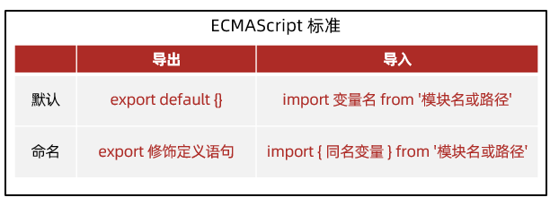
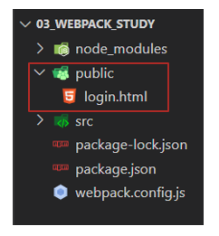

# 01_Node.js入门

## 01.什么是 Node.js

1. Node.js 是一个独立的 JavaScript 运行环境，能独立执行 JS 代码，因为这个特点，它可以用来编写服务器后端的应用程序

2. Node.js 作用除了编写后端应用程序，也可以对前端代码进行压缩，转译，整合等等，提高前端开发和运行效率

3. Node.js 基于Chrome V8 引擎封装，独立执行 JS 代码，但是语法和浏览器环境的 V8 有所不同，没有 document 和 window 但是都支持 ECMAScript 标准的代码语法

4. 想要得到 Node.js 需要把这个软件安装到电脑，在素材里有安装程序（window 和 mac 环境的）参考 PPT 默认下一步安装即可

5. Node.js 没有图形化界面，需要使用 cmd 终端命令行（利用一些命令来操控电脑执行某些程序软件）输入，node -v 检查是否安装成功

   ```bash
   node -v
   ```

   

6. 需求：新建 index.js 文件，编写打印代码和 for 循环打印 3 个 6

   ```js
   /**
    * 目标：编写 js 代码，用 node 命令执行
    * 终端作用：敲击命令，调用对应程序执行
    * 终端打开：目标文件->右键->在集成终端中打开
    * 命令：node xxx.js （注意路径）
    */
   console.log('Hello, World')
   for (let i = 0; i < 3; i++) {
     console.log(6)
   }
   ```

   

7. Node.js 执行目标 JS 文件，需要使用 node xxx.js 命令来执行（我们可以借助 VSCode 集成终端使用，好处：可以快速切换到目标 JS 文件所在终端目录，利用相对路径找到要执行的目标 JS 文件

   


## 02.fs模块-读写文件

1. 模块：类似插件，封装了方法和属性供我们使用

2. fs 模块：封装了与本机文件系统进行交互的，方法和属性

3. fs 模块使用语法如下：

   * 加载 fs 模块，得到 fs 对象

     ```js
     const fs = require('fs')
     ```

   * 写入文件内容语法：

     ```js
     fs.writeFile('文件路径', '写入内容', err => {
       // 写入后的回调函数
     })
     ```

   * 读取文件内容的语法：

     ```js
     fs.readFile('文件路径', (err, data) => {
       // 读取后的回调函数
       // data 是文件内容的 Buffer 数据流
     })
     ```


4. 需求：向 test.txt 文件写入内容并读取打印

   ```js
   /**
    * 目标：使用 fs 模块，读写文件内容
    * 语法：
    * 1. 引入 fs 模块
    * 2. 调用 writeFile 写入内容
    * 3. 调用 readFile  读取内容
    */
   // 1. 引入 fs 模块
   const fs = require('fs')
   // 2. 调用 writeFile 写入内容
   // 注意：建议写入字符串内容，会覆盖目标文件所有内容
   fs.writeFile('./text.txt', '欢迎使用 fs 模块读写文件内容', err => {
     if (err) console.log(err)
     else console.log('写入成功')
   })
   // 3. 调用 readFile  读取内容
   fs.readFile('./text.txt', (err, data) => {
     if (err) console.log(err)
     else console.log(data.toString()) // 把 Buffer 数据流转成字符串类型
   })
   ```

   

## 03.path模块-路径处理

1. 为什么在 Node.js 待执行的 JS 代码中要用绝对路径：

   > Node.js 执行 JS 代码时，代码中的路径都是以终端所在文件夹出发查找相对路径，而不是以我们认为的从代码本身出发，会遇到问题，所以在 Node.js 要执行的代码中，访问其他文件，建议使用绝对路径

2. 新建 03 文件夹编写待执行的 JS 代码，访问外层相对路径下的文件，<span style="color: red;">然后在最外层终端路径来执行目标文件，造成问题</span>

   

   


3. 问题原因：就是从代码文件夹出发，使用`../text.txt`解析路径，找不到目标文件，报错了！

4. 解决方案：使用模块内置变量 `__dirname`配合 path.join() 来得到绝对路径使用

   ```js
   const fs = require('fs')
   console.log(__dirname) // D:\备课代码\2_node_3天\Node_代码\Day01_Node.js入门\代码\03
   
   // 1. 加载 path 模块
   const path = require('path')
   // 2. 使用 path.join() 来拼接路径
   const pathStr = path.join(__dirname, '..', 'text.txt')
   console.log(pathStr)
   
   fs.readFile(pathStr, (err, data) => {
     if (err) console.log(err)
     else console.log(data.toString())
   })
   ```

   

5. 再次执行查看问题就被修复了！以后在 Node.js 要执行的 JS 代码中访问其他文件的路径，都建议使用绝度路径


## 04.案例-压缩前端html

1. 前端工程化：前端代码压缩，整合，转译，测试，自动部署等等工具的集成统称，为了提高前端开发项目的效率

2. 需求：把准备好的 html 文件里的回车符（\r）和换行符（\n）去掉进行压缩，写入到新 html 中

3. 步骤：

   1. 读取源 html 文件内容
   2. 正则替换字符串
   3. 写入到新的 html 文件中，并运行查看是否能正常打开网页

4. 代码如下：

   ```js
   /**
    * 目标一：压缩 html 里代码
    * 需求：把 public/index.html 里的，回车/换行符去掉，写入到 dist/index.html 中
    *  1.1 读取 public/index.html 内容
    *  1.2 使用正则替换内容字符串里的，回车符\r 换行符\n
    *  1.3 确认后，写入到 dist/index.html 内
    */
   const fs = require('fs')
   const path = require('path')
   // 1.1 读取 public/index.html 内容
   fs.readFile(path.join(__dirname, 'public', 'index.html'), (err, data) => {
     const htmlStr = data.toString()
     // 1.2 使用正则替换内容字符串里的，回车符\r 换行符\n
     const resultStr = htmlStr.replace(/[\r\n]/g, '')
     // 1.3 确认后，写入到 dist/index.html 内
     fs.writeFile(path.join(__dirname, 'dist', 'index.html'), resultStr, err => {
       if (err) console.log(err)
       else console.log('压缩成功')
     })
   })
   ```


## 05.认识URL中的端口号

1. URL 是统一资源定位符，简称网址，用于访问网络上的资源
2. 端口号的作用：标记服务器里对应的服务程序，值为（0-65535 之间的任意整数）标记区分服务器里不同的服务程序
3. 注意：http 协议，默认访问的是 80 端口
4. Web服务：一个程序，用于提供网上信息浏览功能
5. 注意：0-1023 和一些特定的端口号被占用，我们自己编写服务程序请避开使用

## 06.http模块-创建Web服务

1. 需求：引入 http 模块，使用相关语法，创建 Web 服务程序，响应返回给请求方一句提示 ‘hello，world’

2. 步骤：

   1. 引入 http 模块，创建 Web 服务对象
   2. 监听 request 请求事件，对本次请求，做一些响应处理
   3. 启动 Web 服务监听对应端口号
   4. 运行本服务在终端进程中，用浏览器发起请求

3. 注意：本机的域名叫做 localhost

4. 代码如下：

   ```js
   /**
    * 目标：基于 http 模块创建 Web 服务程序
    *  1.1 加载 http 模块，创建 Web 服务对象
    *  1.2 监听 request 请求事件，设置响应头和响应体
    *  1.3 配置端口号并启动 Web 服务
    *  1.4 浏览器请求（http://localhost:3000）测试
    */
   // 1.1 加载 http 模块，创建 Web 服务对象
   const http = require('http')
   const server = http.createServer()
   // 1.2 监听 request 请求事件，设置响应头和响应体
   server.on('request', (req, res) => {
     // 设置响应头-内容类型-普通文本以及中文编码格式
     res.setHeader('Content-Type', 'text/plain;charset=utf-8')
     // 设置响应体内容，结束本次请求与响应
     res.end('欢迎使用 Node.js 和 http 模块创建的 Web 服务')
   })
   // 1.3 配置端口号并启动 Web 服务
   server.listen(3000, () => {
     console.log('Web 服务启动成功了')
   })
   ```

   


# 02_Node.js模块化

## 01.模块化简介

1. 在 Node.js 中每个文件都被当做是一个独立的模块，模块内定义的变量和函数都是独立作用域的，因为 Node.js 在执行模块代码时，将使用如下所示的函数封装器对其进行封装

   

​	

2. 而且项目是由多个模块组成的，每个模块之间都是独立的，而且提高模块代码复用性，按需加载，独立作用域

   

3. 但是因为模块内的属性和函数都是私有的，如果对外使用，需要使用标准语法导出和导入才可以，而这个标准叫 CommonJS 标准，接下来我们在一个需求中，体验下模块化导出和导入语法的使用

4. 需求：定义 utils.js 模块，封装基地址和求数组总和的函数，导入到 index.js 使用查看效果

   

5. 导出语法：

   ```js
   module.exports = {
     对外属性名: 模块内私有变量
   }
   ```

6. 导入语法：

   ```js
   const 变量名 = require('模块名或路径')
   // Node.js 环境内置模块直接写模块名（例如：fs，path，http）
   // 自定义模块：写模块文件路径（例如：./utils.js)
   ```

   > 变量名的值接收的就是目标模块导出的对象

7. 代码实现

   * utils.js：导出

     ```js
     /**
      * 目标：基于 CommonJS 标准语法，封装属性和方法并导出
      */
     const baseURL = 'http://hmajax.itheima.net'
     const getArraySum = arr => arr.reduce((sum, item) => sum += item, 0)
     
     // 导出
     module.exports = {
       url: baseURL,
       arraySum: getArraySum
     }
     ```

   * index.js：导入使用

     ```js
     /**
      * 目标：基于 CommonJS 标准语法，导入工具属性和方法使用
      */
     // 导入
     const obj = require('./utils.js')
     console.log(obj)
     const result = obj.arraySum([5, 1, 2, 3])
     console.log(result)
     ```

     


## 02.ECMAScript标准-默认导出和导入

1. CommonJS 规范是 Node.js 环境中默认的，后来官方推出 ECMAScript 标准语法，我们接下来在一个需求中，体验下这个标准中默认导出和导入的语法要如何使用

1. 需求：封装并导出基地址和求数组元素和的函数，导入到 index.js 使用查看效果

1. 导出语法：

   ```js
   export default {
     对外属性名: 模块内私有变量
   }
   ```

1. 导入语法：

   ```js
   import 变量名 from '模块名或路径'
   ```

   > 变量名的值接收的就是目标模块导出的对象


5. 注意：Node.js 默认只支持 CommonJS 标准语法，如果想要在当前项目环境下使用 ECMAScript 标准语法，请新建 package.json 文件设置 type: 'module' 来进行设置

   ```json
   { “type”: "module" }
   ```


6. 代码实现：

   * utils.js：导出

     ```js
     /**
      * 目标：基于 ECMAScript 标准语法，封装属性和方法并"默认"导出
      */
     const baseURL = 'http://hmajax.itheima.net'
     const getArraySum = arr => arr.reduce((sum, item) => sum += item, 0)
     
     // 默认导出
     export default {
       url: baseURL,
       arraySum: getArraySum
     }
     ```

   * index.js：导入

     ```js
     /**
      * 目标：基于 ECMAScript 标准语法，"默认"导入，工具属性和方法使用
      */
     // 默认导入
     import obj from './utils.js'
     console.log(obj)
     const result = obj.arraySum([10, 20, 30])
     console.log(result)
     ```


## 03.ECMAScript标准-命名导出和导入

1. ECMAScript 标准的语法有很多，常用的就是默认和命名导出和导入，这节课我们来学习下命名导出和导入的使用

2. 需求：封装并导出基地址和数组求和函数，导入到 index.js 使用查看效果

3. 命名导出语法：

   ```js
   export 修饰定义语句
   ```

4. 命名导入语法：

   ```js
   import { 同名变量 } from '模块名或路径'
   ```

   > 注意：同名变量指的是模块内导出的变量名

5. 代码示例：

   * utils.js 导出

     ```js
     /**
      * 目标：基于 ECMAScript 标准语法，封装属性和方法并"命名"导出
      */
     export const baseURL = 'http://hmajax.itheima.net'
     export const getArraySum = arr => arr.reduce((sum, item) => sum += item, 0)
     
     ```

   * index.js 导入

     ```js
     /**
      * 目标：基于 ECMAScript 标准语法，"命名"导入，工具属性和方法使用
      */
     // 命名导入
     import {baseURL, getArraySum} from './utils.js'
     console.log(obj)
     console.log(baseURL)
     console.log(getArraySum)
     const result = getArraySum([10, 21, 33])
     console.log(result)
     ```

6. 与默认导出如何选择：

   * 按需加载，使用命名导出和导入
   * 全部加载，使用默认导出和导入


## 04.包的概念


1. 包：将模块，代码，其他资料整合成一个文件夹，这个文件夹就叫包

2. 包分类：

   * 项目包：主要用于编写项目和业务逻辑
   * 软件包：封装工具和方法进行使用

3. 包要求：根目录中，必须有 package.json 文件（记录包的清单信息）

   

   

4. 包使用：在引入一个包文件夹到代码中，默认引入的是包文件节下的 index.js 模块文件里导出的对象，如果没有 index.js 文件，则会引入 package.json 里 main 属性指定的文件模块导出的对象

5. 需求：封装数组求和函数的模块，封装判断用户名和密码长度函数的模块，形成一个软件包，并导入到 index.js 中使用查看效果

6. 代码示例：

   * utils/lib 相关代码在素材里准备好了，只需要自己在 utils/index.js 统一出口进行导出

     ```js
     /**
      * 本文件是，utils 工具包的唯一出口
      * 作用：把所有工具模块方法集中起来，统一向外暴露
      */
     const { getArraySum } = require('./lib/arr.js')
     const { checkUser, checkPwd } = require('./lib/str.js')
     
     // 统一导出所有函数
     module.exports = {
       getArraySum,
       checkUser,
       checkPwd
     }
     
     ```

   * index.js 导入软件包文件夹使用（注意：这次导入的是包文件夹，不是模块文件）

     ```js
     /**
      * 目标：导入 utils 软件包，使用里面封装的工具函数
      */
     const obj = require('./utils')
     console.log(obj)
     const result = obj.getArraySum([10, 20, 30])
     console.log(result)
     ```

     


## 05.npm软件包管理器

1. npm 简介[链接]([http://dev.nodejs.cn/learn/an-introduction-to-the-npm-package-manager#npm-%E7%AE%80%E4%BB%8B](http://dev.nodejs.cn/learn/an-introduction-to-the-npm-package-manager))： 软件包管理器，用于下载和管理 Node.js 环境中的软件包

   

2. npm 使用步骤：

   1. 初始化清单文件： npm init -y （得到 package.json 文件，有则跳过此命令）

      > 注意 -y 就是所有选项用默认值，所在文件夹不要有中文/特殊符号，建议英文和数字组成，因为 npm 包名限制建议用英文和数字或者下划线中划线

   2. 下载软件包：npm i 软件包名称

   3. 使用软件包

3. 需求：使用 npm 下载 dayjs 软件包到本地项目文件夹中，引入到 index.js 中格式化日期打印，运行观察效果

4. 具体使用流程图：

   

## 06.npm安装所有依赖

1. 我们拿到了一个别人编写的项目，但是没有 node_modules，项目能否正确运行？

   > 不能，因为缺少了项目需要的依赖软件包，比如要使用 dayjs 和 lodash 但是你项目里没有这个对应的源码，项目会报错的

   

1. 为何没有给我 node_modules？

   > 因为每个人在自己的本机使用 npm 下载，要比磁盘间传递要快（npm 有缓存在本机）

1. 如何得到需要的所有依赖软件包呢？

   > 直接在项目目录下，运行终端命令：npm i 即可安装 package.json 里记录的所有包和对应版本到本项目中的 node_modules

   


4. 需求：请在准备好的素材项目中，安装项目所有需要的依赖软件包，并运行 index.js 代码看是否正常！


## 07.npm全局软件包-nodemon

1. 软件包区别：
   * 本地软件包：当前项目内使用，<span style="color: red;">封装属性和方法</span>，存在于 node_modules
   * 全局软件包：本机所有项目使用，<span style="color: red;">封装命令和工具</span>，存在于系统设置的位置


2. nodemon 作用：替代 node 命令，检测代码更改，自动重启程序
3. 使用：
   1. 安装：npm i nodemon -g （-g 代表安装到全局环境中）
   2. 运行：nodemon 待执行的目标 js 文件
4. 需求：使用 nodemon 命令来启动素材里准备好的项目，然后修改代码保存后，观察终端重启应用程序


## 08.Node.js概念和常用命令总结

1. Node.js 模块化：把每个文件当做一个模块，独立作用域，按需加载，使用特定标准语法导出和导入使用

   > CommonJS 标准：一般应用在 Node.js 项目环境中
   >
   > ECMAScript 标准：一般应用在前端工程化项目中

   

   


2. Node.js 包：把模块文件，代码文件，其他资料聚合成一个文件夹就是包

   > 项目包：编写项目需求和业务逻辑的文件夹
   >
   > 软件包：封装工具和方法进行使用的文件夹（一般使用 npm 管理）
   >
   > * 本地软件包：作用在当前项目，封装的属性/方法，供项目调用编写业务需求
   > * 全局软件包：作用在所有项目，一般封装的命令/工具，支撑项目运行

   


3. Node.js 常用命令：

   


# 03_Webpack模块打包工具

## 01.Webpack 简介以及体验

1. Webpack 是一个静态模块打包工具，从入口构建依赖图，打包有关的模块，最后用于展示你的内容

   


2. 静态模块：编写代码过程中的，html，css， js，图片等固定内容的文件

3. 打包过程，注意：只有和入口有直接/间接引入关系的模块，才会被打包

   


4. Webpack 的作用：把静态模块内容，压缩，这个和，转译等（前端工程化）

   * 把 less/sass 转成 css 代码
   * 把 ES6+ 降级成 ES5 等
   * 支持多种模块文件类型，多种模块标准语法

 5. 为何不学 vite？

    > 现在很多项目还是基于 Webpack 来进行构建的，所以还是要掌握 Webpack 的使用

 6. 体验 Webpack 打包 2 个 JS 文件内容

 7. 需求：封装 utils 包，校验手机号和验证码长度，在 src/index.js 中使用，使用 Webpack 打包

 8. 步骤：

    1. 新建项目文件夹 Webpack_study，初始化包环境，得到 package.json 文件

       ```bash
       npm init -y
       ```

    2. 新建 src 源代码文件夹（书写代码）包括 utils/check.js 封装用户名和密码长度函数，引入到 src/index.js 进行使用

       * src/utils/check.js

         ```js
         // 封装校验手机号长度和校验验证码长度的函数
         export const checkPhone = phone => phone.length === 11
         export const checkCode = code => code.length === 6
         ```

       * src/index.js

         ```js
         /**
          * 目标1：体验 webpack 打包过程
          */
         // 1.1 准备项目和源代码
         import { checkPhone, checkCode } from '../utils/check.js'
         console.log(checkPhone('13900002020'))
         console.log(checkCode('123123123123'))
         // 1.2 准备 webpack 打包的环境
         // 1.3 运行自定义命令打包观察效果（npm run 自定义命令）
         ```

    3. 下载 webpack webpack-cli 到项目（版本独立）

       ```bash
       npm i webpack webpack-cli --save-dev
       ```

       > 注意：虽然 webpack 是全局软件包，封装的是命令工具，但是为了保证项目之间版本分别独立，所以这次比较特殊，下载到某个项目环境下，但是需要把 webpack 命令配置到 package.json 的 scripts 自定义命令，作为局部命令使用

       

    4. 项目中运行工具命令，采用自定义命令的方式（局部命令）

       ```bash
       npm run build
       ```

       > npm run 自定义命令名字
       >
       > 注意：实际上在终端运行的是 build 右侧的具体命名

    5. 自动产生 dist 分发文件夹（压缩和优化后，用于最终运行的代码）

 9. 需求最终流程图：

    


## 02.Webpack 修改入口和出口

1. [Webpack 配置]([https://webpack.docschina.org/concepts/#entry](https://webpack.docschina.org/concepts/))：影响 Webpack 打包过程

2. 步骤：

   1. 项目根目录，新建 Webpack.config.js 配置文件

   2. 导出配置对象，配置入口，出口文件路径（别忘了修改磁盘文件夹和文件的名字）

      ```js
      const path = require('path')
      
      module.exports = {
        entry: path.resolve(__dirname, 'src/login/index.js'), //配置入口
        output: { //修改出口
          path: path.resolve(__dirname, 'dist'),
          filename: './login/index.js'  
        }
      }
      ```

   3. 重新打包观察

3. 图解：

   

## 03.案例-用户登录-长度判断

1. 需求：点击登录按钮，判断手机号和验证码长度是否符合要求

2. 步骤：

   1. 新建 public/login.html 准备网页模板（方便查找标签和后期自动生成 html 文件做准备）

      

   2. 核心 JS 代码写在 src/login/index.js 文件

      ```js
      /**
       * 目标3：用户登录-长度判断案例
       *  3.1 准备用户登录页面
       *  3.2 编写核心 JS 逻辑代码
       *  3.3 打包并手动复制网页到 dist 下，引入打包后的 js，运行
       */
      // 3.2 编写核心 JS 逻辑代码
      document.querySelector('.btn').addEventListener('click', () => {
        const phone = document.querySelector('.login-form [name=mobile]').value
        const code = document.querySelector('.login-form [name=code]').value
      
        if (!checkPhone(phone)) {
          console.log('手机号长度必须是11位')
          return
        }
      
        if (!checkCode(code)) {
          console.log('验证码长度必须是6位')
          return
        }
      
        console.log('提交到服务器登录...')
      })
      ```

      

   3. 运行自定义命令，让 Webpack 打包 JS 代码

   4. 手动复制 public/login.html 到 dist 下，手动引入打包后的 JS 代码文件，运行 dist/login.html 在浏览器查看效果

      

## 04.Webpack 自动生成 html 文件

1. [插件 html-webpack-plugin 作用](https://webpack.docschina.org/plugins/html-webpack-plugin/)：在 Webpack 打包时生成 html 文件，并引入其他打包后的资源

2. 步骤：

   1. 下载 html-webpack-plugin 本地软件包到项目中

      ```bash
      npm i html-webpack-plugin --save-dev
      ```

   2. 配置 webpack.config.js 让 Webpack 拥有插件功能

      ```js
      // ...
      const HtmlWebpackPlugin = require('html-webpack-plugin')
      
      module.exports = {
        // ...
        plugins: [
          new HtmlWebpackPlugin({
            template: './public/login.html', // 模板文件
            filename: './login/index.html' // 输出文件
          })
        ]
      }
      ```

   3. 指定以 public/login.html 为模板复制到 dist/login/index.html，并自动引入其他打包后资源

3. 运行打包命令，观察打包后 dist 文件夹下内容并运行查看效果

## 05.Webpack-打包 css 代码

1. 注意：Webpack 默认只识别 JS 和 JSON 文件内容，所以想要让 Webpack 识别更多不同内容，需要使用加载器

2. 介绍需要的 2 个加载器来辅助 Webpack 才能打包 css 代码

   * [加载器 css-loader](https://webpack.docschina.org/loaders/css-loader/)：解析 css 代码
   * [加载器 style-loader](https://webpack.docschina.org/loaders/style-loader/)：把解析后的 css 代码插入到 DOM（style 标签之间）

3. 步骤：

   1. 准备 css 文件引入到 src/login/index.js 中（压缩转译处理等）

      ```js
      /**
       * 目标5：打包 css 代码
       *  5.1 准备 css 代码，并引入到 js 中
       *  5.2 下载 css-loader 和 style-loader 本地软件包
       *  5.3 配置 webpack.config.js 让 Webpack 拥有该加载器功能
       *  5.4 打包后观察效果
       */
      // 5.1 准备 css 代码，并引入到 js 中
      import 'bootstrap/dist/css/bootstrap.min.css'
      import './index.css'
      ```

      > 注意：这里只是引入代码内容让 Webpack 处理，不需定义变量接收在 JS 代码中继续使用，所以没有定义变量接收

   2. 下载 css-loader 和 style-loader 本地软件包

      ```bash
      npm i css-loader style-loader --save-dev
      ```

   3. 配置 webpack.config.js 让 Webpack 拥有该加载器功能

      ```js
      // ...
      
      module.exports = {
        // ...
        module: { // 加载器
          rules: [ // 规则列表
            {
              test: /\.css$/i, // 匹配 .css 结尾的文件
              use: ['style-loader', 'css-loader'], // 使用从后到前的加载器来解析 css 代码和插入到 DOM
            }
          ]
        }
      };
      ```

   4. 打包后运行 dist/login/index.html 观察效果，看看准备好的样式是否作用在网页上


## 06.优化-提取 css 代码

1. 需求：让 webpack 把 css 代码内容字符串单独提取到 dist 下的 css 文件中

2. 需要：mini-css-extract-plugin 插件来实现

3. 步骤：

   1. 下载 mini-css-extract-plugin 插件软件包到本地项目中

      ```bash
      npm i --save-dev mini-css-extract-plugin
      ```

   2. 配置 webpack.config.js 让 Webpack 拥有该插件功能

      ```js
      // ...
      const MiniCssExtractPlugin = require("mini-css-extract-plugin")
      
      module.exports = {
        // ...
        module: {
          rules: [
            {
              test: /\.css$/i,
              // use: ['style-loader', 'css-loader']
              use: [MiniCssExtractPlugin.loader, "css-loader"],
            },
          ],
        },
        plugins: [
          // ...
          new MiniCssExtractPlugin()
        ]
      };
      ```

      

   3. 打包后观察效果

   4. 注意：不能和 style-loader 一起使用

   5. 好处：css 文件可以被浏览器缓存，减少 JS 文件体积，让浏览器并行下载 css 和 js 文件


## 07.优化压缩过程

1. 需求：把提出的 css 文件内样式代码压缩

2. 需要：css-minimizer-webpack-plugin 插件来实现

3. 步骤：

   1. 下载 mini-css-extract-plugin 插件软件包到本地项目中

      ```bash
      npm i css-minimizer-webpack-plugin --save-dev 
      ```

   2. 配置 webpack.config.js 让 Webpack 拥有该插件功能

      ```js
      // ...
      const CssMinimizerPlugin = require("css-minimizer-webpack-plugin");
      
      module.exports = {
        // ...
        // 优化
        optimization: {
          // 最小化
          minimizer: [
            // 在 webpack@5 中，你可以使用 `...` 语法来扩展现有的 minimizer（即 
            // `terser-webpack-plugin`），将下一行取消注释（保证 JS 代码还能被压缩处理）
            `...`,
            new CssMinimizerPlugin(),
          ],
        }
      };
      ```

   3. 打包后观察 css 文件内自己代码是否被压缩了
   
   4. 

## 08.Webpack-打包 less 代码

1. [加载器 less-loader](https://webpack.docschina.org/loaders/less-loader/)：把 less 代码编译为 css 代码，还需要依赖 less 软件包

2. 步骤：

   1. 新建 login/index.less 文件，设置背景图样式（图片在配套资料-素材文件夹中）

      ```less
      html {
        body {
          background: url('./assets/login-bg.png') no-repeat center/cover;
        }
      }m 
      ```

      

   2.  less 样式引入到 src/login/index.js 中

      ```js
      /**
       * 目标8：打包 less 代码
       *  8.1 新建 less 代码（设置背景图）并引入到 src/login/index.js 中
       *  8.2 下载 less 和 less-loader 本地软件包
       *  8.3 配置 webpack.config.js 让 Webpack 拥有功能
       *  8.4 打包后观察效果
       */
      // 8.1 新建 less 代码（设置背景图）并引入到 src/login/index.js 中
      import './index.less'
      ```

   3. 下载 less 和 less-loader 本地软件包

      ```bash
      npm i less less-loader --save-dev
      ```

   4. 配置 webpack.config.js 让 Webpack 拥有功能

      ```js
      // ...
      
      module.exports = {
        // ...
        module: {
          rules: [
            // ...
            {
              test: /\.less$/i,
              use: [MiniCssExtractPlugin.loader, "css-loader", "less-loader"]
            }
          ]
        }
      }
      ```

   5. 打包后运行  观察效果


## 09.Webpack-打包图片

1. [资源模块](https://webpack.docschina.org/guides/asset-modules/)：Webpack 内置了资源模块的打包，无需下载额外 loader 

2. 步骤：

   1. 配置 webpack.config.js 让 Webpack 拥有打包图片功能

      占位符 【hash】对模块内容做算法计算，得到映射的数字字母组合的字符串

      占位符 【ext】使用当前模块原本的占位符，例如：.png / .jpg 等字符串

      占位符 【query】保留引入文件时代码中查询参数（只有 URL 下生效）

      

   2. 注意：判断临界值默认为 8KB

      大于 8KB 文件：发送一个单独的文件并导出 URL 地址

      小于 8KB 文件：导出一个 data URI（base64字符串）

   3. 在 src/login/index.js 中给 img 标签添加 logo 图片

      ```js
      /**
       * 目标9：打包资源模块（图片处理）
       *  9.1 创建 img 标签并动态添加到页面，配置 webpack.config.js
       *  9.2 打包后观察效果和区别
       */
      // 9.1 创建 img 标签并动态添加到页面，配置 webpack.config.js
      // 注意：js 中引入本地图片资源要用 import 方式（如果是网络图片http地址，字符串可以直接写）
      import imgObj from './assets/logo.png'
      const theImg = document.createElement('img')
      theImg.src = imgObj
      document.querySelector('.login-wrap').appendChild(theImg)
      ```

   4. 配置 webpack.config.js 让 Webpack 拥有打包图片功能

      ```js
      // ...
      
      module.exports = {
        // ...
        module: {
          rules: [
            // ...
            {
              test: /\.(png|jpg|jpeg|gif)$/i,
              type: 'asset',
              generator: {
                filename: 'assets/[hash][ext][query]'
              }
            }
          ]
        }
      }
      ```

   5. 打包后运行观察效果


## 10.案例-用户登录-完成功能

1. 需求：点击登录按钮，基于 npm 下载 axios 包，完成验证码登录功能

   

2. 步骤：

   1. 使用 npm 下载 axios

      ```bash
      npm i axios
      ```

   2. 引入到 src/login/index.js 中编写业务实现

      ```js
      /**
       * 目标10：完成登录功能
       *  10.1 使用 npm 下载 axios（体验 npm 作用在前端项目中）
       *  10.2 准备并修改 utils 工具包源代码导出实现函数
       *  10.3 导入并编写逻辑代码，打包后运行观察效果
       */
      // 10.3 导入并编写逻辑代码，打包后运行观察效果
      import myAxios from '../utils/request.js'
      import { myAlert } from '../utils/alert.js'
      document.querySelector('.btn').addEventListener('click', () => {
        const phone = document.querySelector('.login-form [name=mobile]').value
        const code = document.querySelector('.login-form [name=code]').value
      
        if (!checkPhone(phone)) {
          myAlert(false, '手机号长度必须是11位')
          console.log('手机号长度必须是11位')
          return
        }
      
        if (!checkCode(code)) {
          myAlert(false, '验证码长度必须是6位')
          console.log('验证码长度必须是6位')
          return
        }
      
        myAxios({
          url: '/v1_0/authorizations',
          method: 'POST',
          data: {
            mobile: phone,
            code: code
          }
        }).then(res => {
          myAlert(true, '登录成功')
          localStorage.setItem('token', res.data.token)
          location.href = '../content/index.html'
        }).catch(error => {
          myAlert(false, error.response.data.message)
        })
      })
      ```

   3. 打包后运行观察效果

## 10.Webpack 搭建开发环境

1. 每次改动代码，都要重新打包，很麻烦，所以这里给项目集成 webpack-dev-server 开发服务器

2. 作用：启动 Web 服务，打包输出源码在内存，并会自动检测代码变化热更新到网页

3. 步骤；

   1. 下载 webpack-dev-server 软件包到当前项目

      ```bash
      npm i webpack-dev-server --save-dev
      ```

   2. 配置自定义命令，并设置打包的模式为开发模式

      ```js
      // ...
      
      module.exports = {
        // ...
        mode: 'development'  //进入开发模式
      }
      ```

      ```json
      "scripts": {
        // ...
        "dev": "webpack serve --mode=development"
      },
      ```

   3. 使用 npm run dev 来启动开发服务器，访问提示的域名+端口号，在浏览器访问打包后的项目网页，修改代码后试试热更新效果

      > 在 js / css 文件中修改代码保存后，会实时反馈到浏览器


## 11.Webpack 打包模式

1. [打包模式](https://webpack.docschina.org/configuration/mode/)：告知 Webpack 使用相应模式的内置优化

2. 分类：

   | **模式名称** | **模式名字** | **特点**                         | 场景     |
   | ------------ | ------------ | -------------------------------- | -------- |
   | 开发模式     | development  | 调试代码，实时加载，模块热替换等 | 本地开发 |
   | 生产模式     | production   | 压缩代码，资源优化，更轻量等     | 打包上线 |

3. 如何设置影响 Webpack呢？

   * 方式1：在 webpack.config.js 配置文件设置 mode 选项

     ```js
     // ...
     
     module.exports = {
       // ...
       mode: 'production'
     }
     ```

   * 方式2：在 package.json 命令行设置 mode 参数

     ```json
     "scripts": {
       "build": "webpack --mode=production",
       "dev": "webpack serve --mode=development"
     },
     ```

4. 注意：命令行设置的优先级高于配置文件中的，推荐用命令行设置

5. 体验：在 build 命令后 修改 mode 的值，打包输出观察打包后的 js 文件内容


## 12.Webpack 打包模式的应用


1. 需求：在开发模式下用 style-loader 内嵌更快，在生产模式下提取 css 代码

2. [方案](https://webpack.docschina.org/configuration/mode/)[1](https://webpack.docschina.org/configuration/mode/)：webpack.config.js 配置导出函数，但是局限性大（只接受 2 种模式）

   方案2：借助 cross-env （跨平台通用）包命令，设置参数区分环境

   [方案](https://webpack.docschina.org/guides/production/)[3](https://webpack.docschina.org/guides/production/)：配置不同的 webpack.config.js （适用多种模式差异性较大情况）

3. 主要使用方案 2 尝试，其他方案可以结合点击跳转的官方文档查看尝试

4. 步骤：

   1.下载 cross-env 软件包到当前项目

   ```js
   npm i cross-env --save-dev
   ```

   

   2.配置自定义命令，传入参数名和值（会绑定到 process.env 对象下）

   

   3.在 webpack.config.js 区分不同环境使用不同配置

   ```js
   module: {
       rules: [
         {
           test: /\.css$/i,
           // use: ['style-loader', "css-loader"],
           use: [process.env.NODE_ENV === 'development' ? 'style-loader' : MiniCssExtractPlugin.loader, "css-loader"]
         },
         {
           test: /\.less$/i,
           use: [
             // compiles Less to CSS
             process.env.NODE_ENV === 'development' ? 'style-loader' : MiniCssExtractPlugin.loader,
             'css-loader',
             'less-loader',
           ],
         }
       ],
     },
   ```

   

   4.重新打包观察两种配置区别

   

## 13.Webpack 前端注入环境变量

1. 需求：前端项目中，开发模式下打印语句生效，生产模式下打印语句失效

2. 问题：cross-env 设置的只在 Node.js 环境生效，前端代码无法访问 process.env.NODE_ENV

3. [解决](https://webpack.docschina.org/plugins/define-plugin)：使用 Webpack 内置的 DefinePlugin 插件

4. 作用：在编译时，将前端代码中匹配的变量名，替换为值或表达式

5. 配置 webpack.config.js 中给前端注入环境变量

   ```js
   // ...
   const webpack = require('webpack')
   
   module.exports = {
     // ...
     plugins: [
       // ...
       new webpack.DefinePlugin({
         // key 是注入到打包后的前端 JS 代码中作为全局变量
         // value 是变量对应的值（在 corss-env 注入在 node.js 中的环境变量字符串）
         'process.env.NODE_ENV': JSON.stringify(process.env.NODE_ENV)
       })
     ]
   }
   ```

   

## 14.Webpack 开发环境调错 source map

1. [source map]([https://webpack.docschina.org/guides/development/#using-source-maps](https://webpack.docschina.org/guides/development/))：可以准确追踪 error 和 warning 在原始代码的位置

2. 问题：代码被压缩和混淆，无法正确定位源代码位置（行数和列数）

3. 设置：webpack.config.js 配置 devtool 选项

   ```js
   // ...
   
   module.exports = {
     // ...
     devtool: 'inline-source-map'
   }
   ```

   > inline-source-map 选项：把源码的位置信息一起打包在 JS 文件内

4. 注意：source map 适用于开发环境，不要在生产环境使用（防止被轻易查看源码位置）

   

## 15.Webpack 设置解析别名路径

1. [解析别名]([https://webpack.docschina.org/configuration/resolve#resolvealias](https://webpack.docschina.org/configuration/resolve))：配置模块如何解析，创建 import 或 require 的别名，来确保模块引入变得更简单

2. 例如：

   1. 原来路径如下：

      ```js
      import { checkPhone, checkCode } from '../src/utils/check.js'
      ```

   2. 配置解析别名：在 webpack.config.js 中设置

      ```js
      // ...
      
      const config = {
        // ...
        resolve: {
          alias: {
            '@': path.resolve(__dirname, 'src')
          }
        }
      }
      ```

   3. 这样我们以后，引入目标模块写的路径就更简单了

      ```js
      import { checkPhone, checkCode } from '@/utils/check.js'
      ```

3. 修改代码的路径后，重新打包观察效果是否正常！


## 16.优化-CDN使用

1. 需求：开发模式使用本地第三方库，生产模式下使用 CDN 加载引入

2. [CDN](https://developer.mozilla.org/zh-CN/docs/Glossary/CDN)[定义](https://developer.mozilla.org/zh-CN/docs/Glossary/CDN)：内容分发网络，指的是一组分布在各个地区的服务器

3. 作用：把静态资源文件/第三方库放在 CDN 网络中各个服务器中，供用户就近请求获取

4. 好处：减轻自己服务器请求压力，就近请求物理延迟低，配套缓存策略

   


5. 实现需求的思路图：

   

6. 步骤：

   1.在 html 中引入第三方库的 [CDN ](https://www.bootcdn.cn/)[地址](https://www.bootcdn.cn/)[ ](https://www.bootcdn.cn/)并用模板语法判断

   ```html
   <% if(htmlWebpackPlugin.options.useCdn){ %>
       <link href="https://cdn.bootcdn.net/ajax/libs/twitter-bootstrap/5.2.3/css/bootstrap.min.css" rel="stylesheet">
   <% } %>
   ```

   

   2.配置 webpack.config.js 中 [externals](https://webpack.docschina.org/configuration/externals) 外部扩展选项（防止某些 import 的包被打包）

   ```js
   // 生产环境下使用相关配置
   if (process.env.NODE_ENV === 'production') {
     // 外部扩展（让 webpack 防止 import 的包被打包进来）
     config.externals = {
       // key：import from 语句后面的字符串
       // value：留在原地的全局变量（最好和 cdn 在全局暴露的变量一致）
       'bootstrap/dist/css/bootstrap.min.css': 'bootstrap',
       'axios': 'axios'
     }
   }
   ```

   ```js
   // ...
   const config = {
     // ...
     plugins: [
       new HtmlWebpackPlugin({
         // ...
         // 自定义属性，在 html 模板中 <%=htmlWebpackPlugin.options.useCdn%> 访问使用
         useCdn: process.env.NODE_ENV === 'production'
       })
     ]
   }
   ```

   

   3.两种模式下打包观察效果


## 17.Webpack 多页面打包

1. 概念：[单页面](https://developer.mozilla.org/zh-CN/docs/Glossary/SPA)：单个 html 文件，切换 DOM 的方式实现不同业务逻辑展示，后续 Vue/React 会学到

   多页面：多个 html 文件，切换页面实现不同业务逻辑展示


2. 需求：把黑马头条-数据管理平台-内容页面一起引入打包使用

3. 步骤：

   1. 准备源码（html，css，js）放入相应位置，并改用模块化语法导出

   2. 下载 form-serialize 包并导入到核心代码中使用

   3. 配置 webpack.config.js 多入口和多页面的设置

      ```js
      // ...
      const config = {
        entry: {
          '模块名1': path.resolve(__dirname, 'src/入口1.js'),
          '模块名2': path.resolve(__dirname, 'src/入口2.js'),
        },
        output: {
          path: path.resolve(__dirname, 'dist'),
          filename: './[name]/index.js'  
        }
        plugins: [
          new HtmlWebpackPlugin({
            template: './public/页面2.html', // 模板文件
            filename: './路径/index.html', // 输出文件
            chunks: ['模块名2']
          })
          new HtmlWebpackPlugin({
            template: './public/页面2.html', // 模板文件
            filename: './路径/index.html', // 输出文件
            chunks: ['模块名2']
          })
        ]
      }
      ```

   4. 重新打包观察效果


