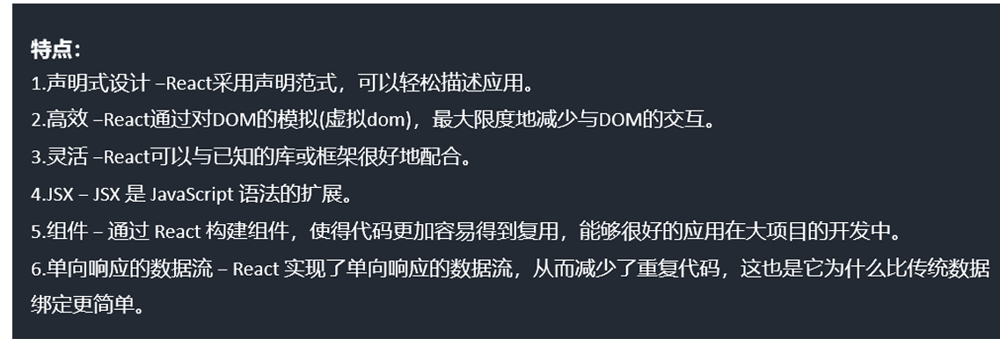
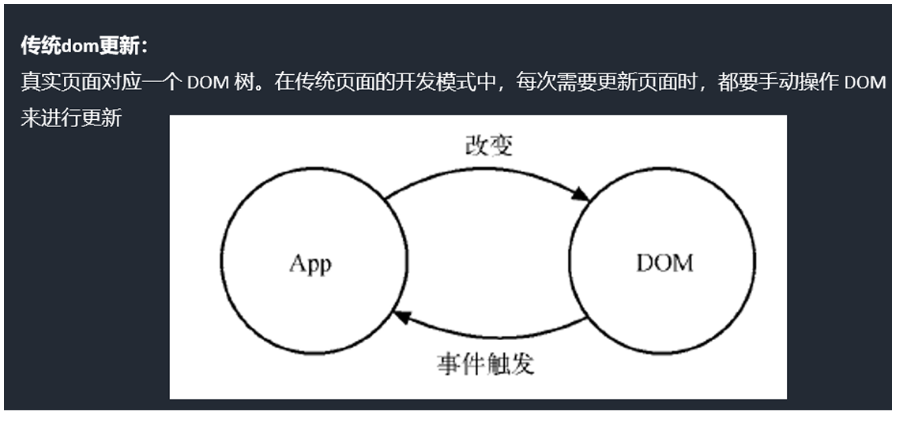
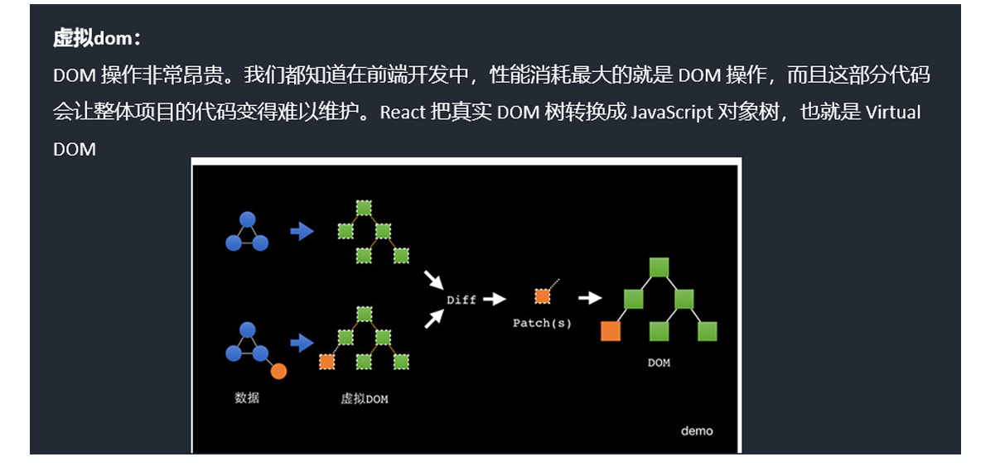

# React 入门

## 一. React 使用

### 1. React 的优势



*   **虚拟 DOM:** React 使用虚拟 DOM 来提高性能，减少直接操作真实 DOM 的次数。

    
    
    

### 2. React 开发环境创建

`create-react-app` 是一个快速创建 React 开发环境的工具，底层由 Webpack 构建，封装了配置细节，开箱即用。

**执行命令：**

*   **全局安装：**

    ```bash
    npm create-react-app react-basic
    ```

*   **非全局安装：**

    ```bash
    npx create-react-app react-basic
    ```

    *   `npx`: Node.js 工具命令，查找并执行后续的包命令。
    *   `create-react-app`: 核心包（固定写法），用于创建 React 项目。
    *   `react-basic`: React 项目的名称（可以自定义）。

## 二. JSX 基础

JSX 是 JavaScript 和 XML (HTML) 的缩写，表示在 JS 代码中编写 HTML 模板结构。 它是 React 中构建 UI 的方式，**也就是将 JavaScript 与 HTML 进行一起编译**。

在 React.js 中，JSX 扩展了 JavaScript 的语法，使 JavaScript 能够直接在代码中编写类似 HTML 标签结构的语法。 编译的过程会把类似 HTML 的 JSX 结构转换成 JavaScript 的对象结构。

```js
import React from 'react';
import ReactDOM from 'react-dom';

class App extends React.Component {
  render() {
    return (
      <div className='app' id='appRoot'>
        <h1 className='title'>欢迎进入React的世界</h1>
        <p>React.js 是一个构建页面 UI 的库</p>
      </div>
    );
  }
}

ReactDOM.render(<App />, document.getElementById('root'));
```

## 三. 组件

### 1. Class 组件 (类组件)

在 ES6 中，JavaScript 直接支持使用 `class` 来定义一个类。 React 创建组件的方式就是使用的类的继承。

```js
import React from 'react';
import ReactDOM from 'react-dom';

class App extends React.Component {
  render() {
    return <h1>欢迎进入React的世界</h1>;
  }
}

ReactDOM.render(<App />, document.getElementById('root'));
```

类组件就相当于一个构造器,每次使用组件都相当于在实例化组件

```js
import React from 'react';
import ReactDOM from 'react-dom';

class App extends React.Component {
  render() {
    return <h1>欢迎进入{this.props.name}的世界</h1>;
  }
}

const app = new App({ name: 'react' }).render();

ReactDOM.render(app, document.getElementById('root'));
```

### 2. 函数式组件

采用函数或箭头函数的形式进行定义。 **注意：组件名采用大驼峰的命名规则，首字母必须大写。**

```js
import React from 'react';
import ReactDOM from 'react-dom';

const App = (props) => <h1>欢迎进入React的世界</h1>;

ReactDOM.render(
  // React组件的调用方式
  <App />,
  document.getElementById('root')
);
```

### 3. 组件的样式

*   **行内样式**

    想给虚拟 DOM 添加行内样式，需要使用表达式传入样式对象的方式来实现：

    ```js
    //  注意这里的两个括号，第一个表示我们在要JSX里插入JS了，第二个是对象的括号
    <p style={{ color: 'red', fontSize: '14px' }}>Hello world</p>;
    ```

    行内样式需要写入一个样式对象，而这个样式对象的位置可以放在很多地方，例如 render 函数里、组件原型上、外链 js 文件。

*   **使用 class**

    React 推荐我们使用行内样式，因为 React 觉得每一个组件都是一个独立的整体。

    其实我们大多数情况下还是大量的在为元素添加类名，但是需要注意的是， **`class` 需要写成 `className`**。

    ```js
    <p className="hello">Hello world</p>;
    ```

### 4. 事件处理

#### 4.1 绑定事件

采用 `on + 事件名` 的方式来绑定一个事件。 注意，这里和原生的事件是有区别的，在原生 js 的事件全是小写 (`onclick`)，**React 里的事件是驼峰 (`onClick`)**。 React 的事件并不是原生事件，而是合成事件。

#### 4.2 事件 Handler 的写法

*   直接在 render 里写行内的箭头函数 (不推荐)
*   在组件内使用箭头函数定义一个方法 (推荐)
*   直接在组件内定义一个非箭头函数的方法，然后在 render 里直接使用 `onClick={this.handleClick.bind(this)}` (不推荐)
*   直接在组件内定义一个非箭头函数的方法，然后在 constructor 里 `bind(this)` (推荐)

#### 4.3 Event 对象

与普通浏览器一样，事件 handler 会被自动传入一个 `event` 对象。 这个对象和普通的浏览器对象所包含的方法和属性都基本一致。 不同的是 React 中的 `event` 对象并不是浏览器提供的，而是它自己内部所构建的。 它同样具有 `event.stopPropagation()` （阻止冒泡）、`event.preventDefault()` （阻止默认提交）这种常用的方法。

### 5. ref 的使用

#### 5.1 给标签设置 `ref="username"`

通过这个获取 `this.refs.username`，`ref` 可以获取到应用的真实 DOM。

#### 5.2 给组件设置 `ref="username"`

通过这个获取 `this.refs.username`，`ref` 可以获取到组件对象。

#### 5.3 新的写法

```js
myRef = React.createRef();

<div ref={this.myRef}>hello</div>;

// 访问
this.myRef.current;
```

## 四、组件的数据挂载方式

### 1. 状态 (state)

状态就是组件描述某种显示情况的数据，由组件自己设置和更改，也就是说由组件自己维护。 使用状态的目的就是为了在不同的状态下使组件的显示不同 (需要自己管理）。

#### (1) 定义 state

**第一种方式：**

```js
import React, { Component } from 'react';
import ReactDOM from 'react-dom';

class App extends Component {
  state = {
    name: 'React',
    isLiked: false,
  };
  render() {
    return (
      <div>
        <h1>欢迎来到{this.state.name}的世界</h1>
        <button>{this.state.isLiked ? '❤取消' : '🖤收藏'}</button>
      </div>
    );
  }
}

ReactDOM.render(<App />, document.getElementById('root'));
```

**第二种方式：**

```js
import React, { Component } from 'react';
import ReactDOM from 'react-dom';

class App extends Component {
  constructor() {
    super();
    this.state = {
      name: 'React',
      isLiked: false,
    };
  }
  render() {
    return (
      <div>
        <h1>欢迎来到{this.state.name}的世界</h1>
        <button>{this.state.isLiked ? '❤取消' : '🖤收藏'}</button>
      </div>
    );
  }
}

ReactDOM.render(<App />, document.getElementById('root'));
```

`this.state` 是纯 JS 对象。 在 Vue 中，`data` 属性是利用 `Object.defineProperty` 处理过的，更改 `data` 的数据的时候会触发数据的 getter 和 setter。 但是 React 中没有做这样的处理，如果直接更改的话，react 是无法得知的，所以，需要使用特殊的更改状态的方法 `setState`。

#### (2) setState

`isLiked` 存放在实例的 `state` 对象当中，组件的 `render` 函数内，会根据组件 `state` 的 `isLiked` 不同显示“取消”或“收藏”内容。 下面给 button 加上了点击事件的事件监听。

```js
import React, { Component } from 'react';
import ReactDOM from 'react-dom';

class App extends Component {
  constructor() {
    super();
    this.state = {
      name: 'React',
      isLiked: false,
    };
  }
  handleBtnClick = () => {
    this.setState({
      isLiked: !this.state.isLiked,
    });
  };
  render() {
    return (
      <div>
        <h1>欢迎来到{this.state.name}的世界</h1>
        <button onClick={this.handleBtnClick}>
          {this.state.isLiked ? '❤取消' : '🖤收藏'}
        </button>
      </div>
    );
  }
}

ReactDOM.render(<App />, document.getElementById('root'));
```

`setState` 有两个参数。 第一个参数可以是对象，也可以是方法 return 一个对象，我们把这个参数叫做 updater。

*   **参数是对象：**

    ```js
    this.setState({ isLiked: !this.state.isLiked });
    ```

*   **参数是方法：**

    ```js
    this.setState((prevState, props) => {
      return { isLiked: !prevState.isLiked };
    });
    ```

    注意的是这个方法接收两个参数，第一个是上一次的 state, 第二个是 props。

    `setState` 是异步的，所以想要获取到最新的 state，没有办法获取，就有了第二个参数，这是一个可选的回调函数。

    ```js
    this.setState(
      (prevState, props) => {
        return {
          isLiked: !prevState.isLiked,
        };
      },
      () => {
        console.log('回调里的', this.state.isLiked);
      }
    );
    console.log('setState外部的', this.state.isLiked);
    ```

### 2. 属性 (props)

`props` 是正常是外部传入的，组件内部也可以通过一些方式来初始化的设置。 属性不能被组件自己更改，但是你可以通过父组件主动重新渲染的方式来传入新的。

属性是描述性质、特点的，组件自己不能随意更改。

之前的组件代码里面有 `props` `props` 的简单使用。 总的来说，在使用一个组件的时候，可以把参数放在标签的属性当中，所有的属性都会作为组件 `props` 对象的键值。 通过箭头函数创建的组件，需要通过函数的参数来接收 `props`。

(1) 在组件上通过 `key=value` 写属性,通过 `this.props` 获取属性,这样组件的可复用性提高了。

(2) 注意在传参数时候，如果写成 `isShow="true"` 那么这是一个字符串。 如果写成 `isShow={true}` 这个是布尔值。

(3) `{...对象}` 展开赋值。

(4) 默认属性值

```js
// 方式一
*.defaultProps = { }
// 方式二
static defaultProps = {
  myname: "默认的myname",
  myshow: true
}
```

(5) prop-types 属性验证

```js
import propTypes from "prop-types";
// 方式一
*.propTypes={ name:propTypes.string, age:propTypes.number }
// 方式二
static propTypes={
  myname:propTypes.string,
  myshow:propTypes.bool
}
```

### 3. 属性 vs 状态

*   **相似点：** 都是纯 JS 对象，都会触发 render 更新，都具有确定性（状态/属性相同，结果相同）。
*   **不同点：**
    1.  属性能从父组件获取，状态不能。
    2.  属性可以由父组件修改，状态不能。
    3.  属性能在内部设置默认值，状态也可以，设置方式不一样。
    4.  属性不在组件内部修改，状态要在组件内部修改。
    5.  属性能设置子组件初始值，状态不可以。

属性可以修改子组件的值，状态不可以。 `state` 的主要作用是用于组件保存、控制、修改自己的可变状态。 组件自身修改，而外部不能访问也不能修改。 你可以认为 `state` 是一个局部的、只能被组件自身控制的数据源。

`state` 中状态可以通过 `state` 在组件内部初始化，可以被 `this.setState` 方法进行更新， `setState` 会导致组件的重新渲染。

`props` 的主要作用是让使用该组件的父组件可以传入参数来配置该组件。 它是外部传进来的配置参数，组件内部无法控制也无法修改。 除非外部组件主动传入新的 `props`，否则组件的 `props` 永远保持不变。

没有 `state` 的组件叫无状态组件（stateless component），设置了 `state` 的叫做有状态组件（stateful component）。 因为状态会带来管理的复杂性，我们尽量多地写无状态组件，尽量少地写有状态的组件。 这样会降低代码维护的难度，也会在一定程度上增强组件的可复用性。


## 4. 渲染数据

### 4.1 条件渲染

可以使用三元运算符或 `&&` 运算符来进行条件渲染。

- **三元运算符：**

  ```jsx
  {condition ? '渲染列表的代码' : '空空如也'}
  ```

### 4.2 列表渲染

在 React 中，使用 `map()` 方法来遍历数组，并将每个元素渲染成对应的 JSX 元素。


```javascript
// 数据
const people = [
  {
    id: 1,
    name: 'Leo',
    age: 35,
  },
  {
    id: 2,
    name: 'XiaoMing',
    age: 16,
  },
];

// 渲染列表
{
  people.map((person) => {
    return (
      <dl key={person.id}>
        <dt>{person.name}</dt>
        <dd>age: {person.age}</dd>
      </dl>
    );
  });
}
```

**Key 的重要性：**

React 的高效依赖于 Virtual-DOM，尽量不碰 DOM。对于列表元素来说会有一个问题：元素可能会在一个列表中改变位置。要实现这个操作，只需要交换一下 DOM 位置就行了，但是 React 并不知道其实我们只是改变了元素的位置，所以它会重新渲染后面的元素（再执行 Virtual-DOM），这样会大大增加 DOM 操作。但如果给每个元素加上唯一的标识，React 就可以知道这两个元素只是交换了位置，这个标识就是 `key`，这个 `key` 必须是每个元素唯一的标识。

### 4.3 dangerouslySetInnerHTML

对于富文本创建的内容，后台拿到的数据可能是 HTML 字符串。

```javascript
content = "<p>React.js是一个构建UI的库</p>";
```

出于安全的原因，React 当中所有表达式的内容会被转义，如果直接输入，标签会被当成文本。 这时候就需要使用 `dangerouslySetInnerHTML` 属性，它允许我们动态设置 `innerHTML`。


```javascript
import React, { Component } from 'react';
import ReactDOM from 'react-dom';

class App extends Component {
  constructor() {
    super();
    this.state = {
      content: '<p>React.js是一个构建UI的库</p>',
    };
  }
  render() {
    return (
      <div
        // 注意这里是两个下划线 __html
        dangerouslySetInnerHTML={{ __html: this.state.content }}
      />
    );
  }
}

ReactDOM.render(<App />, document.getElementById('root'));
```

**注意：** 使用 `dangerouslySetInnerHTML` 需要谨慎，因为它可能会导致 XSS 攻击。 确保你信任数据来源，并对数据进行适当的过滤和转义。

## 五. 表单中的受控组件与非受控组件

### 5.1 非受控组件

React 要编写一个非受控组件，可以使用 `ref` 来从 DOM 节点中获取表单数据。

例如，下面的代码使用非受控组件接受一个表单的值：


```javascript
class NameForm extends React.Component {
  constructor(props) {
    super(props);
    this.handleSubmit = this.handleSubmit.bind(this);
    this.input = React.createRef();
  }

  handleSubmit(event) {
    alert('A name was submitted: ' + this.input.current.value);
    event.preventDefault();
  }

  render() {
    return (
      <form onSubmit={this.handleSubmit}>
        <label>
          Name:
          <input type="text" ref={this.input} />
        </label>
        <input type="submit" value="Submit" />
      </form>
    );
  }
}
```

因为非受控组件将真实数据储存在 DOM 节点中，所以在使用非受控组件时，有时候反而更容易同时集成 React 和非 React 代码。 如果你不介意代码美观性，并且希望快速编写代码，使用非受控组件往往可以减少你的代码量。 否则，你应该使用受控组件。

#### 默认值

在 React 渲染生命周期时，表单元素上的 `value` 将会覆盖 DOM 节点中的值。 在非受控组件中，你经常希望 React 能赋予组件一个初始值，但是不去控制后续的更新。 在这种情况下, 你可以指定一个 `defaultValue` 属性，而不是 `value`。


```javascript
render() {
  return (
    <form onSubmit={this.handleSubmit}>
      <label>
        Name:
        <input
          defaultValue="Bob"
          type="text"
          ref={this.input}
        />
      </label>
      <input type="submit" value="Submit" />
    </form>
  );
}
```

同样，`<input type="checkbox">` 和 `<input type="radio">` 支持 `defaultChecked`，`<textarea>` 支持 `defaultValue`，`<select>` 支持 `defaultValue`。

### 2.2 受控组件

在 HTML 中，表单元素（如 `<input>`, `<textarea>`, 和 `<select>`）通常自己维护 state，并根据用户的输入更新。 在 React 中，mutable state 通常保存在组件的 state 属性中，并且只能通过使用 `setState()`来更新。

通过使 React 的 state 成为 “唯一数据源”，与之结合的表单元素将成为“受控组件”。

例如：

```javascript
class NameForm extends React.Component {
  constructor(props) {
    super(props);
    this.state = { value: '' };

    this.handleChange = this.handleChange.bind(this);
    this.handleSubmit = this.handleSubmit.bind(this);
  }

  handleChange(event) {
    this.setState({ value: event.target.value });
  }

  handleSubmit(event) {
    alert('提交的名字: ' + this.state.value);
    event.preventDefault();
  }

  render() {
    return (
      <form onSubmit={this.handleSubmit}>
        <label>
          名字:
          <input type="text" value={this.state.value} onChange={this.handleChange} />
        </label>
        <input type="submit" value="提交" />
      </form>
    );
  }
}
```

由于在表单元素上设置了 `value` 属性，因此显示的值将始终为 `this.state.value`，这使得 React 的 state 成为唯一数据源。 由于 `handleChange` 在每次按键时都会执行并更新 React 的 state，因此显示的值将随着用户输入而更新。

对于受控组件来说，输入的值始终由 React 的 state 驱动。 你也可以将 value 传递给其他 UI 元素，或者通过其他事件处理函数重置，但这意味着你需要编写更多的代码。

> **广义范围的说法：** React 组件的数据渲染是否被调用者传递的 props 完全控制，控制则为受控组件，否则非受控组件。

# 六.React 组件通信

## 1. 父子组件通信方式

### 1.1 传递数据 (父传子) 与传递方法 (子传父)

- **父传子：** 父组件通过 `props` 将数据传递给子组件。
- **子传父：** 父组件将一个函数作为 `props` 传递给子组件，子组件调用该函数并将数据作为参数传递给父组件。

### 1.2 ref 标记 (父组件拿到子组件的引用，从而调用子组件的方法)

父组件可以使用 `ref` 获取子组件的引用，然后直接调用子组件的方法。

```javascript
// 在父组件中清除子组件的 input 输入框的 value 值
this.refs.form.reset();
```

## 2. 非父子组件通信方式

### 2.1 状态提升 (中间人模式)

React 中的状态提升概括来说, 就是将多个组件需要共享的状态提升到它们最近的父组件上。 在父组件上改变这个状态然后通过 `props` 分发给子组件。

### 2.2 发布订阅模式实现

可以使用第三方库（如 `EventEmitter`）或自定义实现发布订阅模式来进行组件通信。

### 2.3 Context 状态树传参

Context 提供了一种在组件树中共享数据的方法，而无需手动地通过每一层传递 `props`。

**a. 先定义全局 context 对象**

```javascript
import React from 'react';
const GlobalContext = React.createContext();
export default GlobalContext;
```

**b. 根组件引入 GlobalContext，并使用 GlobalContext.Provider（生产者）**

```javascript
// 重新包装根组件 class App {}
<GlobalContext.Provider
  value={{
    name: 'kerwin',
    age: 100,
    content: this.state.content,
    show: this.show.bind(this),
    hide: this.hide.bind(this),
  }}
>
  <之前的根组件></之前的根组件>
</GlobalContext.Provider>;
```

**c. 任意组件引入 GlobalContext 并调用 context，使用 GlobalContext.Consumer（消费者）**

```javascript
<GlobalContext.Consumer>
  {context => {
    this.myshow = context.show; // 可以在当前组件任意函数触发
    this.myhide = context.hide; // 可以在当前组件任意函数触发
    return (
      <div>
        {context.name}-{context.age}-{context.content}
      </div>
    );
  }}
</GlobalContext.Consumer>;
```

> **注意：** `GlobalContext.Consumer` 内必须是回调函数，通过 `context` 方法改变根组件状态。
>
> Context 优缺点：
>
> - **优点：** 跨组件访问数据。
> - **缺点：** React 组件树中某个上级组件 `shouldComponentUpdate` 返回 `false`，当 context 更新时，不会引起下级组件更新。