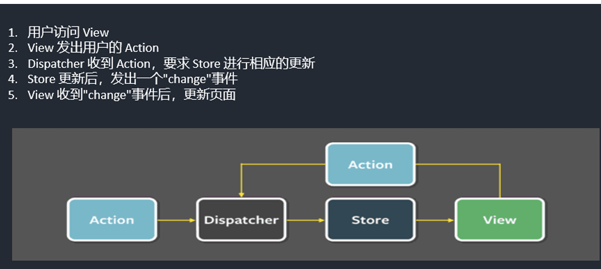
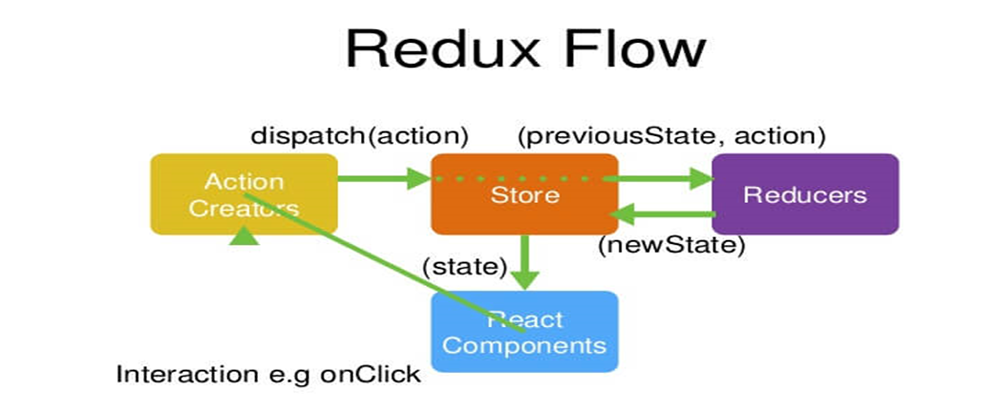

# React 进阶 (二)

## 一· React 生命周期（待补充）

### React 组件的生命周期分为三个阶段：

1.  **挂载阶段 (Mounting):** 组件实例被创建并插入到 DOM 中。
    - `constructor()`: 组件构造函数，用于初始化 state 和绑定方法。
    - `static getDerivedStateFromProps(nextProps, prevState)`: 静态方法，在挂载和更新时被调用，用于根据 props 更新 state。
    - `render()`: 渲染组件的 UI。
    - `componentDidMount()`: 组件挂载后立即调用，通常用于执行副作用操作，如发起网络请求、订阅事件等。
2.  **更新阶段 (Updating):** 组件因 props 或 state 的改变而重新渲染。
    - `static getDerivedStateFromProps(nextProps, prevState)`: 与挂载阶段相同。
    - `shouldComponentUpdate(nextProps, nextState)`: 用于控制组件是否需要重新渲染，返回 `true` 表示需要更新，返回 `false` 则跳过更新。
    - `render()`: 渲染组件的 UI。
    - `getSnapshotBeforeUpdate(prevProps, prevState)`: 在 DOM 更新之前调用，用于获取 DOM 状态，返回值将作为 `componentDidUpdate` 的第三个参数。
    - `componentDidUpdate(prevProps, prevState, snapshot)`: 组件更新后立即调用，通常用于执行副作用操作，如更新 DOM、发起网络请求等。
3.  **卸载阶段 (Unmounting):** 组件从 DOM 中移除。
    - `componentWillUnmount()`: 组件卸载前调用，用于清理副作用操作，如取消订阅、清除定时器等。

### 1.1 废弃的生命周期方法

以下生命周期方法已被废弃，不建议使用：

*   `componentWillMount`: 在服务端渲染 (SSR) 中会被多次调用，可能导致重复触发，且绑定事件无法解绑，导致内存泄漏。
*   `componentWillReceiveProps`: 外部组件频繁更新传入不同的 props，会导致不必要的异步请求。
*   `componentWillUpdate`: 更新前记录 DOM 状态，但与 `componentDidUpdate` 相隔时间过长，可能导致状态不一致。

### 1.2 新的生命周期方法

*   `getDerivedStateFromProps(nextProps, prevState)`: 在组件初始化和后续更新过程中被调用，返回一个对象作为新的 state，返回 `null` 则说明不需要更新 state。

    ```javascript
    static getDerivedStateFromProps(nextProps, prevState) {
        if (nextProps.value !== undefined) {
            return {
                current: nextProps.value
            };
        }
        return null;
    }
    ```

*   `getSnapshotBeforeUpdate(prevProps, prevState)`: 在 update 发生时，在 render 之后 DOM 渲染之前被调用，返回一个值作为 `componentDidUpdate` 的第三个参数。

    ```javascript
    getSnapshotBeforeUpdate(prevProps, prevState) {
        // 获取滚动位置
        return this.wrapper.scrollHeight;
    }
    
    componentDidUpdate(prevProps, prevState, snapshot) {
        // 恢复滚动位置
        this.wrapper.scrollTop = this.wrapper.scrollHeight - snapshot;
    }
    ```

### 1.3 示例：滚动位置保持

```jsx
class MyComponent extends React.Component {
  constructor(props) {
    super(props);
    this.wrapperRef = React.createRef();
    this.state = {
      messages: ['Message 1', 'Message 2', 'Message 3'],
    };
  }

  getSnapshotBeforeUpdate(prevProps, prevState) {
    // 获取滚动容器的当前滚动高度
    return this.wrapperRef.current.scrollHeight;
  }

  componentDidUpdate(prevProps, prevState, snapshot) {
    // 计算新增内容的高度
    const scrollDiff = this.wrapperRef.current.scrollHeight - snapshot;
    // 设置滚动位置，保持用户之前的阅读位置
    this.wrapperRef.current.scrollTop += scrollDiff;
  }

  render() {
    return (
      <div
        ref={this.wrapperRef}
        style={{ height: '200px', overflow: 'auto' }}
      >
        {this.state.messages.map((message, index) => (
          <div key={index}>{message}</div>
        ))}
      </div>
    );
  }
}

```

## 二. React 性能优化

- **`shouldComponentUpdate(nextProps, nextState)`:**
  - 用于手动控制组件是否需要重新渲染。
  - 通过比较 `nextProps` 和 `this.props`、`nextState` 和 `this.state` 来决定是否更新。
  - 如果返回 `false`，则跳过渲染，包括子组件的渲染。
- **`React.memo(Component, [areEqual])`:**
  - 高阶组件，用于缓存函数组件的渲染结果。
  - 默认情况下，`React.memo` 会浅比较 props 的变化，如果 props 没有变化，则跳过重新渲染。
  - 可以提供 `areEqual` 函数来自定义比较逻辑。
- **`useMemo(callback, [dependencies])` 和 `useCallback(callback, [dependencies])`:**
  - `useMemo` 用于缓存计算结果，只有当依赖项发生变化时才会重新计算。
  - `useCallback` 用于缓存函数，只有当依赖项发生变化时才会创建新的函数。
  - 可以避免在每次渲染时都重新创建函数或计算值，提高性能。

## 三. React Hooks（钩子函数）

### 3.1 为什么要使用 Hooks?

1.  高阶组件为了复用，导致代码层级复杂。
2.  生命周期的复杂性。
3.  从函数组件改为 class 组件成本高。

### 3.2 常用的 Hooks

*   `useState(initialState)`: 保存组件状态。

    ```javascript
    const [state, setState] = useState(initialState);
    ```

*   `useEffect(effect, [dependencies])`: 处理副作用，如数据获取、订阅等。

    ```javascript
    useEffect(() => {
        // effect
        return () => {
            // cleanup
        };
    }, [dependencies]);
    ```

*   `useLayoutEffect(effect, [dependencies])`: 同步执行副作用，在 DOM 更新后立即执行，会阻塞页面渲染。

*   `useCallback(callback, [dependencies])`: 记忆函数，防止组件重新渲染导致方法被重新创建。

    ```javascript
    const handleClick = useCallback(() => {
        console.log(name);
    }, [name]);
    ```

*   `useMemo(callback, [dependencies])`: 记忆组件，缓存计算结果。

    ```javascript
    const memoizedValue = useMemo(() => computeExpensiveValue(a, b), [a, b]);
    ```

*   `useRef(initialValue)`: 保存引用值，用于访问 DOM 元素或在组件的整个生命周期中保持一个可变值。

    ```javascript
    const mySwiper = useRef(null);
    <Swiper ref={mySwiper} />;
    ```

*   `useReducer(reducer, initialState)`: 用于管理复杂的状态逻辑。

*   `useContext(Context)`: 用于访问 Context 中的值，减少组件层级。

### 3.3 useEffect 和 useLayoutEffect 的区别

*   `useEffect` 在浏览器完成 DOM 更新后异步执行，不会阻塞页面渲染。
*   `useLayoutEffect` 在 React 完成 DOM 更新后同步执行，会阻塞页面渲染。

**建议：** 优先使用 `useEffect`，只有在需要同步操作 DOM 时才使用 `useLayoutEffect`，以避免页面抖动。

### 3.4 Hooks 的使用规则

- 只能在函数组件或自定义 hook 中调用 Hooks。
- 只能在函数组件的最顶层调用 Hooks，不能在循环、条件语句或嵌套函数中调用 Hooks。
- 自定义 hook 必须以 `use` 开头。

### 3.5 自定义 Hooks

用于提取组件中的逻辑，使其可以在多个组件之间共享。

```js
import { useState, useEffect } from 'react';

function useFetch(url) {
  const [data, setData] = useState(null);
  const [loading, setLoading] = useState(true);
  const [error, setError] = useState(null);

  useEffect(() => {
    async function fetchData() {
      try {
        const response = await fetch(url);
        const json = await response.json();
        setData(json);
      } catch (error) {
        setError(error);
      } finally {
        setLoading(false);
      }
    }

    fetchData();
  }, [url]);

  return { data, loading, error };
}

```


## 四. React 路由

### 4.1 什么是路由？

路由是根据不同的 URL 地址展示不同的内容或页面。

### 4.2 安装 React Router

```bash
npm install react-router-dom@6
```

### 4.3 使用 React Router

#### 4.3.1 导入路由组件

```javascript
import {
  BrowserRouter as Router,
  Routes,
  Route,
  Link,
  Navigate
} from "react-router-dom";
```

#### 4.3.2 定义路由和重定向

```jsx
<Router>
  <Routes>
    <Route path="/films" element={<Films />} />
    <Route path="/cinemas" element={<Cinemas />} />
    <Route path="/center" element={<Center />} />
    <Route path="/" element={<Navigate to="/films" />} />
    {/* <Route path="*" element={<NotFound />} /> */}
  </Routes>
</Router>
```

*   `<Routes>`: 用于包裹所有的 `<Route>` 组件。
*   `<Route>`: 定义一个路由，`path` 属性指定 URL 路径，`element` 属性指定要渲染的组件。
*   `<Link>`: 用于创建链接，类似于 HTML 的 `<a>` 标签，但可以避免页面刷新。
*   `<Navigate>`: 用于重定向，类似于 HTML 的 `<meta>` 标签。

#### 4.3.3 嵌套路由

```jsx
<Routes>
  <Route path="/films/nowplaying" element={<Nowplaying />} />
  <Route path="/films/comingsoon" element={<Comingsoon />} />
  <Route path="/films" element={<Navigate to="/films/nowplaying" />} />
</Routes>
```

#### 4.3.4 路由跳转方式

*   **声明式导航：**

    ```jsx
    <Link to="/films">Films</Link>
    <Link to="/cinemas">Cinemas</Link>
    <Link to="/center">Center</Link>
    ```

*   **编程式导航：**

    ```javascript
    import { useNavigate } from 'react-router-dom';
    
    function MyComponent() {
      const navigate = useNavigate();
    
      const handleClick = () => {
        navigate('/center');
      };
    
      return <button onClick={handleClick}>Go to Center</button>;
    }
    ```

#### 4.3.5 路由传参

*   **URL 参数：**

    ```jsx
    <Route path="/user/:id" element={<User />} />
    ```

    在 `User` 组件中：

    ```javascript
    import { useParams } from 'react-router-dom';

    function User() {
      const { id } = useParams();
      return <div>User ID: {id}</div>;
    }
    ```

*   **查询参数：**

    ```javascript
    navigate('/user?day=Friday');
    ```

    在 `User` 组件中：

    ```javascript
    import { useLocation } from 'react-router-dom';

    function User() {
      const location = useLocation();
      const queryParams = new URLSearchParams(location.search);
      const day = queryParams.get('day');
      return <div>Day: {day}</div>;
    }
    ```

*   **State：**

    ```javascript
    navigate('/user', { state: { day: 'Friday' } });
    ```

    在 `User` 组件中：

    ```javascript
    import { useLocation } from 'react-router-dom';
    
    function User() {
      const location = useLocation();
      const { day } = location.state;
      return <div>Day: {day}</div>;
    }
    ```

#### 4.3.6 路由拦截 (权限控制)

```jsx
import { useRoutes } from 'react-router-dom';

function App() {
  let element = useRoutes([
    {
      path: '/center',
      element: isAuth() ? <Center /> : <Navigate to="/login" />,
    },
    // ...
  ]);

  return element;
}
```


### 4.4. 项目注意事项

#### 1) 反向代理

在 `package.json` 文件中添加 `proxy` 字段：

```json
"proxy": "http://localhost:5000"
```

或者使用 `http-proxy-middleware`：

```bash
npm install http-proxy-middleware --save
```

```javascript
const { createProxyMiddleware } = require('http-proxy-middleware');

module.exports = function(app) {
  app.use(
    '/api',
    createProxyMiddleware({
      target: 'http://localhost:5000',
      changeOrigin: true,
    })
  );
};
```

#### 2) CSS Modules

```css
/* MyComponent.module.css */
.title {
  color: red;
}

:global(.active) {
  color: blue;
}
```

```javascript
import styles from './MyComponent.module.css';

function MyComponent() {
  return <h1 className={styles.title}>Hello</h1>;
}
```

  好的，我将对你提供的 Flux、Redux 和 React-Redux 的笔记进行整理、修改和更新，使其更清晰、更易懂，并包含最新的实践和概念。


## 五. Flux 架构

### 5.1 什么是 Flux？

Flux 是一种用于构建客户端 Web 应用的架构模式，由 Facebook 提出。它主要解决的是数据流向的问题，通过单向数据流来管理应用的状态，使得应用的状态变化可预测、易于调试和维护。

### 5.2 Flux 的核心概念

*   **Action (动作):** 描述发生了什么事件，是一个包含 `type` 属性的 JavaScript 对象。
*   **Dispatcher (调度器):** 接收 Action，并将 Action 分发给所有注册的 Store。
*   **Store (数据存储):** 存储应用的状态，并响应 Action 的变化，更新状态并通知 View。
*   **View (视图):** 显示 Store 中的数据，并触发 Action。

### 5.3 Flux 的单向数据流

1. View 触发 Action。

2. Action 被 Dispatcher 接收。

3. Dispatcher 将 Action 分发给所有注册的 Store。

4. Store 响应 Action，更新状态。

5. Store 通知 View，View 重新渲染。

   

## 六. Redux

### 6.1 什么是 Redux？

Redux 是一个 JavaScript 状态容器，用于管理应用的状态。它受到了 Flux 架构的启发，但做了一些简化和改进。Redux 可以与 React、Angular、Vue 等框架一起使用。

### 6.2 Redux 的三大原则

1.  **单一数据源 (Single source of truth):** 整个应用的状态都存储在一个 JavaScript 对象树中，这个对象树被称为 Store。
2.  **状态是只读的 (State is read-only):** 唯一改变 state 的方法就是触发 action。action 是一个用于描述发生了什么的普通 JavaScript 对象。
3.  **使用纯函数来执行修改 (Changes are made with pure functions):** 为了描述 action 如何改变 state tree ，你需要编写 reducers。

### 6.3 Redux 的核心概念

*   **Action (动作):** 描述发生了什么事件，是一个包含 `type` 属性的 JavaScript 对象。
*   **Reducer (归约函数):** 接收先前的 state 和 action，并返回新的 state。Reducer 必须是一个纯函数，不能有副作用。
*   **Store (数据存储):** 存储应用的状态，提供 `dispatch`、`subscribe` 和 `getState` 等方法。

### 6.4 Redux 的工作流程

1. View 触发 Action。

2. Action 被 `dispatch` 函数接收。

3. `dispatch` 函数将 Action 传递给 Reducer。

4. Reducer 接收先前的 state 和 action，并返回新的 state。

5. Store 更新状态，并通知所有订阅者。

6. View 重新渲染。

   

### 6.5 Redux 的核心 API

*   **`createStore(reducer, [preloadedState], [enhancer])`:** 创建 Redux Store。
*   **`store.dispatch(action)`:** 触发 Action，将 Action 传递给 Reducer。
*   **`store.subscribe(listener)`:** 订阅 Store 的变化，当 Store 的状态发生变化时，执行 listener 函数。
*   **`store.getState()`:** 获取 Store 的当前状态。
*   **`combineReducers(reducers)`:** 将多个 Reducer 合并成一个 Reducer。
*   **`applyMiddleware(...middlewares)`:** 应用中间件，用于扩展 Redux 的功能。

### 6.6 Redux 中间件

Redux 中间件是在 Action 被 dispatch 之后，Reducer 接收到 Action 之前，对 Action 进行处理的函数。中间件可以用于处理异步操作、日志记录、错误处理等。

#### 6.6.1 常见的 Redux 中间件

*   **`redux-thunk`:** 允许 dispatch 函数。
*   **`redux-promise`:** 允许 dispatch Promise 对象。
*   **`redux-logger`:** 记录 Redux 的 Action 和 State 变化。

#### 6.6.3中间件的由来与原理、机制 

```js
export default function thunkMiddleware({ dispatch, getState }) { 
    return next => action => typeof action === 'function' ? action(dispatch, getState) :next(action);
} 
```


这段代码的意思是，中间件这个桥梁接受到的参数action，如果不是function则和过去一样直接执 行next方法(下一步处理)，相当于中间件没有做任何事。如果action是function，则先执行action， action的处理结束之后，再在action的内部调用dispatch

#### 6.6.2 自定义 Redux 中间件

```javascript
const loggerMiddleware = store => next => action => {
  console.log('dispatching', action);
  let result = next(action);
  console.log('next state', store.getState());
  return result;
};
```

### 6.7 Redux DevTools Extension

Redux DevTools Extension 是一个 Chrome 浏览器插件，用于调试 Redux 应用。它可以查看 Action 和 State 的变化、进行时间旅行等。

```javascript
import { createStore, applyMiddleware, compose } from 'redux';
import reducer from './reducer';

const composeEnhancers = window.__REDUX_DEVTOOLS_EXTENSION_COMPOSE__ || compose;

const store = createStore(reducer, composeEnhancers(
  applyMiddleware(/* ...中间件 */)
));

export default store;
```

## 七. React-Redux


### 7.1 什么是 React-Redux？

React-Redux 是一个 Redux 的官方 React 绑定库，用于将 Redux Store 连接到 React 组件。

### 7.2 React-Redux 的核心概念

*   **UI 组件 (Presentational Components):** 只负责 UI 的呈现，不带有任何业务逻辑，没有状态，所有数据都由 props 提供，不使用任何 Redux 的 API。
*   **容器组件 (Container Components):** 负责管理数据和业务逻辑，不负责 UI 的呈现，带有内部状态，使用 Redux 的 API。

### 7.3 React-Redux 的核心 API

*   **`<Provider store={store}>`:** 将 Redux Store 传递给所有容器组件。
*   **`connect(mapStateToProps, [mapDispatchToProps], [mergeProps], [options])(Component)`:** 将 UI 组件连接到 Redux Store，生成容器组件。

    *   `mapStateToProps(state, [ownProps])`: 将 Redux Store 的 state 映射到 UI 组件的 props。
    *   `mapDispatchToProps(dispatch, [ownProps])`: 将 dispatch 函数映射到 UI 组件的 props。

### 7.4 React-Redux 的使用

1.  创建 Redux Store。
2.  使用 `<Provider>` 组件将 Redux Store 传递给所有容器组件。
3.  使用 `connect` 函数将 UI 组件连接到 Redux Store，生成容器组件。

```javascript
import React from 'react';
import ReactDOM from 'react-dom';
import { Provider } from 'react-redux';
import store from './store';
import App from './App';

ReactDOM.render(
  <Provider store={store}>
    <App />
  </Provider>,
  document.getElementById('root')
);
```

```javascript
import { connect } from 'react-redux';
import { increment, decrement, reset } from './actionCreators';

const Counter = ({ counter, increment, decrement, reset }) => (
  <div>
    <h1>{counter}</h1>
    <button onClick={increment}>+</button>
    <button onClick={decrement}>-</button>
    <button onClick={reset}>Reset</button>
  </div>
);

const mapStateToProps = state => ({
  counter: state.counter
});

const mapDispatchToProps = {
  increment,
  decrement,
  reset
};

export default connect(mapStateToProps, mapDispatchToProps)(Counter);
```

### 7.5 Hooks API (useSelector, useDispatch)

React-Redux 提供了 Hooks API，可以在函数组件中使用 Redux。

*   **`useSelector(selector, [equalityFn])`:** 从 Redux Store 中提取数据。
*   **`useDispatch()`:** 获取 dispatch 函数。

```javascript
import { useSelector, useDispatch } from 'react-redux';
import { increment, decrement, reset } from './actionCreators';

const Counter = () => {
  const counter = useSelector(state => state.counter);
  const dispatch = useDispatch();

  return (
    <div>
      <h1>{counter}</h1>
      <button onClick={() => dispatch(increment())}>+</button>
      <button onClick={() => dispatch(decrement())}>-</button>
      <button onClick={() => dispatch(reset())}>Reset</button>
    </div>
  );
};

export default Counter;
```

### 7.6 高阶组件 (HOC)

`connect` 函数是一个高阶组件，它接收一个组件作为参数，并返回一个新的组件。高阶组件可以用于代码复用、增加 props、渲染劫持等。Provider组件，可以让容器组件拿到state ， 使用了context

5. 高阶组件构建与应用 

    HOC不仅仅是一个方法，确切说应该是一个组件工厂，获取低阶组件，生成高阶组件。

    (1)代码复用，代码模块化 (2)增删改props  (3) 渲染劫持 

   ```js
   //定义高阶函数
   import React from 'react';
   
   // 高阶函数
   function Control(WrappedComponent) {
     return class MyControl extends React.Component {
       render() {
         if (!this.props.data) {
           return <div>loading...</div>;
         }
         return <WrappedComponent {...this.props} />;
       }
     };
   }
   
   class MyComponent extends React.Component {
     render() {
       return <div>{this.props.data}</div>;
     }
   }
   
   //使用高阶函数
   export default Control(MyComponent); // 高阶组件
   import React, { useState } from 'react';
   import MyControlComponent from './Child';
   
   function ParentComponent() {
     const [data, setData] = useState(null);
   
     // 模拟异步获取数据
     setTimeout(() => {
       setData('Hello from Parent!');
     }, 2000);
   
     return <MyControlComponent data={data} />;
   }
   
   export default ParentComponent;
   
   ```

   

### 7.7 Redux 持久化

Redux 持久化可以将 Redux Store 的状态保存到本地存储中，以便在页面刷新后恢复状态。

```javascript
import { persistStore, persistReducer } from 'redux-persist';
import storage from 'redux-persist/lib/storage'; // localStorage
// import storageSession from 'redux-persist/lib/storage/session'; // sessionStorage
import autoMergeLevel2 from 'redux-persist/lib/stateReconciler/autoMergeLevel2';

const persistConfig = {
  key: 'root',
  storage,
  stateReconciler: autoMergeLevel2 // 控制新老状态如何合并
};

const persistedReducer = persistReducer(persistConfig, reducer);

const store = createStore(persistedReducer);
const persistor = persistStore(store);

export { store, persistor };
```

```javascript
import { PersistGate } from 'redux-persist/integration/react';
import { store, persistor } from './store';

ReactDOM.render(
  <Provider store={store}>
    <PersistGate loading={null} persistor={persistor}>
      <App />
    </PersistGate>
  </Provider>,
  document.getElementById('root')
);
```

## 八.UI组件库

 Ant Design 是一个致力于提升『用户』和『设计者』使用体验的设计语言 ；旨在统一中台项目的前端 UI 设计，屏蔽不 必要的设计差异和实现成本，解放设计和前端的研发资源； 包含很多设计原则和配套的组件库。

- ant-design （PC端） 

 https://ant.design/index-cn https://ant-design.gitee.io/index-cn (镜像库，快) 

- antd-mobile （移动端） 

 https://mobile.ant.design 