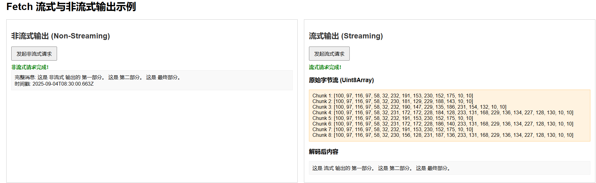

# feath实现流式响应输出

## 1.流式输出与非流式输出

- **非流式输出:**是指在数据完成整个生成过程后，一次性返回全部生成的结果。
  - **优点**：实现简单，易于处理和调试。
  - **缺点**：对于长时间任务，用户等待时间较长，可能导致用户体验下降；需要一次性存储所有结果，可能增加内存占用。
  - **应用场景**：适用于那些不依赖即时反馈、需要对整个输出进行整体处理的场景，例如批量文本生成、文档摘要等。

- **流式输出:**流式输出是指数据生成的内容是逐步、逐块返回的，而不是等到整个生成过程完成后再一次性返回所有内容。
  - **优点**：
    *   **提升用户体验:** 用户可以更早地开始看到部分结果，感知到系统正在工作，提高即时性和交互性。
    *   **降低内存占用:** 对于长时间生成任务，可以减少内存占用，因为不需要一次性存储完整的输出。
    *   **更适合实时应用:** 能够更好地支持实时反馈和渐进式渲染。
  - **应用场景**：适用于需要即时响应和高交互性的场景，比如智能助手、AI对话、实时日志、股票行情等。
  - **常见实现技术**：Server-Sent Events (SSE), WebSocket, HTTP 长连接等。

## 2.feath实现流式布局

### 2.1后端实现（node.js+express）

#### 1.安装node环境

#### 2.安装express

```js
npm install express
```

#### 3.node服务器启动

```js
node server.js
```

#### 4.流式与非流式实现

- **非流式 (`/non-stream`)：**
  - 使用 `setInterval` 模拟数据分块生成，但将所有生成的 `parts` 累加到 `fullResult` 变量中。
  - 只有当 `fullResult` 完全构建完成后，才调用 `res.json()` 将**完整的 JSON 对象**发送给客户端。
  - `res.json()` 本质上是 `res.send(JSON.stringify(data))`，它会等待所有数据准备好才发送。
- **流式 (`/stream`)：**
  - 设置 `Content-Type: text/event-stream`：这是 Server-Sent Events (SSE) 的标准 MIME 类型，告诉客户端这是一个事件流。
  - 设置 `Cache-Control: no-cache` 和 `Connection: keep-alive`：确保连接不会被缓存，并保持活动状态。
  - 使用 `setInterval` 模拟数据分块生成。
  - 每次生成一部分数据时，立即调用 `res.write(\`data: ${data}\n\n`)`。`res.write()` 会将数据块立即发送给客户端，而不会等待整个响应完成。
  - `data: ...\n\n` 是 SSE 的标准格式，`data:` 前缀表示数据内容，`\n\n` 表示一个事件的结束。
  - `res.end()`：当所有数据发送完毕后，结束流式响应。
  - `req.on('close', ...)`：处理客户端断开连接的情况，及时清理服务器端的定时器。

#### 5.代码实现

```js
// server.js
const express = require('express');
const app = express();
const port = 3000;

// Middleware: 允许跨域请求 (CORS)
// 这样前端页面 (通常运行在 file:// 或其他域名) 才能访问此服务器
app.use((req, res, next) => {
    res.header('Access-Control-Allow-Origin', '*'); // 允许所有来源的请求
    res.header('Access-Control-Allow-Headers', 'Origin, X-Requested-With, Content-Type, Accept');
    next();
});

// --- 非流式输出 API ---
// 当客户端请求此端点时，服务器会模拟数据生成，但会等待所有数据生成完毕后一次性返回
app.get('/non-stream', (req, res) => {
    console.log('收到非流式请求');
    let fullResult = ''; // 用于累积所有生成的数据
    const parts = ['这是', '非流式', '输出的', '第一部分。', '这是', '第二部分。', '这是', '最终部分。'];
    let index = 0;

    // 模拟数据生成过程，每隔 500ms 生成一部分
    const interval = setInterval(() => {
        if (index < parts.length) {
            fullResult += parts[index] + ' '; // 将数据累加到 fullResult
            console.log(`非流式数据生成中: ${parts[index]}`);
            index++;
        } else {
            clearInterval(interval); // 所有数据生成完毕
            // 数据全部生成完毕后，一次性通过 res.json() 返回
            console.log('非流式数据生成完毕，一次性返回。');
            res.json({ message: fullResult.trim(), timestamp: new Date().toISOString() });
        }
    }, 500); // 每0.5秒生成一部分数据
});


// --- 流式输出 API (使用 Server-Sent Events - SSE) ---
// 当客户端请求此端点时，服务器会逐步发送数据，客户端可以实时接收和显示
app.get('/stream', (req, res) => {
    console.log('收到流式请求');
    // 设置响应头，声明这是一个 SSE 流
    res.setHeader('Content-Type', 'text/event-stream'); // 关键：指定为事件流
    res.setHeader('Cache-Control', 'no-cache');        // 禁用缓存
    res.setHeader('Connection', 'keep-alive');          // 保持连接活跃
    res.setHeader('X-Accel-Buffering', 'no');           // 禁用代理服务器的缓冲 (如 Nginx)

    const parts = ['这是', '流式', '输出的', '第一部分。', '这是', '第二部分。', '这是', '最终部分。'];
    let index = 0;

    // 模拟数据生成和发送过程，每隔 700ms 发送一部分
    const interval = setInterval(() => {
        if (index < parts.length) {
            const data = parts[index];
            // 发送 SSE 格式的数据：data: [你的数据]\n\n
            // res.write() 会立即将数据块发送到客户端
            res.write(`data: ${data}\n\n`);
            console.log(`流式数据发送中: ${data}`);
            index++;
        } else {
            clearInterval(interval); // 所有数据发送完毕
            res.end(); // 结束响应，关闭连接
            console.log('流式数据发送完毕，连接关闭。');
        }
    }, 700); // 每0.7秒发送一部分数据

    // 处理客户端断开连接的事件，及时清理服务器端的定时器
    req.on('close', () => {
        console.log('客户端断开流式连接');
        clearInterval(interval); // 清理定时器，防止内存泄漏
        res.end(); // 确保响应被关闭
    });
});

// 启动服务器
app.listen(port, () => {
    console.log(`服务器运行在 http://localhost:${port}`);
});

```

### 2.2前端实现

#### 1.使用featch实现流式响应  [featchAPI](./featchAPI.md)

#### 2.流式与非流式实现

- **非流式 (`fetchNonStream`)：**
  - 使用 `await fetch(...)` 发起请求。
  - 使用 `await response.json()`。`response.json()` 会读取整个响应体，直到服务器关闭连接，然后尝试将其解析为 JSON。这意味着它会等待所有数据都到达后才解析并返回结果。在此之前，`await response.json()` 会一直阻塞。
- **流式 (`fetchStream`)：**
  - 使用 `await fetch(...)` 发起请求。
  - 获取 `reader = response.body.getReader()`：`response.body` 是一个 `ReadableStream` 对象，`getReader()` 方法获取一个读取器，用于逐步读取流中的数据。
  - 使用`while (!done)`循环：
    - `await reader.read()`：每次调用都会返回一个 Promise，该 Promise 解析为一个对象 `{ value: Uint8Array, done: boolean }`。`value` 是一个字节数组，代表当前读取到的数据块；`done` 表示流是否已结束。
    - `decoder.decode(value, { stream: true })`：将 `Uint8Array` 字节数据解码为字符串。`{ stream: true }` 告诉解码器这是一个流，它可能会在多个块之间保留状态（例如处理多字节字符）。
    - 将解码后的数据追加到 `streamOutput.textContent` 中，实现逐步显示。
    - 这里对 SSE 格式 `data: ...\n\n` 进行了简单的解析，确保只显示 `data:` 后面的内容，并正确处理分块。

#### 3.代码实现

```js
<!DOCTYPE html>
<html lang="zh-CN">
<head>
    <meta charset="UTF-8">
    <meta name="viewport" content="width=device-width, initial-scale=1.0">
    <title>Fetch 流式与非流式输出示例</title>
    <style>
        body { font-family: Arial, sans-serif; margin: 20px; }
        .container { display: flex; gap: 20px; }
        .box { border: 1px solid #ccc; padding: 15px; flex: 1; min-height: 200px; }
        h2 { color: #333; }
        button { padding: 10px 15px; font-size: 16px; cursor: pointer; margin-bottom: 10px; }
        #nonStreamOutput, #streamOutput, #streamRawOutput { /* 添加 streamRawOutput */
            background-color: #f9f9f9;
            padding: 10px;
            border: 1px solid #eee;
            white-space: pre-wrap;
            max-height: 200px; 
            overflow-y: auto;
            margin-bottom: 10px;
        }
        #streamRawOutput { 
            background-color: #fff3e0; 
            border-color: #ffcc80;
        }
        .loading { color: orange; }
        .finished { color: green; font-weight: bold; }
        .error { color: red; font-weight: bold; }
    </style>
</head>
<body>
    <h1>Fetch 流式与非流式输出示例</h1>

    <div class="container">
        <div class="box">
            <h2>非流式输出 (Non-Streaming)</h2>
            <button onclick="fetchNonStream()">发起非流式请求</button>
            <div id="nonStreamStatus"></div>
            <div id="nonStreamOutput">等待数据...</div>
        </div>

        <div class="box">
            <h2>流式输出 (Streaming)</h2>
            <button onclick="fetchStream()">发起流式请求</button>
            <div id="streamStatus"></div>
            <h3>原始字节流 (Uint8Array)</h3> 
            <div id="streamRawOutput">等待数据...</div> 
            <h3>解码后内容</h3> 
            <div id="streamOutput">等待数据...</div>
        </div>
    </div>

    <script>
        const nonStreamStatus = document.getElementById('nonStreamStatus');
        const nonStreamOutput = document.getElementById('nonStreamOutput');
        const streamStatus = document.getElementById('streamStatus');
        const streamRawOutput = document.getElementById('streamRawOutput'); 
        const streamOutput = document.getElementById('streamOutput');

        // --- 非流式请求 (保持不变) ---
        async function fetchNonStream() {
            nonStreamOutput.textContent = '等待数据...';
            nonStreamStatus.className = 'loading';
            nonStreamStatus.textContent = '加载中... (服务器正在生成所有数据，请等待)';

            try {
                const response = await fetch('http://localhost:3000/non-stream');

                if (!response.ok) {
                    throw new Error(`HTTP error! Status: ${response.status}`);
                }

                const data = await response.json();

                nonStreamOutput.textContent = `完整消息: ${data.message}\n时间戳: ${data.timestamp}`;
                nonStreamStatus.className = 'finished';
                nonStreamStatus.textContent = '非流式请求完成！';
                console.log('非流式请求完成，收到完整数据:', data);

            } catch (error) {
                nonStreamOutput.textContent = `请求失败: ${error.message}`;
                nonStreamStatus.className = 'error';
                nonStreamStatus.textContent = `非流式请求失败！`;
                console.error('非流式请求失败:', error);
            }
        }
        // --- 流式请求 (fetchStream 函数) ---
        async function fetchStream() {
            streamRawOutput.textContent = ''; // 清空原始输出
            streamOutput.textContent = ''; // 清空解码后输出
            streamStatus.className = 'loading';
            streamStatus.textContent = '加载中... (数据将逐步显示)';
            try {
                const response = await fetch('http://localhost:3000/stream');
                if (!response.ok) {
                    throw new Error(`HTTP error! Status: ${response.status}`);
                }
                const reader = response.body.getReader();
                const decoder = new TextDecoder('utf-8');

                let receivedChunks = ''; // 用于累积和解析 SSE 事件
                let done = false;
                let chunkCount = 0;

                while (!done) {
                    const { value, done: readerDone } = await reader.read();
                    done = readerDone;

                    if (value) {
                        chunkCount++;
                        // --- 显示原始 Uint8Array ---
                        // value 是 Uint8Array 类型，直接打印到控制台会显示其内容
                        console.log(`--- 原始 Uint8Array chunk ${chunkCount} ---`, value);
                        // 在页面上显示为数组字符串
                        streamRawOutput.textContent += `Chunk ${chunkCount}: [${Array.from(value).join(', ')}]\n`;
                        streamRawOutput.scrollTop = streamRawOutput.scrollHeight; // 滚动到底部

                        // --- 解码 Uint8Array 并处理 SSE 事件 ---
                        const decodedPart = decoder.decode(value, { stream: true }); // 解码当前块
                        receivedChunks += decodedPart; // 累加解码后的字符串

                        // 尝试解析完整的 SSE 事件
                        let eventEndIndex;
                        while ((eventEndIndex = receivedChunks.indexOf('\n\n')) !== -1) {
                            const event = receivedChunks.substring(0, eventEndIndex);
                            receivedChunks = receivedChunks.substring(eventEndIndex + 2); // 移除已处理的事件

                            if (event.startsWith('data: ')) {
                                const data = event.substring(6); // 移除 'data: ' 前缀
                                streamOutput.textContent += data + ' '; // 逐步追加显示解码后的数据
                                streamOutput.scrollTop = streamOutput.scrollHeight; // 滚动到底部
                                console.log('解码后接收到数据:', data);
                            }
                        }
                    }
                }
                // 处理循环结束后可能存在的最后一个不完整的事件（如果有的话）
                if (receivedChunks.startsWith('data: ')) {
                    const data = receivedChunks.substring(6);
                    streamOutput.textContent += data + ' ';
                    streamOutput.scrollTop = streamOutput.scrollHeight;
                    console.log('解码后接收到最后数据:', data);
                }
                streamStatus.className = 'finished';
                streamStatus.textContent = '流式请求完成！';
                console.log('流式请求完成，所有数据已接收。');
            } catch (error) {
                streamOutput.textContent = `请求失败: ${error.message}`;
                streamRawOutput.textContent = `请求失败: ${error.message}`;
                streamStatus.className = 'error';
                streamStatus.textContent = `流式请求失败！`;
                console.error('流式请求失败:', error);
            }
        }
    </script>
</body>
</html>

```

## 3.实现效果 部分讲解

### **后端**

​	在这流式（**`/non-stream`**）和非流式（**`/stream`**）情况下，Node.js 的 `express` 框架在将这些 JavaScript 字符串发送到网络之前，会根据 HTTP 协议和默认编码（通常是 **UTF-8**）将它们**编码成字节序列**。

#### **1.非流式**

```js
res.json({ message: fullResult.trim(), timestamp: new Date().toISOString() });
```

#### 2.**流式**

```js
res.setHeader('Content-Type', 'text/event-stream');
res.write(`data: ${data}\n\n`);

```

### 前端

#### 1.为什么前端 `fetch` 接收到的是 `Uint8Array`？

这是 `fetch` API 和 Web Streams API 的核心设计：

- **所有网络数据都是字节：** 无论你发送的是文本、图片、视频还是任何其他文件，在网络传输的最低层，它们都是一系列的**字节（bytes）**。HTTP 协议本身并不关心这些字节代表什么，它只负责传输。
- **`ReadableStream` 的统一接口：** `fetch` 的 `response.body` 属性返回一个 `ReadableStream` 对象。这个 `ReadableStream` 的设计目标就是提供一个统一的接口来处理**任何类型的数据流**，而最通用的数据单位就是字节。
- **`getReader()` 返回 `Uint8Array`：** 当你调用 `response.body.getReader()` 并通过 `reader.read()` 读取数据时，它总是以 `Uint8Array` 的形式返回数据块。`Uint8Array` 是 JavaScript 中表示原始字节序列的标准方式，每个元素都是一个 0 到 255 之间的无符号 8 位整数，正好对应一个字节。

#### 2. `TextDecoder` 的作用

因为后端发送的是 UTF-8 编码的文本（尽管在传输时是字节），所以前端需要一个机制来将这些字节**解码**回可读的文本字符串。这就是 `TextDecoder` 的作用：

```javascript
const decoder = new TextDecoder('utf-8');
const decodedPart = decoder.decode(value, { stream: true }); // value 是 Uint8Array
```

`TextDecoder('utf-8')` 告诉浏览器，你收到的这些字节是按照 UTF-8 规则编码的，请将它们转换成 JavaScript 字符串。

### 实现效果



