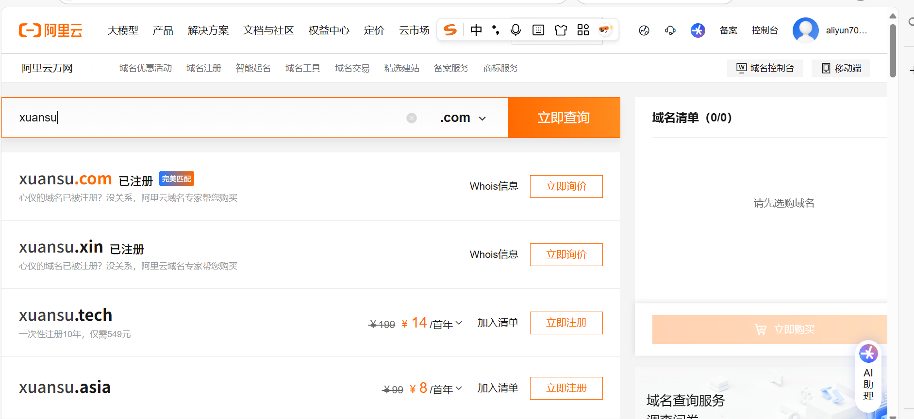
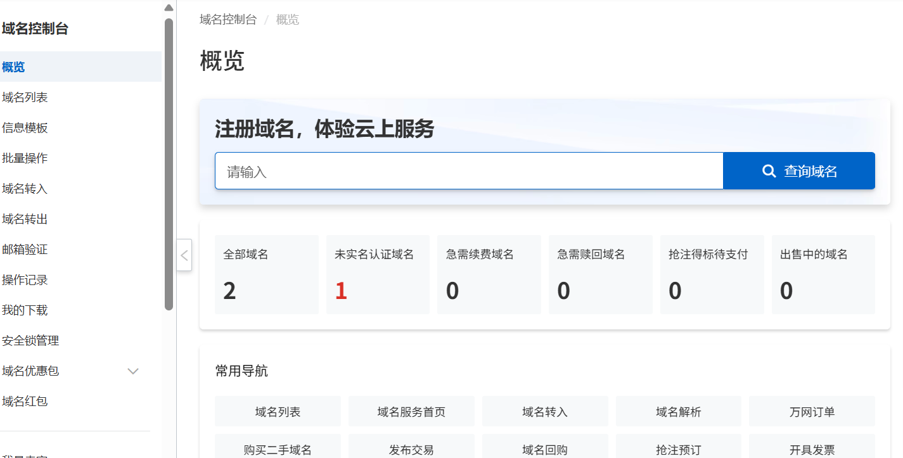
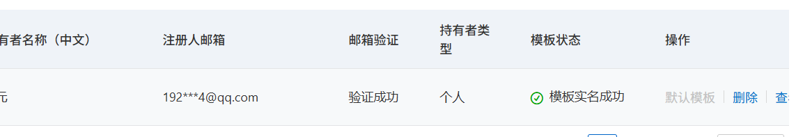
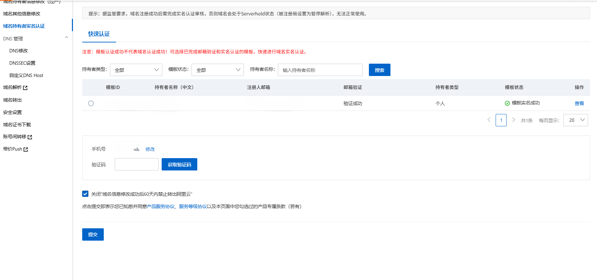
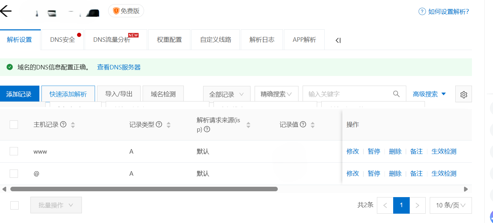
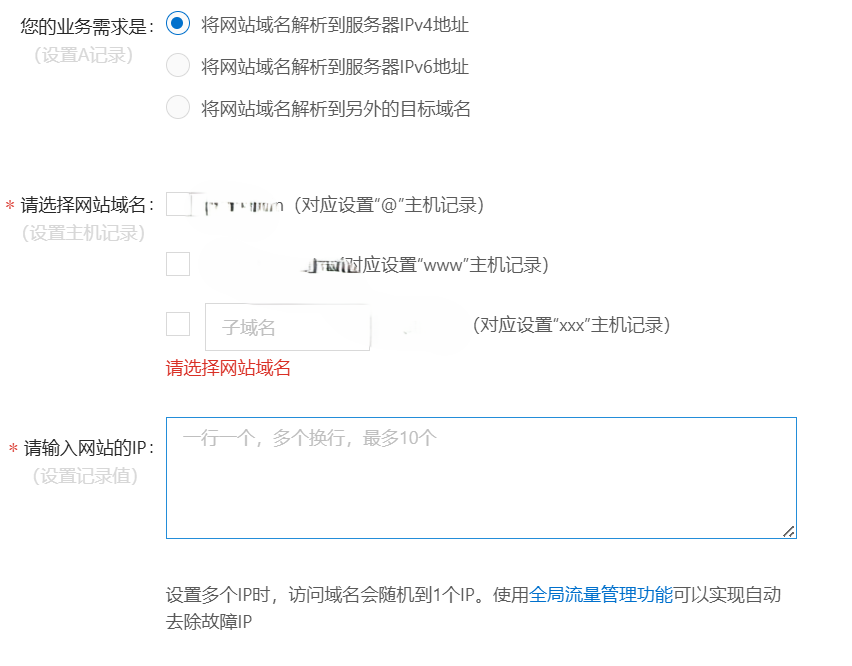
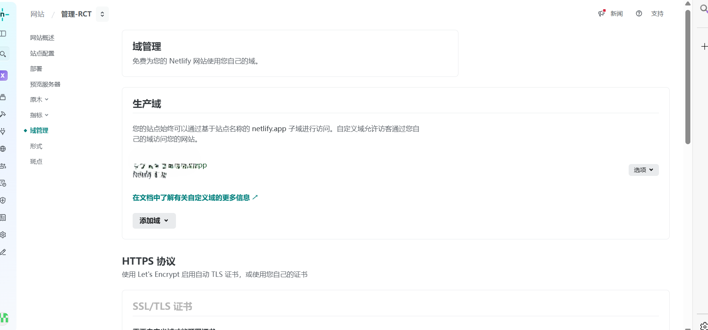

# netlify的域名配置

## 一.购买域名

1.首先你得有一个域名,可以去netlify的官网,[阿里云](https://wanwang.aliyun.com/domain/searchresult/)等平台上去查找域名 

接下来以阿里云为例

选择心意的域名进行购买(通常是以年为单位 第一年都很便宜)

## 二.域名进行实名认证

1.跳转到阿里云控制台点击信息模版

2.填写个人信息并实名认证

3.在域名列表选择你的域名 进入快速认证界面进行提交

4.等待审核完成 

## 三.配置域名解析

1.完成后点击域名列表的解析

2.点击快速添加解析

2.1选择网站解析

2.2勾选ipv4

2.3勾选@  www主机记录

2.4网站ip 到netlify你的项目上获取

3.在netlify上找到自己的项目 添加域名

4.在添加域名之后 netlify会要求进行域名的解析 点击后会有一个ip地址  将ip地址复制到阿里云快速接线的网址ip(暂无图片)

5.保存后等待netlify解析完成 会自动生成ssl证书