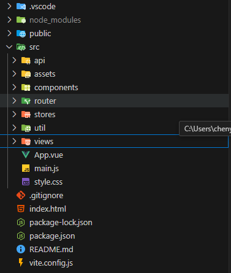

# Vite+Vue3框架搭建

### 官网链接：

1. vite：[开始 | Vite 官方中文文档](https://vitejs.cn/vite3-cn/guide/)
2. pinia：[简介 | Pinia](https://pinia.vuejs.org/zh/introduction.html)
3. 路由：[入门 | Vue Router](https://router.vuejs.org/zh/guide/)
4. element plus：[一个 Vue 3 UI 框架 | Element Plus](https://element-plus.org/zh-CN/)

### 一. vite搭建vue3项目

1.使用命令创建项目

使用 NPM:

```
$ npm create vite@latest
```

使用 Yarn:

```
$ yarn create vite
```

使用 PNPM:

```
$ pnpm create vite
```

> 创建过程中选着vue3 如果需要其他功能可自己添加 创建完项目后 npm install

### 二.创建目录结构

目录结构如下：

api：定义接口

assets：静态资源

components:公共组件

router：路由

stores：状态管理

util：工具类

views：视图



### 三.安装router pinia element-plus less

**安装router**

```js
npm install vue-router@4 
```

**安装pinia**

```js
npm install pinia
```

**安装element-plus**

```js
npm install element-plus
```

**安装less**

```js
npm install less --save-dev
```

**安装axios 图标库**

```js
npm i axios
```


**安装element-plus 图标库**

```js
npm install @element-plus/icons-vue
```

### 四.文件配置

#### 1.main.js配置 

将这些工具挂载在app上

```js
import { createApp } from 'vue'
import ElementPlus from 'element-plus'
import 'element-plus/dist/index.css' //element-plus样式
import App from './App.vue'
import router from './router'
import { createPinia } from 'pinia'
import zhCn from 'element-plus/es/locale/lang/zh-cn' //element-plus中文化
import * as ElementPlusIconsVue from '@element-plus/icons-vue'//element-plus图标库


import './style.css'

const app = createApp(App)
const pinia = createPinia()

app.use(pinia)
app.use(router)
app.use(ElementPlus,{
    locale: zhCn
})
for (const [key, component] of Object.entries(ElementPlusIconsVue)) {
  app.component(key, component)
}   
app.mount('#app')

```

#### 2.vite.config.js配置

```js
import { defineConfig } from 'vite'
import vue from '@vitejs/plugin-vue'
import { fileURLToPath, URL } from 'node:url'

// https://vite.dev/config/
export default defineConfig({
  plugins: [vue()],
    //配置@
  resolve: {
    alias: {
      '@': fileURLToPath(new URL('./src', import.meta.url)), // 使用 fileURLToPath 和 URL
    },
  },
    //配置代理
  // server: {
  //   proxy: {
  //     '/api': { // 代理的路径 
  //       target: "地址", // 目标地址
  //       changeOrigin: true, // 允许跨域
  //       rewrite: (path) => path.replace(/^\/api/, ''), // 重写路径
  //     },
  //   }
  // },
})
```

#### 3.使用element-plus创建布局组件 layout.vue 

```js
<template>
    <div class="common-layout">
        <el-container class="layout-container">
            <!-- 头部区域 -->
            <el-header class="layout-header">
                <div class="header-content">
                    <div class="logo">智慧导游系统</div>
                    <nav class="main-nav">
                        <router-link to="/home">首页</router-link>
                        <router-link to="/about">关于我们</router-link>
                    </nav>
                    <div class="user-info">
                        <router-link to="/login">登录</router-link>
                    </div>
                </div>
            </el-header>

            <!-- 主要内容区域 (包含侧边栏和主内容) -->
            <el-container class="content-container">
                <!-- 侧边栏区域
                <el-aside width="200px" class="layout-aside">
                    <el-menu default-active="2" class="el-menu-vertical-demo" :collapse="false">
                        <el-menu-item index="1">
                            <el-icon><el-icon-location /></el-icon>
                            <span> 首页</span>
                        </el-menu-item>
                        <el-sub-menu index="2">
                            <template #title>
                                <el-icon><el-icon-menu /></el-icon>
                                <span> 关于我们</span>
                            </template>
                            <el-menu-item index="2-1">
                                <el-icon><el-icon-menu /></el-icon>
                                <span> 联系我们</span>
                            </el-menu-item>
                            <el-menu-item index="2-2">
                                <el-icon><el-icon-menu /></el-icon>
                                <span> 联系我们</span>
                            </el-menu-item>
                        </el-sub-menu>
                        <el-menu-item index="3">
                            <el-icon><el-icon-document /></el-icon>
                            <span> 联系我们</span>
                        </el-menu-item>
                    </el-menu>
                </el-aside> -->

                <!-- 主内容区域 -->
                <el-main class="layout-main">
                    <router-view />
                </el-main>
            </el-container>

            <!-- 底部区域 (可选，如果不需要可以移除 el-footer) -->
            <el-footer class="layout-footer">
                © 2025 智慧导游系统与你相伴
            </el-footer>
        </el-container>
    </div>
</template>
<script setup>
import { RouterLink, RouterView } from 'vue-router';
</script>

<style scoped>
.common-layout {
    height: 100vh;
    display: flex;
    flex-direction: column;
}

.layout-container {
    flex: 1;
}

.layout-header {
    background-color: #607D8B ;
    color: #fff;
    line-height: 60px;
    padding: 0 20px;
    display: flex;
    align-items: center;
    justify-content: space-between;
}

.header-content {
    display: flex;
    width: 100%;
    justify-content: space-between;
    align-items: center;
}

.logo {
    font-size: 24px;
    font-weight: bold;
}

.main-nav a {
    color: #fff;
    text-decoration: none;
    margin: 0 15px;
    font-weight: bold;
}

.main-nav a.router-link-exact-active {
    color: #ffd04b;
    /* 激活状态颜色 */
}

.user-info .el-button {
    color: #fff;
}

.content-container {
    flex: 1;
    /* 确保内容容器填充剩余空间 */
}

.layout-aside {
    background-color: #d3dce6;
    color: #333;
    padding-top: 20px;
    /* 为菜单留出顶部空间 */
}

.layout-aside .el-menu {
    border-right: none;
    /* 移除 Element Plus 菜单默认的右边框 */
}

.layout-main {
    background-color: #e9eef3;
    color: #333;
    padding: 20px;
    overflow-y: auto;
    /* 当内容超出时允许滚动 */
}

.layout-footer {
    background-color: #b3c0d1;
    color: #333;
    text-align: center;
    line-height: 60px;
    font-size: 14px;
}
</style>

```


#### 4.路由配置

在router文件夹下面创建index.js文件

```js
import { createRouter, createWebHistory } from 'vue-router'
import HomeView from '../views/HomeView.vue'
import AboutView from '../views/AboutView.vue'
import LoginView from '../views/LoginView.vue'
import Layout from '../components/Layout.vue' // 引入 Layout 组件

const routes = [
  {
    path: '/login', // 默认路径指向登录页面
    name: 'login',
    component: LoginView
  },
  {
    path: '/', 
    component: Layout, // 这个路径会渲染 Layout 组件
    children: [ // 所有的子路由都会在 Layout 内部的 <router-view> 中渲染
      {
        path: '/home', 
        name: 'home',
        component: HomeView
      },
      {
        path: '/about',
        name: 'about',
        component: AboutView
      }
    ]
  },
  //   {
  //   path: '/:pathMatch(.*)*', // 匹配所有未定义的路由
  //   name: 'NotFound',
  //   redirect: '/' // 或者重定向到一个专门的404页面
  // }
]

const router = createRouter({
  history: createWebHistory(),
  routes
})

// // 配置路由守卫
// router.beforeEach((to, from, next) => {
//   const userStore = useUserStore();

//   // 排除不需要登录的页面
//   const noLoginRequired = ['/login', '/404'];
//   if (noLoginRequired.includes(to.path)) {
//     return next();  // 直接放行
//   }

//   // 检查用户是否已经登录
//   if (userStore.id) {
//     return next();  // 用户已登录，允许访问
//   }

//   // 如果未登录，重定向到登录页面
//   return next('/login');
// });

export default router
```

#### 5.app.vue路由使用配置

```js
<script setup>
</script>

<template>
  <router-view /> <!-- 顶级路由视图，会根据路由渲染 LoginView 或 Layout -->
</template>

<style>
/* 确保 html, body, #app 占据整个视口高度，以便布局组件能正确显示 */
html, body, #app {
  margin: 0;
  padding: 0;
  height: 100%;
  width: 100%;
  overflow: hidden; /* 防止出现双滚动条 */
}

#app {
  font-family: Avenir, Helvetica, Arial, sans-serif;
  -webkit-font-smoothing: antialiased;
  -moz-osx-font-smoothing: grayscale;
  color: #2c3e50;
}
</style>
```

#### 6.pinia配置

在stores文件夹下创建login.js

```js
import { defineStore } from 'pinia'

export const useLoginStore = defineStore('login', {
  state: () => ({
    count: 0
  }),
  getters: {
    doubleCount: (state) => state.count * 2
  },
  actions: {
    increment() {
      this.count++
    },
    decrement() {
      this.count--
    }
  }
})

```

验证 HomeView

```js
<script setup>
import { useLoginStore } from '../stores/login' // 引入您的 store

const loginStore = useLoginStore() // 使用 store 实例
</script>

<template>
  <div style="border: 1px solid #eee; padding: 20px; margin-top: 20px;">
    <h2>测试pinia</h2>
    <p>Count: {{ loginStore.count }}</p>
    <p>Double Count: {{ loginStore.doubleCount }}</p>
    <button @click="loginStore.increment()">Increment</button>
    <button @click="loginStore.decrement()" style="margin-left: 10px;">Decrement</button>
  </div>
</template>

```

#### 7.剩余代码

1.LoginView.vue

```js
<template>
  <div class="login-page-content">
    <h1>登录</h1>
    <button @click="headleLogin">登录</button>
  </div>
</template>

<script setup>
import { useRouter } from 'vue-router'
const router = useRouter()
const headleLogin = () => {
  console.log('登录')
  // 登录成功后，跳转到首页
  router.push({ name: 'home' })
}

</script>

<style scoped>
.about-page-content {
  padding: 20px;
}
</style>

```

2.AboutView.vue

```js
<template>
  <div class="about-page-content">
    <h1>关于我们</h1>
  </div>
</template>

<style scoped>
.about-page-content {
  padding: 20px;
}
</style>

```

#### 8.多层封装axios

在util下创建request.js文件

```js
import axios, { AxiosInstance, InternalAxiosRequestConfig, AxiosResponse, AxiosError } from 'axios';
import { useRouter } from 'vue-router';
import { ElMessage } from 'element-plus'; // 导入 ElMessage 组件
import { baseURL } from '@/api/config';

// 创建axios实例，可以自定义配置
const request = axios.create({
  baseURL, // 基础URL
  timeout: 10000, // 请求超时时间，设置为10秒，可以根据实际情况调整
});

// 添加请求拦截器
request.interceptors.request.use(
  (config) => {
    // 在发送请求之前做些什么，例如添加token
    // TODO 1. 当第一个请求开始时显示Loading
    // 可以使用 element-plus 的 loading 组件，这里省略具体实现

    // TODO 2. 携带token
    // const userStore = useUserStore(); // 获取用户状态管理 store
    // const token = userStore.token; // 从 store 中获取 token

    // 如果存在 token，则添加到请求头中
    if (token) {
      config.headers = config.headers || {}; // 确保 headers 存在
      config.headers.Authorization = 'Bearer ' + token;
    }

    return config; // 必须返回 config，否则请求将无法发送
  },
  (err) => {
    // 请求错误处理
    console.error('请求错误：', err);
    return Promise.reject(err); // 必须 reject，否则后续请求会认为成功
  }
);

// 添加响应拦截器
request.interceptors.response.use(
  (res) => {
    // 2xx 范围内的状态码都会触发该函数。
    // 对响应数据做点什么
    // 统一处理响应状态码，方便后续判断
    if (!res.data.code) {
      res.data.code = 0; // 默认code为0，表示成功
    }

    if (res.data.code === 0) {
      // 请求成功
      // TODO 4. 摘取核心响应数据 (可以根据项目需求，只返回核心数据)
      return res; // 直接返回完整响应，可以根据需要修改
    } else {
      // TODO 3. 处理业务失败
      // 业务逻辑错误，例如用户名密码错误等
      ElMessage.error(res.data.msg || '服务器异常'); // 使用 Element Plus 的 message 组件提示错误信息
      return Promise.reject(res.data); // 必须 reject，否则后续请求会认为成功
    }
  },
  (err) => {
    // 超出 2xx 范围的状态码都会触发该函数。
    // TODO 5. 处理401错误---权限不足--token过期
    if (err.response?.status === 401) {
      // 未授权，token过期
      const router = useRouter(); // 获取路由实例
      // 跳转到登录页面，并携带当前页面的路径，方便登录后跳转回来
      router.push({
        path: '/login',
        query: { redirect: router.currentRoute.value.fullPath },
      });
      ElMessage.warning('登录已过期，请重新登录'); // 提示用户重新登录
    } else {
      // 默认错误处理
      ElMessage.error((err.response?.data)?.msg || '服务器异常'); // 使用 Element Plus 的 message 组件提示错误信息
    }
    console.error('响应错误：', err);
    return Promise.reject(err); // 必须 reject，否则后续请求会认为成功
  }
);

// 导出 axios 实例
export default request;

```

### 五.运行npm run dev