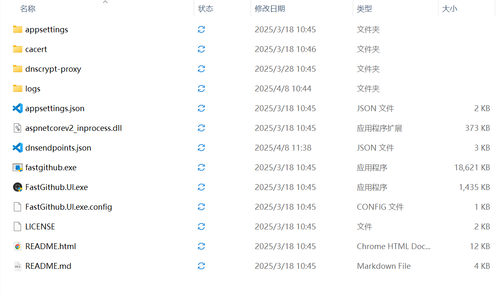
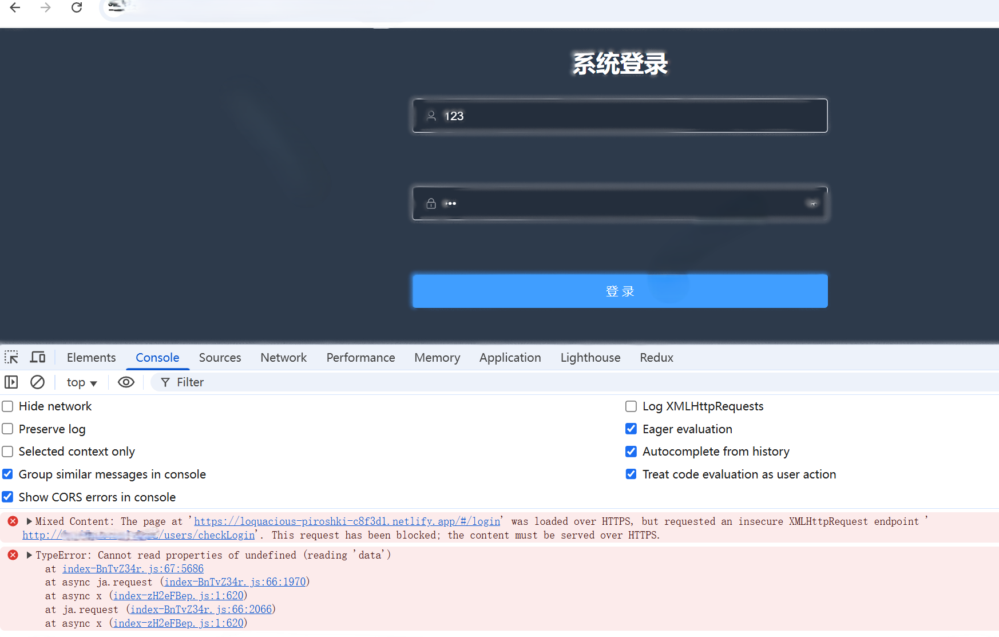

> 该部署方法只适合github 不适合gitee
>
> gitee与github好像有一个仓库同步的功能

## 一.下载github加速软件

只针对于github的加速器

fastgithub_win-x64下载地址[清华大学云盘](https://cloud.tsinghua.edu.cn/d/df482a15afb64dfeaff8/files/?p=%2Ffastgithub_win-x64.zip)

解压双击运行FastGithub.UI.exe



## 二.创建github仓库

在github里面创建一个空的仓库**(注意:要空的 md文档也不要有)**

1.(先运行FastGithub.UI.exe)进入github创建一个空的仓库 


2.填写仓库名称 英文   最好就只添加一个描述(description) 其他的不要动


3.创建成功 会跳转到 另一个界面 (看最下面的栏)

 

4.后续会将复制粘贴命令到终端

## 三.在项目里面创建git项目

1.在你的项目文件里面初始化仓库 通过git  init 进行git的初始化

> 注意不要弄错目录了
>
> 一定要切换到你的项目


2..通过git add . 将文件放到暂存区  字母U变A 提交成功


3..通过 git commit -m "备注/提醒信息"    字母由A变无 


4.将二步骤的命令复制过来 或者通过git push 你的仓库名 分支(git push origin mian)


5.返回git仓库 里面就有了提交的文件 和信息 

> 如果进去是一个文件夹 那么请你删掉项目外面的那个git 在项目里面创建git


## 四.项目上线

进入netilify网站进行部署[Scale & Ship Faster with a Composable Web Architecture | Netlify](https://www.netlify.com/)

1.先登录注册(使用github账号登录)


2.点击第一个 直接在github上导入


3.点击有导入的仓库

> 站点名称最好写一个   分支 和及目录不要管
>
> 构建命令 npm run build 
>
> 发布目录 dist
>
> 最后一个不要改
>
> 然后部署
>
> 如果不是vue和react项目,是原生JS,  构建命令,发布目录不要填了
>


4.等待部署成功 点击绿色网站


这样就部署成功了点击绿色的网址就可以进行访问

## 五.netlify线上代理

在netnilify上部署系统 如果遇到跨域问题 就要进行代理



修改部署思路(这种部署思路旨在利用 Netlify 的代理功能，将前端应用部署在 Netlify 上，同时将 API 请求和图片资源请求代理到你的后端服务器

1.在你的项目根目录下添加文件

netlify.toml   (并不完全 需要自己补充)

```js
[[redirects]]
 # from: 指定要匹配的 URL 模式。这里匹配所有以 /api/ 开头的 URL。
  from = "/api/*"
  # to: 指定要重定向到的目标 URL。:splat 是一个占位符，用于捕获 from 中 * 匹配的部分。
  # 这里将 /api/* 重定向到 后端数据请求地址/*，并将 * 匹配的部分添加到目标 URL 中。
  to = "http://后端数据请求地址/:splat"
  # status: 指定 HTTP 重定向的状态码。200 表示“OK”，但在这里实际上是使用 Netlify 的代理功能，而不是真正的重定向。
  # 这允许 Netlify 代理请求到后端服务器，而不会更改浏览器地址栏中的 URL。
  status = 200
  # force: 指定是否强制执行重定向。设置为 true 表示即使有其他规则匹配，也强制执行此重定向。
  force = true

# 同样的规则，用于重定向 /upload/imgs/acc_img/ 下的图片请求。
[[redirects]]
  from = "/upload/imgs/acc_img/*"
  to = "后端数据请求地址/upload/imgs/acc_img/:splat"
  status = 200
  force = true

# 同样的规则，用于重定向 /upload/imgs/goods_img/ 下的图片请求。
[[redirects]]
  from = "/upload/imgs/goods_img/*"
  to = "后端数据请求地址/upload/imgs/goods_img/:splat"
  status = 200
  force = true
```

2.然后还需要将请求地址进行修改

例如 对于第一个规则


eg . 对于登录 就相当于  **请求后端数据请求地址/api//users/checkLogin**

3.修改完成后从新提交github上  netnilify会自行部署


