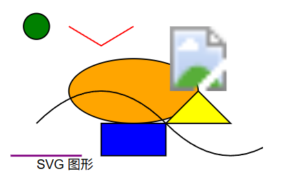
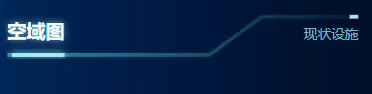

# 使用svg绘制图形并添加流光动画

## 一.svg是什么?

svg可以理解为是矢量图的绘画工具

- 位图：放大会失真图像边缘有锯齿；是由像素点组成；前端的 Canvas 就是位图效果。
- 矢量图：放大不会失真；使用 XML 描述图形。

## 二.svg的使用方式

### 1.基本使用

使用方式可以理解为html中的新标签

默认宽度是 300px ，默认高度是 150px

```js
<svg style="width: 200px; height: 200px;viewBox="0 0 400 300""></svg>
```

- **关键：** 设置 `viewBox` 属性。`viewBox="min-x min-y width height"` 定义了 SVG 内部的坐标系统。这使得 SVG 可以在不改变内部元素坐标的情况下进行缩放，实现响应式设计。例如，`viewBox="0 0 400 300"` 表示内部坐标系统从 (0,0) 开始，宽度为 400，高度为 300。 

  > 将这块画布平均分成宽400个块,高300个块的区域 

- 默认情况下，SVG 的原点 (0,0) 在左上角，x 轴向右，y 轴向下。

### 2.添加图形元素进行使用

#### 2.1图形元素标签

使用 SVG 提供的各种元素来绘制图形：

- `<rect>`：矩形
- `<circle>`：圆形
- `<ellipse>`：椭圆 (您代码中使用的)
- `<line>`：直线
- `<polyline>`：折线
- `<polygon>`：多边形
- `<path>`：路径 (用于绘制任意复杂的形状，通过 `d` 属性定义一系列命令，如 M 移动到, L 画线到, Z 闭合路径等)
- `<text>`：文本
- `<image>`：嵌入位图图像

- 为这些元素设置位置和尺寸属性（如 `x`, `y`, `cx`, `cy`, `rx`, `ry`, `width`, `height`, `d` 等）。

  > - x: 左上角x轴坐标
  > - y: 左上角y轴坐标
  > - width: 宽度
  > - height: 高度
  > - rx: 圆角，x轴的半径
  > - ry: 圆角，y轴的半径

```js
<svg width="100%" height="100%" viewBox="0 0 400 300">
  <!-- 绘制椭圆，设置中心点 (cx, cy) 和半轴 (rx, ry) -->
  <ellipse cx="200" cy="150" rx="100" ry="50" fill="orange" stroke="black" stroke-width="2" />

  <!-- 绘制圆形，设置圆心 (cx, cy) 和半径 (r) -->
  <circle cx="50" cy="50" r="20" fill="green" stroke="black" stroke-width="2" />

  <!-- 绘制矩形，设置位置 (x, y)，宽度 (width)，高度 (height) -->
  <rect x="150" y="200" width="100" height="50" fill="blue" stroke="black" stroke-width="2" />

  <!-- 绘制直线，设置起点 (x1, y1) 和终点 (x2, y2) -->
  <line x1="10" y1="250" x2="120" y2="250" stroke="purple" stroke-width="3" />

  <!-- 绘制折线，设置一系列点的坐标 (points) -->
  <polyline points="100,50 150,80 200,50" fill="none" stroke="red" stroke-width="2" />

  <!-- 绘制多边形，设置一系列点的坐标 (points) -->
  <polygon points="300,150 350,200 250,200" fill="yellow" stroke="black" stroke-width="2" />

  <!-- 使用路径绘制复杂形状，d 属性定义路径命令 -->
  <path d="M 50 200 Q 150 100, 250 200 T 450 200" fill="none" stroke="black" stroke-width="2" />

  <!-- 绘制文本，设置文本位置 (x, y) 和字体属性 -->
  <text x="50" y="270" font-family="Arial" font-size="20" fill="black">SVG 图形</text>

  <!-- 嵌入位图图像，设置位置 (x, y) 和大小 (width, height) -->
  <image href="https://via.placeholder.com/150" x="250" y="50" width="100" height="100" />
</svg>
```



### 3.图形化样式

#### 3.1.使用 CSS 或 SVG 属性来控制图形的外观

常用的样式属性包括：

- `fill`：填充颜色
- `stroke`：描边颜色
- `stroke-width`：描边宽度
- `opacity`：透明度
- `transform`：变换 (位移、旋转、缩放等)
- `stroke-dasharray` 和 `stroke-dashoffset`：用于创建虚线和控制虚线起始位置

#### 3.2使用方式

- **行内样式:** 直接在元素上使用 `style` 属性 (`<circle style="fill: blue; stroke: red; stroke-width: 2;"/>`)。优先级最高。
- **CSS 类:** 使用 `class` 属性，并在 `<style>` 标签或外部 CSS 文件中定义样式规则 (`<ellipse class="my-ring"/>`)。
- **SVG 属性:** 直接使用 SVG 属性（`<rect x="10" y="10" width="80" height="80" fill="green"/>`）。优先级最低。

```js
<style>
  .my-ring {
    fill: none;
    stroke: cyan;
    stroke-width: 2;
  }
</style>
<svg width="100%" height="100%" viewBox="0 0 400 300">
  <ellipse cx="200" cy="150" rx="100" ry="50" class="my-ring"/>
</svg>

```

## 4.定义可重用资源 (defs和 use)

- 在 `<svg>` 内部使用 `<defs>` 标签来定义可重用的资源，这些资源本身不会直接渲染。
- 常用的可重用资源包括：
  - `<linearGradient>` / `<radialGradient>`：渐变 (您代码中用于描边透明度变化)
  - `<pattern>`：图案
  - `<filter>`：滤镜效果 (您代码中用于发光效果)
  - `<symbol>`：符号 (用于定义图形模板)
- 使用 `<use>` 元素来引用 `<defs>` 中定义的资源，通过 `href` (或 xlink:href ) 属性指定资源的 ID

```js
<svg width="100%" height="100%" viewBox="0 0 400 300">
  <!-- 定义线性渐变 -->
  <defs>
    <linearGradient id="myGradient" x1="0%" y1="0%" x2="100%" y2="0%">
      <!-- 渐变起始颜色为红色 -->
      <stop offset="0%" stop-color="red"/>
      <!-- 渐变结束颜色为蓝色 -->
      <stop offset="100%" stop-color="blue"/>
    </linearGradient>
  </defs>
  
  <!-- 绘制一个矩形，填充渐变色 -->
  <rect x="10" y="10" width="80" height="80" fill="url(#myGradient)"/>
</svg>

```

## 5.实现动态效果 (Animation & Interactivity)

1. **CSS 动画:** 使用 CSS `@keyframes` 和 `animation` 属性动画化一些 SVG 属性（如 `opacity`, `transform`, `stroke-dashoffset`）。
2. **Web Animations API (WAAPI):** 使用 JavaScript 的 `element.animate()` 方法来创建更灵活和强大的动画 (您代码中使用的)。
3. JavaScript DOM 操作:
4. 直接使用 JavaScript 访问和修改 SVG 元素的属性和样式 (您代码中用于动态创建元素、获取getTotalLength
5. 、设置stroke-dasharray和stroke-dashoffset)。
6. - 使用 `document.createElementNS('http://www.w3.org/2000/svg', 'elementName')` 创建 SVG 元素。
   - 使用 `element.setAttribute('attributeName', 'value')` 设置属性。
   - 使用 `element.style.propertyName = 'value'` 设置行内样式。
   - 使用 `element.getTotalLength()` 获取路径或描边的总长度 (对于 `<path>`, `<circle>`, `<ellipse>`, `<line>`, `<polyline>`, `<polygon>`)。
7. **SVG 动画 (SMIL):** 虽然在大多数浏览器中已弃用，但了解一下可以在 SVG 内部使用 `<animate>`, `<animateMotion>`, `<animateTransform>` 等标签进行声明式动画。
8. **JavaScript 库:** 使用专门的 SVG 或动画库，如 GreenSock (GSAP), Snap.svg, SVG.js, D3.js 等，可以极大地简化复杂的动画和交互操作。
9. **事件处理:** 为 SVG 元素添加标准的 DOM 事件监听器（如 `click`, `mouseover`, `mouseout` 等）来实现交互。

## 6.案例

### 1.功能实现效果



### 2.实现逻辑

1.1先创建  静态的渐变背景线条

1.2再创建一个线条用于相当于接受流光效果

1.3创建带有流光动画的线条


### 3.代码实现

#### 1.创建svg

```js
<svg width="100%" height="100%" viewBox="0 0 200 20" preserveAspectRatio="none" xmlns="http://www.w3.org/2000/svg"></svg>
```

#### 2.创建折线图

```js
 		 {/* 1. 静态的渐变背景线条 */}
        <polyline
          points={backgroundSegment1}
          fill="none"
          stroke="url(#backgroundGradient)" 
          strokeWidth="2" // 背景线粗细
        />
         {/* 第二段：使用突出显示的颜色 */}
        <polyline
          points={backgroundSegment2}
          fill="none"
          stroke="#a6edef" // 或者直接使用纯色
          strokeWidth="2"
        />

        {/* 带有流光动画的线条 */}
        <polyline
          points={pointsData}
          fill="none"
          stroke="#a6edef" // 流光线颜色 (保持纯色)
          strokeWidth="2"
          className="flowing-line" // 应用 CSS 动画和描边属性
          style={{ filter: 'url(#glow)' }} // 应用辉光滤镜
        />
```

#### 3.设置动画以及何可重复资源

```js
<defs>
        {/* 定义一个滤镜来创建辉光效果，只应用到流光线上*/}
          <filter id="glow">
            {/* 应用高斯模糊来创建辉光效果 */}
            <feGaussianBlur stdDeviation="2" result="coloredBlur" />
            {/* 合并滤镜和源图像 */}
            <feMerge>
              {/* 应用辉光效果 
              in="coloredBlur" 表示将之前 feGaussianBlur 处理后的模糊效果作为输入。
              in="SourceGraphic" 表示将原始图形作为输入。
            */}
              <feMergeNode in="coloredBlur" />
              <feMergeNode in="SourceGraphic" />
            </feMerge>
          </filter>


          {/* id="backgroundGradient": 背景渐变的唯一ID */}
          {/* x1, y1, x2, y2: 定义渐变方向，例如从左到右 */}
          <linearGradient id="backgroundGradient" x1="0" y1="0" x2="200" y2="0" gradientUnits="userSpaceOnUse">
            {/* 渐变停止点 - 定义背景线的颜色过渡 */}
            {/* 示例：从一个颜色过渡到另一个颜色 */}
            <stop offset="0%" stopColor="#1c96a9" /> {/* 起始颜色*/}
            <stop offset="100%" stopColor="#031a35" /> {/* 结束颜色*/}
          </linearGradient>
        </defs>

```

```css
.css文件
.flowing-line {
  /* 描边动画的关键属性 */
  stroke-dasharray: 30 180; /* 示例：光带长度 30，空白 180 (总长约 210) */
  stroke-dashoffset: 210; /* 初始偏移量，将光带移出视野 */

  /* 应用 CSS 动画 */
  animation: flow 3s linear infinite; /* 动画名称，持续时间，速度曲线，无限循环 */
}

/* 定义动画关键帧 */
@keyframes flow {
  to {
    /* 将偏移量从 210 变为 -210，使光带从头流到尾，然后从头开始 */
    stroke-dashoffset: -210;
  }
}
```

