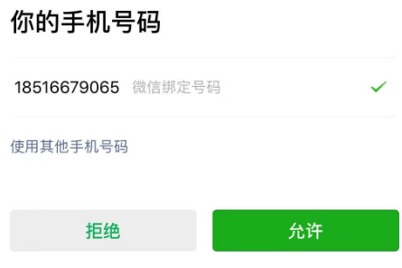

## 微信小程序登录流程

> 目前来说微信小程序的登录都是要求绑定手机号的  如果说微信小程序绑定了手机号那就采取静默登录
>
> 如果微信小程序没有绑定那么就要采取手机号号授权

### 1.通过wx.login()获取微信小程序的code

```js
wx.login({
			success: async function(res) {
				console.log("获取用户数据",res)
				loginCode.value = res.code;//存储获取的code
			},
		});
```

### 2.将code传递给后后端 获取用户的信息

```js
const data={
			"code": loginCode.value,
		}
const resPhone = await loginMiniProgramApi(data)//后端请求接口
console.log("用户信息",resPhone.data)
```

### 3.如果手机号未绑定 通过getPhoneNumber获取手机号的code 

> 因为微信小程序的底层逻辑 这个不能够被其他事件所触发和隐藏

```js
<button class="btn" :class="{'disabled-look': !loginStore.radiovalue}" open-type="getPhoneNumber"@getphonenumber="getPhoneNumberCallback">
				用户一键登录
</button>
```

通过按钮会拉起微信授权的弹窗



### 4.通过getPhoneNumberCallback回调函数和后端接口绑定手机号

```js
const getPhoneNumberCallback = async (e) => {
		if (e.detail.errMsg === 'getPhoneNumber:ok') {
			phoneCode.value=e.detail.code
			const data={
				 "code": loginCode.value,//微信账号的code
				  "phoneCode": phoneCode.value,//手机号的code
			}
			const resPhone = await loginMiniProgramApi(data)//后端手机号绑定接口
			console.log("用户信息",resPhone.data)
			loginStore.token = resPhone.data.token
			loginStore.phone= resPhone.data.phone
		} else {
			uni.showToast({
				title: '用户拒绝授权',
				icon: 'none'
			});
		}
	};
```

