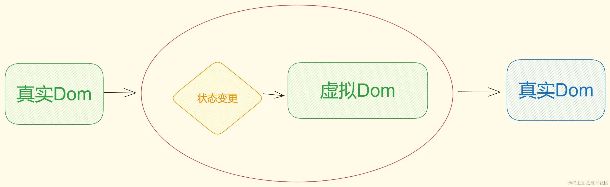

# 一.真实Dom

DOM（Document Object Model）是将整个 HTML 文档的每一个标签元素视为一个对象，这个对象下包含了许多的属性和方法，通过操作这些属性或者调用这些方法实现**对 HTML 的动态更新**，为实现网页特效以及用户交互提供技术支撑。

简言之 DOM 是用来动态修改 HTML 的，其目的是开发网页特效及用户交互。

观察一个小例子：


上述的例子中当用户分分别点击【开始】或【结束】按钮后，通过右侧调试窗口可以观察到 html 标签的内容在不断的发生改变，这便是通过 DOM 实现的。

## 1.DOM 树

```html
<!DOCTYPE html>
<html lang="en">
<head>
  <meta charset="UTF-8">
  <meta name="viewport" content="width=device-width, initial-scale=1.0">
  <title>标题</title>
</head>
<body>
  文本
  <a href="">链接名</a>
  <div id="" class="">文本</div>
</body>
</html>
```

如下图所示，将 HTML 文档以树状结构直观的表现出来，我们称之为文档树或 DOM 树，**文档树直观的体现了标签与标签之间的关系。**


## 2.DOM 节点

节点是文档树的组成部分，**每一个节点都是一个 DOM 对象**，主要分为元素节点、属性节点、文本节点等。

1. 【元素节点】其实就是 HTML 标签，如上图中 `head`、`div`、`body` 等都属于元素节点。
2. 【属性节点】是指 HTML 标签中的属性，如上图中 `a` 标签的 `href` 属性、`div` 标签的 `class` 属性。
3. 【文本节点】是指 HTML 标签的文字内容，如 `title` 标签中的文字。
4. 【根节点】特指 `html` 标签。

## 3.document

`document` 是 JavaScript 内置的专门用于 DOM 的对象，该对象包含了若干的属性和方法，`document` 是学习 DOM 的核心。

```html
<script>
  // document 是内置的对象
  // console.log(typeof document);

  // 1. 通过 document 获取根节点
  console.log(document.documentElement); // 对应 html 标签

  // 2. 通过 document 节取 body 节点
  console.log(document.body); // 对应 body 标签

  // 3. 通过 document.write 方法向网页输出内容
  document.write('Hello World!');
</script>
```

## 4.缺点:

- **重绘和回流（Reflow 和 Repaint）**：每次修改 DOM 时，浏览器需要重新计算页面的布局，可能会导致重绘（repaint）和回流（reflow），这会影响性能，尤其是当 DOM 树很复杂时。
- **操作开销**：频繁地操作 DOM 会造成性能瓶颈，尤其是在处理大量节点时。因为每次操作 DOM 都需要更新页面的渲染，可能导致页面的响应变慢。

​	

# 二.虚拟Dom

​	虚拟 DOM 是一种用 **JavaScript 对象**表示的 DOM 结构，它是 **真实 DOM** 的一个轻量级副本。虚拟 DOM 存储在内存中，包含了页面结构和数据，而不直接操作真实 DOM。因此，虚拟 DOM 的变化并不直接影响页面的渲染，而是通过计算差异来批量更新真实 DOM。



### 三.虚拟Dom与真实Dom的区别

| **特点**     | **真实 DOM**                                            | **虚拟 DOM**                                         |
| ------------ | ------------------------------------------------------- | ---------------------------------------------------- |
| **定义**     | 真实的 DOM 树，是浏览器中的实际 DOM 结构。              | 是内存中的 JavaScript 对象，表示 DOM 结构的副本。    |
| **更新频率** | 每次 DOM 变化时，都会重新渲染整个页面，导致回流和重绘。 | 通过 diff 算法和批量更新，只更新变化部分，提高性能。 |
| **性能**     | 操作 DOM 开销大，性能较差，尤其是频繁更新时。           | 更加高效，避免了大量的回流和重绘，提高了性能。       |
| **开发方式** | 需要手动操作 DOM 元素，控制更新过程。                   | 通过声明式编程描述 UI 状态，框架自动处理 DOM 更新。  |